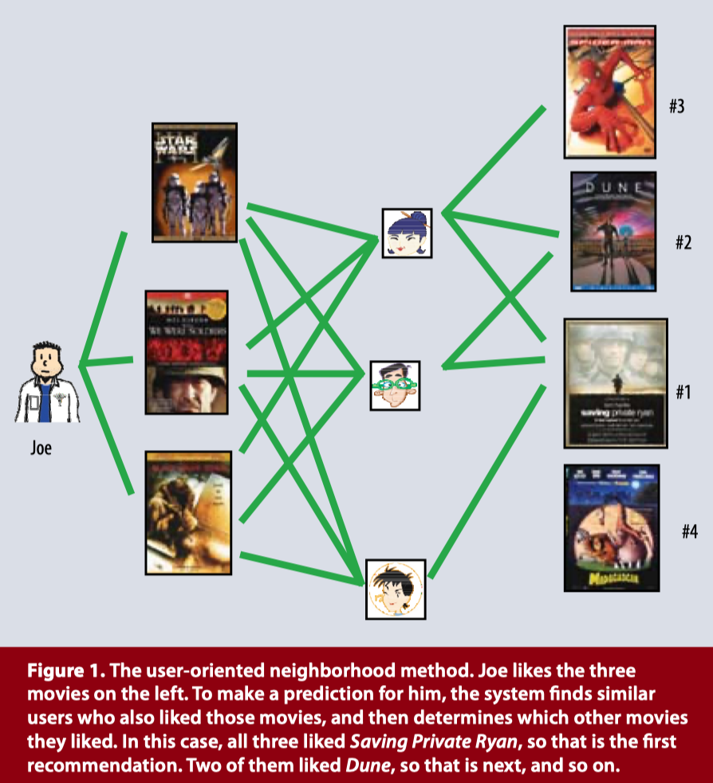
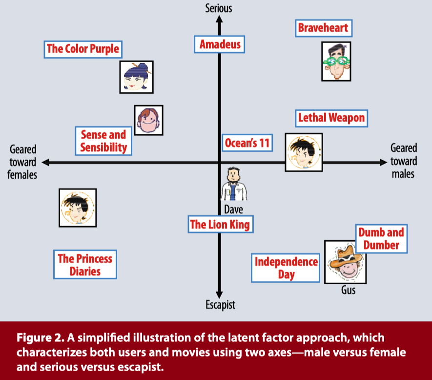

# Matrix Factorization

참고 자료

- [MATRIX FACTORIZATION TECHNIQUES FOR RECOMMENDER SYSTEMS](https://datajobs.com/data-science-repo/Recommender-Systems-[Netflix].pdf)
-  [Large-scale Parallel Collaborative Filtering for the Netflix Prize](https://endymecy.gitbooks.io/spark-ml-source-analysis/content/推荐/papers/Large-scale Parallel Collaborative Filtering the Netflix Prize.pdf)
-  [Collaborative Filtering for Implicit Feedback Datasets](http://yifanhu.net/PUB/cf.pdf)

 

### 0-1. Recommender System 개요

추천 시스템은 기능과 목적에 따라 설명될 수 있다.

- 기능적 구분
  - Content-based Filtering
  - Collaborative Filtering
  - Hybrid
- 목적 구분
  - 연관 추천
  - 개인화 추천

Content-based filtering은 item의 정보 혹은 user의 메타 데이터를 사용하여 추천할 item 혹은 user를 선정한다. 유사한 제목을 가진 영화를 추천해 주거나, 유사한 내용의 책을 추천하는 등을 예로 들 수 있다.

Collaborative filtering은 user와 item의 정보를 모두 사용하여 추천할 item 혹은 user를 선정한다. 대표적인 예시로 user가 평가한 item들에 대한 rating 내역을 이용하여, 평가하지 않은 다른 item에 대한 rating을 예측하는 것이 있다.

  

## 1. Collaborative Filtering

Collaborative filtering은 다시 세 가지로 나뉜다.

- Neighborhood methods
- Latent factor models
- Model-based

 

### 1-1. CF가 겪는 문제점

- `Cold Start`
  - New user problem
  - New item problem
- `Scaleability`: 확장성
- `Data Sparsity`: rating 내역이 충분하지 않은 경우 overfitting 될 가능성이 크다.
- `Gray/Black Sheep`: rating한 내용이 특정 취향을 가려낼 수 없는 경우
- `Shilling Attack`: 고의/의도적으로 특정 아이템의 rating을 조작하는 행위

 

### 1-2. Neighborhood Methods

위에서 설명한 예시와 `<Figure 1>`이 neighborhood methods, 그리고 그 중에서도 user-based 추천에 대한 내용이다. 기본적인 user-based의 추천 과정은 다음과 같다.

1. `user_1`이 rating한 item들을 토대로, `user_1`과 유사한 rating 기록을 가진 다른 사용자들을 탐색하고, 그 관계를 similarity로 표현(e.g., 피어슨 유사도)
2. 유사한 사용자들이 평가한, 하지만 `user_1`이 경험해보지 못한 item들을 탐색
3. 다른 사용자와 `user_1`의 similarity에 따라 아이템들의 rating을 예측하고, 가장 높게 rating할 것이라 예정되는 아이템들을 추천

그림으로 쉽게 설명하자면, Joe가 시청했으며 높게 rating한 영화 세 편을 토대로 Joe와 유사하게 평가한 유저들을 찾는다. 그리고 탐색한 유저들이 많이 시청한, 그리고 높게 평가한 영화들을 우선으로 하여 Joe가 시청하지 않은 영화를 Joe에게 추천한다.

 

### 1-3. Latent Factor Model

Latent factor model은 user들이 rating한 내용들을 토대로, user들의 특성을 나타내는 matrix와, item들의 특성을 나타내는 matrix로 나눈다. 즉, neighborhood method들과 같이 유사도를 통해 값을 예측하는 것이 아니라, **user와 item의 고유한 feature값을 생성(예측)**한다.

Matrix factorization은 CF의 핵심적인 문제점들 중 scaleability와 data sparsity에 대한 해결책으로 자주 사용되며, 현재까지도 가장 많이 사용되고 있는 추천 알고리즘들 중 하나이다. 아래 `<Figure 2>`는 latent factor model의 예시이며, 이와 같은 형태로 matrix의 feature가 표현된다. 유저 별 자신의 성향을 벡터 공간에 표시하는 한편, 영화에 대해서도 영화의 성향에 따라 표현된다.

Latent factor model의 가장 성공적인 알고리즘들 중 matrix factorization을 기반하여 개발된 알고리즘들이 많다. Matrix factorization은 user feature와 item feature의 inner(dot) product가 item에 대한 rating이 되도록 학습한다.

$\hat r_{ui} = q^T_ip_u$

- $f$ : dimension
- $p_{u} \in \real^f$ : user $u$의 벡터
- $q_{i} \in \real^f$ : item $i$의 벡터

이렇게 계산되는 $\hat r_{ui}$를 실제 user $u$가 rating한 item $i$의 $\hat r_{ui}$와 비교하여 학습한다. 학습 이후에는 모든 user들에 대해 모든 item들과의 rating을 예측할 수 있다.

Matirx factorization을 학습하는 방법으로 SGD를 사용할 수 있으며, 기타 여러 가지 방법들이 존재한다. 하지만 학습해야 하는 독립적인 matrix가 $q$ 와 $p$ 두 가지이기 때문에 학습이 어려운데, ALS가 **필요 resource 대비** 가장 우수한 성능을 보이고 있으며, 현재까지도 매우 활발히 사용되고 있다.

 

### 1-4. Model-based

현재 Youtube, Google 등에서는 딥러닝을 사용하여 추천 결과를 생성하고 있다. 그런데, 시시각각 변화하는 추천 트렌드를 따라잡기 위해 추천 알고리즘과 데이터, 추천 결과는 계속해서 갱신되어야하고, 그런 추천 시스템의 특성을 딥러닝에 반영하기란 매우 힘들다. 엄청난 컴퓨팅 파워가 뒷받침 되어야 하며, 추천 알고리즘의 최적화는 고도로 진행되어 있어야 한다. 즉, 웬만한 기업에서는 추천 시스템에 딥러닝 알고리즘을 활용하기는 어렵다.

 

 

## 2. Alternating Least Squares, ALS

ALS(Alternating Least Squares)는 2008년 Netflix Prize Challenge 과정에서 제안된 matrix factorization의 학습 방법이다. 기존의 $\hat r_{ui} = q^T_ip_u$ 식은 **nonconvex**하며, **$q$와 $p$를 동시에 학습**해야 하므로, 일반적인 deep learning처럼 loss를 계산한 후 미분하여 weight를 업데이트 하기 어렵다. 따라서 $U$ 혹은 M을 고정시킨 후, **objective funcion의 미분 0이되는 지점**을 찾아 $u_i$ 혹은 $m_j$에 대한 **예측값**을 구한다. $q_{i}$와 $p_{u}$를 번갈아 가며 학습하는 개념을 활용한다. [Large-scale Parallel Collaborative Filtering for the Netflix Prize](https://endymecy.gitbooks.io/spark-ml-source-analysis/content/推荐/papers/Large-scale Parallel Collaborative Filtering the Netflix Prize.pdf) 논문에 따르면,

1. Item matrix($M$) 첫 row를 rating의 평균으로 초기화하고, 나머지 행에 대해서는 작은 랜덤한 값으로 채운다.
2. $M$을 고정시키고, user matrix($U$)에 대한 objective function을 최소화 하도록 학습한다.
3. $U$를 고정시키고, $M$에 대한 objective function을 최소화 하도록 학습한다.
4. 2~3 과정을 stopping criterion이 충족될 때 까지 반복한다.

위 단계에 따라 진행하여 item matrix와 user matrix를 학습시킨다. 논문에서는 Netflix 영화 데이터를 사용했으며, stopping criterion으로 RMSE의 1 bps로 설정했다. 1 bps는 0.0001을 의미한다. ALS에서의 목적 함수는 아래와 같으며, overfitting을 방지하기 위해 Tikhonov regularization을 사용한다.

$f(U, M) = \sum_{(i, j) \in I}(r_{ij} - u^T_im_j)^2 + \lambda \left(\sum_in_{u_i}\rVert u_i \rVert ^2 + \sum_jn_{m_j}\rVert m_j \rVert ^2\right)$

- $U$, $M$, $R$: user matrix와 movie matrix, 그리고 user-movie matrix
- $n_f$: user matrix와 movie matrix를 표현하는 **feature space의 차원의 수**
- $n_{u_i}$, $n_{m_{j}}$: user $u_i$와 movie $m_j$ 각각의 **rating 개수**
- $I_i$: user $i$ 가 rating한 **movie들의 집합**($n_{u_{i}}$ 는 $I_i$의 cardinality)
- $I_j$: movie $j$ 를 rating한 **user들의 집합**($n_{m_j}$ 는 $I_j$의 cardinality)

 

### 2-1. Matrix $U$ 학습

위에서 언급한 학습 단계를 따라, 처음에 initializing한 item matrix **$M$을 사용하여 $U$를 학습**하는 것으로 시작한다. 즉, user $i$가 평가한 rating 값($r_{ij}$)과 user $i$가 rating했던 movie $j$의 feature 값인 $m_j$를 사용하여 해당 시점에서의 $u_i$ feature를 구한다.

$f(U, M) = \sum_{(i, j) \in I}(r_{ij} - u^T_im_j)^2 + \lambda \left(\sum_in_{u_i}\rVert u_i \rVert ^2 + \sum_jn_{m_j}\rVert m_j \rVert ^2\right)$

$\frac{1}{2}\frac{\partial f}{\partial u_{ki}}=0\ ,\qquad \forall i,\ k$

$\Rightarrow \sum_{j \in I_{i}} (u^T_im_j - r_{ij})m_{kj} + \lambda n_{u_i}u_{ki} = 0\ ,\qquad \forall i,\ k$

> $u^T_im_j$ 값이 상수이며, 식을 변형시켜 transpose를 취해도 같은 값을 갖는다. 또한 $m_{kj}$가 곱해지는 위치도 고려하지 않아도 되므로, 아래와 같이 식을 변경할 수 있다.

$\Rightarrow \sum_{j \in I_i}m_{kj}m^T_j u_i + \lambda n_{ui} u_{ki} = \sum_{j \in I_i}m_{kj}r_{ij}\ ,\qquad \forall i,\ k$

$\Rightarrow (M_{I_i}M^T_{I_i} + \lambda n_{u_i}E)u_i = M_{I_i}R^T(i, I_i)\ ,\qquad \forall i$

> 단위 행렬인 $E$를 곱해주는 이유는 앞의 $M_{I_i}M^T_{I_i}$와 형태를 맞추기 위함이다.

이후 아래와 같이 치환하여 표현한다.

- $A_i = M_{I_i}M^T_{I_i} + \lambda n_{u_i}E$
  - $M_{I_i}$: $M$에서 $j \in I_i$에 속하는 columns의 sub-matrix
  - user $i$가 평가한 movie들의 현재 feature값들을 곱한 후, user $i$가 평가한 movie 개수를 이용하여 regularize
- $V_i = M_{I_i}R^T(i,\,I_i)$
  - $R(i,\,I_i)$: $R$의 $i$-th row이며, columns가 $j \in I_i$인 값들
  - user $i$가 평가한 movie들의 feature와 해당 movie들의 실제 $r_{ij}$ 값을 곱함

$\Rightarrow u_i = A^{-1}_i V_i\ ,\qquad \forall i$

 

### 2-2. Matrix $M$ 학습

$U$에 대한 학습은 위와 같이 진행하며, $U$를 고정시킨 후 $M$을 학습하는 것 또한 $U$를 학습할 때와 유사한 과정을 거친다.

$\frac{1}{2}\frac{\partial f}{\partial m_{ki}}=0\ ,\qquad \forall j,\ k$

- $A_j = U_{I_j}U^T_{I_j} + \lambda n_{m_j}E$
  - $U_{I_j}$: $U$에서 $i \in I_j$에 속하는 columns의 sub-matirx
- $V_j = M_{I_j}R^T(I_j,\,i)$
  - $R(I_j,\,i)$: $R$의 j-th column이며, row가 $i \in I_j$에 속하는 값들의 column vector

$\Rightarrow m_j = A^{-1}_j V_j\ , \qquad \forall j$

위와 같이 $U$와 $M$을 학습하는 방법을 반복해서 진행하며, 해당 iteration에서 구한 $U$ 혹은 $M$의 예측값을 갱신한다.

 

### 2-3. Handling Sparsity Problem

ALS 연구([Collaborative Filtering for Implicit Feedback Datasets](http://yifanhu.net/PUB/cf.pdf), 2008)에서는 sparsity 문제 해결하고, 보다 성능을 개선시키기 위해 신뢰도를 도입했다. Sparsity problem을 겪고 있는 matrix의 경우 평가 값($r_{ui}$)이 0인 경우가 대부분이다. 만약 위의 식들과 같이 계산할 시, 단지 시청하지 않은 0인 아이템들에 대해서도 비호감이라는 인식을 주게 된다. 따라서 다음과 같은 $c$를 추가하게 된다. 이 식은 Matrix에 존재하는 positive feedback들에 대해 점수화하는 것으로, 1점을 몇점으로 계산할 것인가를 결정한다. 계산 식은 다음과 같다.

$$
c_{ui} = 1 + \alpha r_{ui}
$$
User `u`가 item `i`에 대해 평가한 점수에 $\alpha$ 값을 곱하고 1을 더하는 식이다. $\alpha$ 값은 hyper parameter인데, 이렇게 계산함으로서 값이 0인 모든 아이템들에 대해서도 값을 부여할 수 있게 되며, 점수가 이미 존재하는 아이템들(positive feedback)에 대해서도 얼마나 큰 가치를 줄 것인지 결정할 수 있다. 그런데 $\alpha$ 값을 너무 높을 경우 overfitting의 위험이 있으니, 주의해야한다. $c_{ui}$를 적용한 목적 함수는 아래와 같다.
$$
f(U, M) = \sum_{(i, j) \in I} c_{ui}(r_{ij} - u^T_im_j)^2 + \lambda \left(\sum_i\rVert u_i \rVert ^2 + \sum_j\rVert m_j \rVert ^2\right)
$$

