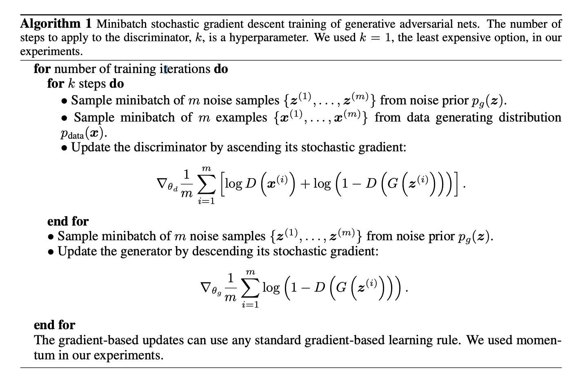

# GAN

논문 리뷰

[TOC]

---

[출처](https://arxiv.org/pdf/1406.2661.pdf)

- 제일 처음 발간된 GAN 논문

## Introduction

Generative Adversarial Nets의 줄임말인 GAN은 2014년에 고안된 딥러닝 모델이다. GAN은 크게 두 부분으로 나뉘는데 이는 다음과 같다.

- Generative Model $G$
    - data의 distribution을 추정하는 모델
- Discriminative Model $D$
    - sample이 $G$에서부터 나온 것이 아니라 training data set에서 나왔을 확률을 추정하는 모델

GAN의 목표는 기존 딥러닝이 해오던 분류를 잘하는 $D$를 만드는 것이 목표가 아니다. GAN의 목표는 $G$의 출력값인 $x$가 모델에서부터 나왔는지 training data set에서부터 나왔는지 $D$가 구분하지 못하게 하는 것이 목표이다. 논문에선 임의와 $G$와 $D$의 공간에서 $G$는 training data distribution을 recovering하고, $D$는 모든 곳에서 1/2를 출력하는 유일한 solution이 존재한다는 것을 밝혀냈다.

이 논문에서는 $G$와 $D$를 multilayer perceptron으로 구현했지만, adversarial nets은 굳이 multilayer perceptron일 필요가 없고, 임의의 모델이어도 된다(심지어 딥러닝 모델이 아니어도 된다).

---

## Adversarial Nets

1. $G(z; \theta_g)$

$G(z; \theta_g)$는 $p_z(z)$ 라는 distribution을 따르는 z에 대해서, $x_{model}$을 출력하는 함수이다.

```python
# z로 사용되는 noise 데이터
noise = np.random.normal(0, 1, (half_batch, 100))
# 평균, 분산, 사이즈=(batchsize, noise_length)
# 평균이 0, 분산이 1인 p_z(z)를 따르는 z(변수명 noise)
```

2. $D(x; \theta_d)$

$D(x; \theta_d)$는 input으로 $x_{data}$ 혹은 $x_{model}$을 받고, input이 training data set에서 왔을 확률을 출력한다.

GAN은 $D$를 데이터에 대해 올바른 label에 대한 확률을 출력할 수 있게 훈련하고, 동시에 $G$는 $log(1 - D(G(z)))$를 최소화하도록 훈련한다. 이를 명확한 수식으로 작성하면 다음과 같다.
$$
\operatorname{min}_G \operatorname{max}_D V(D, G) = \mathbb{E}_{x\sim p_{data}(x)}[\operatorname{log}D(x)] + \mathbb{E}_{z\sim p_z(z)}[\operatorname{log}(1 - D(G(z)))]
$$
기본적으로 $D$는 확률인 0고 1사이의 숫자를 출력하므로 $V(D, G)$는 음수이다. 훈련하는 동안 $V(D, G)$는 $D$에 대해서, maximized되고, $G$에 대해서는 minimized된다.

- $D(x; \theta_d)$에 대해서는 V(D, G)가 score function, 높으면 좋은 함수
- G에 대해서는 V(D, G)가 loss function, 낮으면 좋은 함수

- $x$가 만약 $p_{data}(x)$에서부터 온 데이터라면 $D(x)$는 1에 가까운 수를 출력해야 $V(D, G)$를 높일 수 있고, 0에 가까운 수를 출력하면 $V(D, G)$가 낮아진다.
- $x$가 만약 $p_z(z)$에서부터 온 데이터라면 $D(x)$가 1에 가까운 수를 출력하면 $V(D, G)$ 값이 낮아지고, 0에 가까운 수를 출력해야 $V(D, G)$ 값이 커진다.
- $G(z)$는 $D(G(z))$가 1에 가까운 수를 출력하게 하여 $V(D, G)$ 값을 낮게 해야한다.

훈련하는 동안은 계산 비용의 문제로 epoch 당 매번 완벽하게 D를 최적화하는 대신 k번 gradient descent를 하고, 1번 G를 gradient descent를 한다. 이런 방식을 사용하면, G가 천천히 바뀐다면, D는 optimal solution 근처에 있게 된다.

추가로, 초기에는 $G(z)$가 $p_{data}(x)$의 데이터와 아주 많이 달라 $\operatorname{log}(1-D(G(z)))$가 거의 0에 가깝기 때문에, 아주 작은 gradient를 만든다. 따라서 이를 해결하고자, 학습 초기에는 $\operatorname{log}(1-D(G(z)))$를 최소화하는대신 $\operatorname{log}(D(G(z)))$를 최대화하게 학습한다.

---

## Theoretical Results

### Main Algorithm



