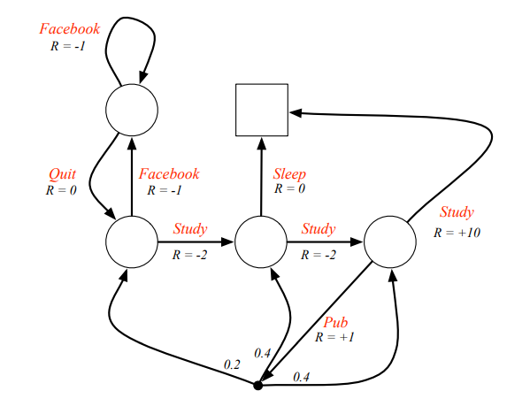

# Reinforcement Learning1

출처: http://www0.cs.ucl.ac.uk/staff/d.silver/web/Teaching.html

## Index

[TOC]

---

## Introduction - Reinforcement Learning

강화학습이란 어떤 환경 안에서 정의된 에이전트가 현재의 상태를 인식하여, 선택 가능한 행동들 중 보상을 최대화하는 행동 혹은 행동 순서를 선택하는 방법이다.

이 정의에서 중요한 키워드는 다음과 같다.

환경(environment)

에이전트(agent)

행동(action)

보상(reward)

행동 혹은 행동 순서를 선택(policy)

강화 학습에서 다루는 '환경'은 주로 마르코브 결정 과정(MDP, Markov Decision Processes)으로 주어진다.

여기서 나오는 **환경, 에이전트, 행동, 보상, 마르코브 결정 과정**의 정의는 밑에 예시로 알아가보자.

---

### MDP(Markov Decision Processes)

#### Markov Chains

key words

**환경**, **에이전트**, **상태**, **행동**, **에피소드**

**environment**, **agent**, **state**, **action**, **episodes**

위에 그림은 Markov Chains의 한 예이다.

**에이전트**는 학생이며, 각 노드에 존재할 수 있다.

노드들은 **에이전트**가 있을 수 있는 **상태**(state)이다.

에이전트가 각 상태에서 취할 수 있는 **행동**들은 화살표 방향으로 가는 것이고, 에이전트가 속해있는 상태에 따라 한 행동을 선택할 확률들이 화살표에 표시되어 있다.

여기서 환경이란 이 그림이 표현하는 전반적인 상황이다. 상태는 환경에 속해있고, 에이전트는 환경을 벗어날 수 없다.

이러한 마르코브 환경에서 상태 s에서 상태 s'으로 갈 수 있는, 혹은 가게 되는 확률을 정의할 수 있는데 이를 state transition probability라고 부르고 위에 수식처럼 정의한다. 여기서 '|'는 contitional probability를 나타내는 것이 아니라, P함수가 $S_t \rightarrow S_{t+1}$인 함수라는 것을 나타낸다. 이렇게 정의된 P함수는 다음과 같이 matrix로도 정의할 수 있다.

예시의 state transition matrix는 다음과 같다. 빈곳은 0

다시 그림을 보자.

여기서 우리는 에피소드(episodes)를 정의할 수 있다. 에피소드란 에이전트가 에이전트의 시작 상태부터 종료 상태에 도달하여 움직이지 않을 때까지의 상태들을 말한다.

---

#### Markov Reward Process

key words

**reward**, **discount factor**, **return**, **state value function**

Markov reward process는 value가 주어진 Markov chain이다. 

위 예시는 Markov chain을 배울 때 보았던 그림에 각 상태 별 reward를 추가한 것이다.

Markov Reward Process의 formal한 정의는 다음과 같다.

여기서 reward function은 현재 agent의 t번 째 상태가 s일 때, 다음 t+1번 째 얻을 수 있는 reward의 평균값인데, 이는 $P_{ss'}$이 정의되었기 때문에 구할 수 있다. 

이 reward와 discount factor로 return $G_t$를 정의할 수 있다.

return은 한 에피소드가 진행되었을 때, time-step t에서부터 에피소드 끝까지 받았던 reward와 discount factor의 power를 곱해 더한 값이다. discount factor가 1에 가까울 수록 미래의 reward를 중요하게 여긴다고 생각할 수 있다.

이러한 return, state를 통해 state value function v(s)를 정의할 수 있다.

이 함수는 agent의 t의 상태가 s일때, 앞으로 생각할 수 있는 episodes를 이용하여 return과 확률을 구하고, 이를 곱하고 더해 평균을 구하는 함수이다.

이러한 state value function을 구할 수 있게 하기 위한 필수적인 공식이 있는데 이는 Bellman equation이라고 한다.

Theorem1. Bellman equation.

​	$$v(s) = R_s + r \sum_{s'\in S} P_{ss'}v(s')$$

proof)

$\begin{matrix}
v(s) &=& \mathbb{E}[G_t | S_t = s] \\
       &=& \mathbb{E}[R_{t+1} + \gamma R_{t+2} +\gamma^2R_{t+3} + \cdots | S_t = s] \\
       &=& \mathbb{E}[R_{t+1} + \gamma (R_{t+2} +\gamma R_{t+3} + \cdots) | S_t = s] \\
       &=& \mathbb{E}[R_{t+1} + \gamma G_{t+1} | S_t = s] \\
       &=& R_s + r \sum_{s'\in S} P_{ss'}v(s') \\
\end{matrix}$

이 Bellman equation을 matrix를 이용하여 간결하게 쓸 수 있다.

Bellman equation은 하나의 선형방정식이기 때문에 바로 솔루션을 구할 수 있다. 하지만 이 솔루션의 계산복잡도는 $O(n^3)$(n은 state의 개수)이기 때문에 state의 개수가 너무 많다면 계산하기 어렵다.

---

#### Markov Decision Process

**policy**, **action-value function**

Markov Decision Process란 decision이 있는 Markov reward process다.

자세한 정의는 다음과 같다.

MDP에서는 한 state에서 다른 state로 넘어갈 때, action이라는 요소가 추가된다. 이에 따라 reward function에도 변화가 생겼다. 본 예제에서는 Pub이 아닌 행동을 선택한다면 다음 state가 1의 확률로 정해지고 Pub을 선택하면, 0.2, 0.4, 0.4의 확률로 C1, C2, C3의 state가 된다.

- 일반적인 MDP 그림

우리는 이제 action에 대한 선택이 생겼고 이에 대한 전략을 policy라고 말한다. policy는 action을 정하는 확률 분포 함수 형태로 표현되며 자세한 정의는 다음과 같다.

이러한 policy에 따라 추가적인 notation인 $P^{\pi}_{s, s'}, R^{\pi}_{s}$의 정의가 필요하다.

- $P^{\pi}_{s, s'}$: state s에서 policy $\pi$를 취할 때, state s'에 도달할 확률
- $R^{\pi}_{s}$: state s에서 policy $\pi$를 취할 때, 얻을 수 있는 reward

이제 확률 P와 reward R에 대한 정의가 생겼으니 state-value function을 다시 정의할 수 있다. 

이제 추가로 action-value function을 정의한다. action-value function은 t 번째 state에서 특정 a라는 action을 취했을때, 얻게 되는 return의 평균값을 나타내는 함수다.

이를 이용해 optimal function들을 정의할 수 있다.

policy $\pi$에 의해 결정되는 $v_\pi(s)$과 $q_{\pi}(s, a)$도 Bellman equation으로 표현할 수 있다.

Theorem2. Bellman Expectation Equation

- $v_\pi(s) = \sum_{a \in A}\pi(s|a)(R^a_s + \gamma \sum_{s'\in S}P^a_{ss'}v_\pi(s'))$
- $q_\pi(s, a) = R^a_s + \gamma \sum_{s'\in S}P^a_{ss'}\sum_{a\in A}\pi (a'|s')q_\pi(s', a')$

proof)

we can rewrite 

​	$v_\pi(s) = \sum_{a\in A}\pi(a|s)q_\pi(s, a)$. (1)

Also, 

​	$q_\pi(s, a) = R^a_s + \gamma\sum_{s' \in S}P^a_{ss'}v_\pi(s')$. (2)

So, combining (1) and (2), we can conclude the theorem2.

Theorem3.

For any Markov Decision Process, there exists an optimal policy $\pi_*$ that is better than or equal to all other policies, i.e.. $v_{\pi_*}(s) \geq v_\pi(s), q_{\pi_*}(s, a) \geq q_\pi(s, a), \forall \pi$ and $v_{\pi_*}(s) = v_*(s), q_{\pi_*}(s, a) = q_*(s, a)$

---

#### Finding an Optimal Policy

Optimal Policy는 $q_*(s, a)$를 최대화하면서 얻을 수 있다.

어떠한 MDP에서도 deterministic한 optimal policy를 찾을 수 있다.

**Optimal Value Function for Student MDP**

**Optimal Action-Value Function for Student MDP**

**Optimal Policy for Student MDP**

우리는 결국 밑에 있는 식을 만족하는 $v_*(s)$ 혹은 $q_*(s, a)$를 구해내면 된다.

- $v_*(s) = max_a(R^a_s + \gamma \sum_{s'\in S}P^a_{ss'}v_\pi(s'))$
- $q_*(s, a) = R^a_s + \gamma \sum_{s'\in S}P^a_{ss'}max_{a'}( q_\pi(s', a'))$

하지만 위 방정식은 non-linear이고 MRP처럼 역행렬을 이용해 구할 수 없다. 이를 해결하기 위해 다른 solution method이 존재한다.

- Value Iteration
- Policy Iteration
- Q-learning
- Sarsa

---

## Model-based RL - Dynamic Programming

### Policy Evalution and Improvement steps

policy가 고정되어 있다면, 그 policy에 대한 state value function을 구할 수 있고, state value function이 고정되어 있다면, 그 state value function에 대한 optimal policy를 구할 수 있다.

1. 먼저 임의로 초기화된 policy $\pi_0$가 있고, state value function $v_0$를 모든 state s에 대해 0의 값을 갖게 초기화하자.
2. 그렇다면 $\pi_0$에 대해서 state value function을 업데이트할 수 있다.
   - MRP에서 구했던 것처럼 Bellman equation을 이용해 구할 수 있다.
   - 이를 state value function $v_1$이라 하자(formally $v_{\pi_0}$)
3. $v_1$을 이용하여 greedy하게 policy $\pi_1$를 구할 수 있다.
   - $\pi_1 = greedy(v_1)$
   - $\pi_1(s) = \operatorname{argmax}_{a\in A}q_\pi(s, a)$
4. $\pi_k$와 $v_k$가 수렴할 때까지 이를 반복한다.

이에 대한 $\pi_k$와 $v_k$수렴성은 보장되어 있고 이는 $\pi_*, v_*$로 수렴한다.

### Value Iteration

1. state value function $v_1$을 모든 state에 대해 0으로 초기화한다.

2. 수렴할 때까지

   - $v_{new}(s) \leftarrow \operatorname{max}_{a\in A}(R^a_s + \gamma \sum_{s' \in S} P^a_{ss'}v_{old}(s'))$

   를 반복한다.
   
3. 수렴한 state value function을 이용하여, optimal policy를 구한다.

Policy iteration과는 다르게 명확한 policy가 정의되지 않기 때문에, 중간에 있는 state value function에 해당하는 policy iteration은 존재하지 않을 수도 있다.

---

## Model-free RL

Model-based RL에서는 환경에 대해 모든 것을 알고 있다고 가정하고, 이를 이용하여 policy와 state-value-function을 구했다. 하지만 많은 경우 환경에 대한 정보가 충분하게 주어지지 못한다. 이러한 상태를 model-free라고 하며 MDP transition이나 reward에 대해 전혀 아는 것이 없는 상태이다. 하지만 여러 실험을 통해 $v_\pi(s), q_\pi(s, a)$ 혹은 $\pi(s, a)$를 추정할 수 있다면, optimal state value function과 policy를 추정할 수 있을 것이다. 

$v_\pi(s), q_\pi(s, a)$를 추정하여 optimal policy를 추정하는 방법에는 대표적으로 Monte-Carlo Learning와 Temporal-Difference이 있다.

$\pi(s, a)$를 직접 추정할 수도 있는데 이를 policy gradient라고 하며, NLP에서는 시퀀스 생성 작업에 자주 쓰이는 방법이다.

