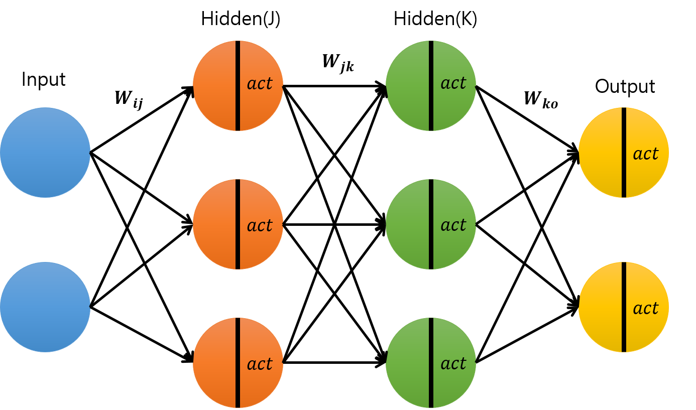
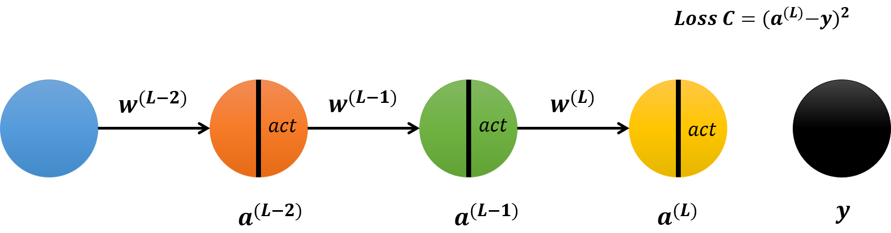
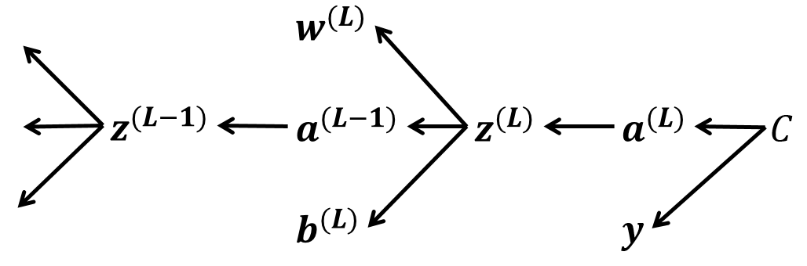
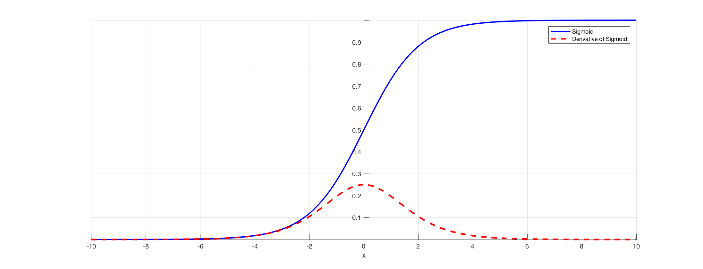

# Gradient Problem

* 참고 사이트
  * [databuzz](https://databuzz-team.github.io/2018/12/27/Back-Propagation-Part-2/)
  * [3blue1brown](https://www.youtube.com/watch?v=tIeHLnjs5U8&list=PLZHQObOWTQDNU6R1_67000Dx_ZCJB-3pi&index=4)

Vanishing Gradient, Exploding Gradient 등의 Gradient Problem은 인공신경망에서 기울기(gradient)를 기반으로 하는 방법(backpropagation)으로 학습시킬 때 발생하는 어려움이다.

이 말을 이해하기 위해서는 먼저 역전파가 어떠한 방식으로 동작하는지 이해할 필요가 있다.

## 역전파

먼저 다음과 같은 네트워크가 있다고 가정한다.

이 네트워크를 단순화 하면 다음과 같은 모양이 된다.

활성화 함수가 시그모이드라고 가정했을 때, 다음과 같은 식을 도출할 수 있다.
$$
\begin{align*}
z^{(L)}&=w^{(L)}a^{(L-1)}+b^{(L)}\\
a^{(L)}&=\sigma(z^{(L)})\\
C&=(a^{(L)}-y)^2
\end{align*}
$$
이 상태에서 가중치 $w^{(L)}$에 대한 손실함수 $C$의 변화량을 체인룰을 사용해 구할 수 있다.
$$
\begin{align*}
\frac{\partial C}{\partial w^{(L)}} &= \frac{\partial z^{(L)}}{\partial w^{(L)}}\frac{\partial a^{(L)}}{\partial z^{(L)}}\frac{\partial C}{\partial a^{(L)}}\\
&=a^{(L-1)}\sigma' z^{(L)}2(a^{(L)}-y)\\
\frac{\partial C}{\partial a^{(L-1)}} &= \frac{\partial z^{(L)}}{\partial a^{(L-1)}}\frac{\partial a^{(L)}}{\partial z^{(L)}}\frac{\partial C}{\partial a^{(L)}}\\
&=w^{(L)}\sigma' z^{(L)}2(a^{(L)}-y)\\
\frac{\partial C}{\partial b^{(L)}} &= \frac{\partial z^{(L)}}{\partial b^{(L)}}\frac{\partial a^{(L)}}{\partial z^{(L)}}\frac{\partial C}{\partial a^{(L)}}\\
&=1\sigma' z^{(L)}2(a^{(L)}-y)
\end{align*}
$$
같은 방법으로 $w^{(L-1)}$에 대한 변화량도 구할 수 있다.
$$
\begin{align*}
\frac{\partial C}{\partial w^{(L-1)}} &= \frac{\partial z^{(L-1)}}{\partial w^{(L-1)}}\frac{\partial a^{(L-1)}}{\partial z^{(L-1)}}\frac{\partial C}{\partial a^{(L-1)}}\\
&=a^{(L-2)}\sigma' z^{(L-1)}(w^{(L)}\sigma' z^{(L)}2(a^{(L)}-y))\\
\vdots
\end{align*}
$$
이 때, $gradient^{(L-1)}$를 구하기 위해 사용되는게 이전 단계에서 구한 가중치 $w^{(L)}$라는 점을 파악해야한다. 이 부분 때문에 초기 가중치를 0으로 설정하지 않는다. $gradient$가 0이 되어 가중치의 업데이트가 일어나지 않는 것을 방지하기 위함이다.

체인룰 과정을 그림으로 도식화하면 다음과 같다.

이 방식을 사용해 단순화한 네트워크에서 처음에 가정한 네트워크로 확장시킬 수 있다.
$$
\begin{align*}
z_o&=w_{ko}a_o+b_{ko}\\
a_o&=\sigma(z_o)\\
C&=\Sigma(a_o-y)^2
\end{align*}
$$

## Vanish Gradient Problem

### 원인

앞에서 $gradient$를 구할 때, Layer를 타고 갈수록 활성화 함수를 미분한 값을 계속하여 곱하는 것을 볼 수 있었다. 이 과정에서, 활성화 함수로 시그모이드 함수를 사용하면 에러를 전파하는 과정에서 1보다 작은 값을 계속 곱해주게 되는 문제가 생긴다.
$$
\sigma' = \sigma(x)(1-\sigma(x))
$$

Layer의 층이 깊어질수록 이 문제는 커져서, 최종적으로 초기 Layer에 다다랐을 때 gradient가 0으로 수렴하여 초기 가중치는 아예 업데이트가 되지 않을 수도 있다. 이것이 **vanish gradient problem**이 일어나게 되는 주요 원인이다. 반대로 활성화 함수를 미분했을 때 1보다 큰 값을 가지게 된다면, **exploding gradient problem**이 발생한다.

### 해결방안

1. 활성화 함수를 바꾼다. => ReLU
2. 가중치 행렬을 적당한 값으로 잘 초기화시켜준다.
3. Regularization을 사용한다.

