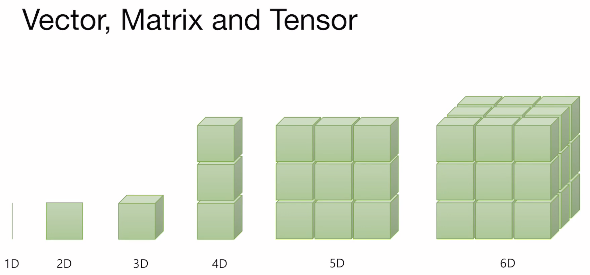
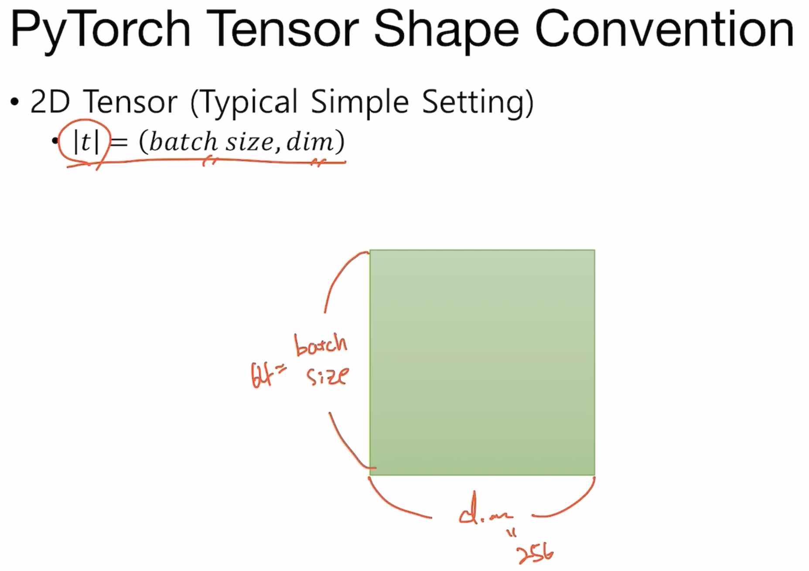
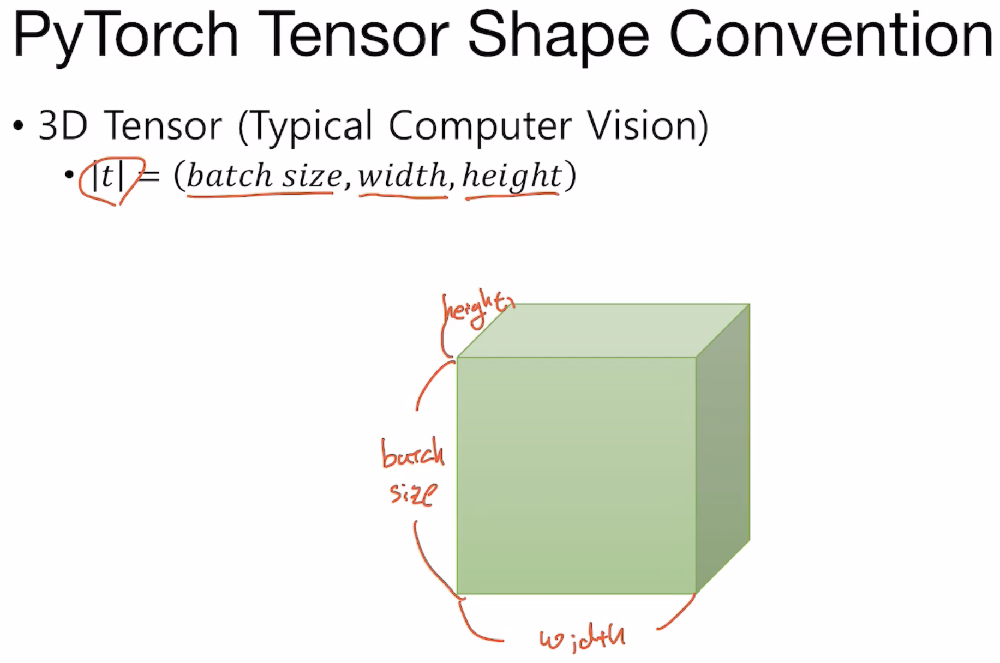
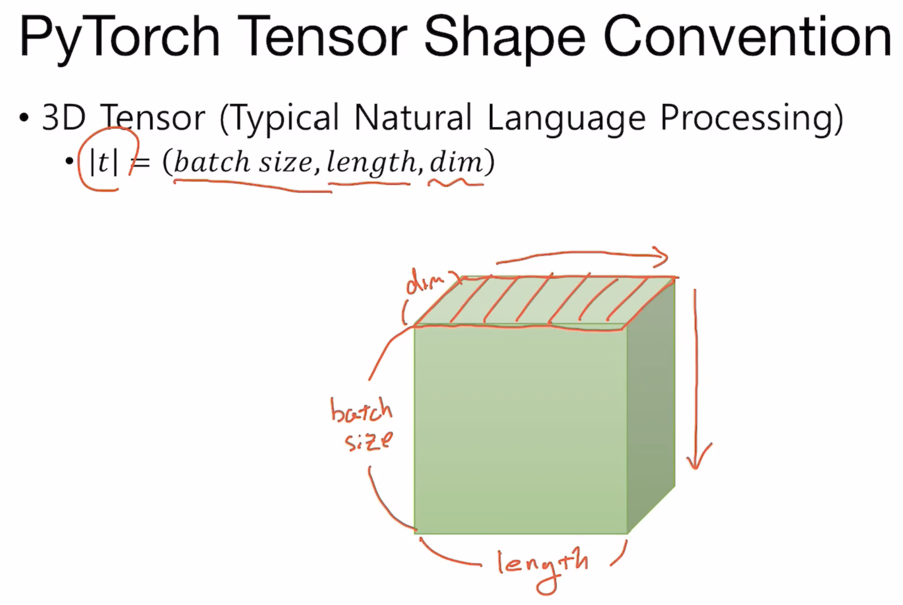
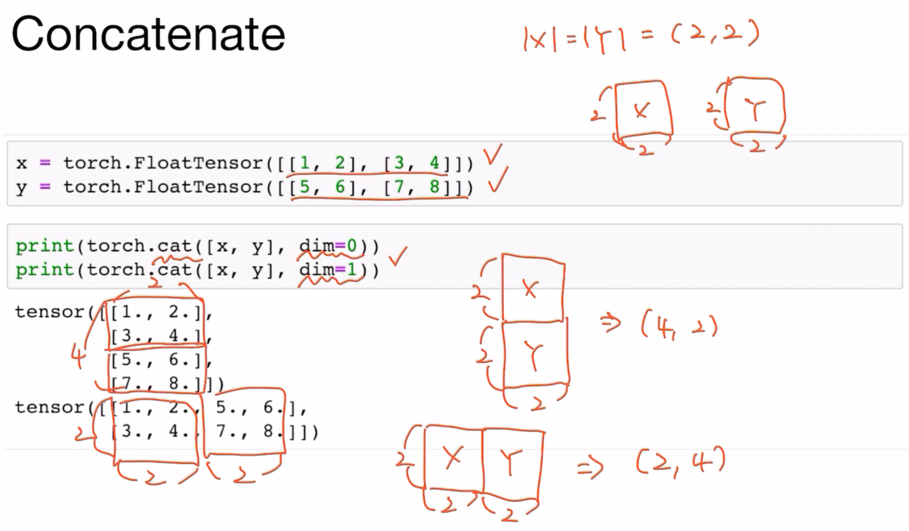

# 1. Tensor

## 1-1. Dimension, 차원



Dimension은 PyTorch operator들의 parameter로 자주 사용되며, `dim=0` 과 같은 형태로 지정할 수 있습니다. `dim=0`은 첫 번째 차원을 의미합니다.

1D는 Vector의 개념과 같으며, 2D는 Matrix, 3D 이상은 Tensor입니다. PyTorch를 사용하면서는 1D Tensor, 2D Tensor 등으로 사용하게 됩니다.

코드로 표현함에 있어서 벡터의 형태는 **열 벡터**를 사용하므로 세로 형태를 띄며, 차원을 늘려가면서는 위의 그림과 같은 진행 방향으로 늘어나게 됩니다.







<br>

<br>

## 2D Slicing

PyTorch에서는 일반적인 Python보다 편리한 slicing 기능을 제공합니다.

```python
tensor_2D = torch.FloatTensor([[1., 2., 3.], [4., 5., 6.], [7., 8., 9]])
print(tensor_2D.dim()) # Rank
print(tensor_2D.shape) # Shape
print(tensor_2D.size()) # Size
print('\ntensor_2D[:, 1]')
print(tensor_2D[:, 1]) # 첫 번째 차원 전부, 두 번째 차원 1번 인덱스만
print(tensor_2D[:, 1].size())
print('\ntensor_2D[:, :-1]')
print(tensor_2D[:, :-1])
print(tensor_2D[:, :-1].size())
print('\ntensor_2D[1:3, :]')
print(tensor_2D[1:3, :])
print(tensor_2D[1:3, :].shape)
```

```bash
2
torch.Size([3, 3])
torch.Size([3, 3])

tensor_2D[:, 1]
tensor([2., 5., 8.])
torch.Size([3])

tensor_2D[:, :-1]
tensor([[1., 2.],
        [4., 5.],
        [7., 8.]])
torch.Size([3, 2])

tensor_2D[1:3, :]
tensor([[4., 5., 6.],
        [7., 8., 9.]])
torch.Size([2, 3])
```

<br>

<br>

## Broadcasting & Multiplication

Broadcasting은 Numpy 또한 제공하는 기능입니다. 사용하기 편리하게 차원과 Shape을 알아서 변경해주는 만큼, 의도치 않은 작동을 유의해야합니다.

```python
## Broadcasting
print('\n>> Broadcasting')
# Same Shape
t1 = torch.FloatTensor([[2, 3]])
t2 = torch.FloatTensor([[2, 3]])
print('Same Shape: ', t1 + t2)

# Scalar + Vector
t1 = torch.FloatTensor([[3]])
t2 = torch.FloatTensor([[2, 3]])
print('Scalar + Vecotr: ', t1 + t2)

# (2x1 Vector) + (1x2 Vector)
# 각각을 2x2로 변형하여 계산
t1 = torch.FloatTensor([[1, 2]])
t2 = torch.FloatTensor([[3], [4]])
print('2x1 Vector + 1x2 Vector:\n', t1 + t2)
```

```bash
>> Broadcasting
Same Shape:  tensor([[4., 6.]])
Scalar + Vecotr:  tensor([[5., 6.]])
2x1 Vector + 1x2 Vector:
 tensor([[4., 5.],
        [5., 6.]])
```

<br>

<br>

## Multiplication

```python
## Multiplication
# Matrix Multiplication, 행렬곱
m1 = torch.FloatTensor([[1, 2], [3, 4]]) # 2x2
m2 = torch.FloatTensor([[1], [2]]) # 2x1
print('>> Matrix Multiplication, m1.matmul(m2):\n', m1.matmul(m2)) # 2x1

# Broadcasting + Multiplication
m1 = torch.FloatTensor([[1, 2], [3, 4]]) # 2x2
m2 = torch.FloatTensor([[1], [2]]) # 2x1
# 2를 2x2로 변환하여 요소별 곱
# m2 => [[1, 1], [2, 2]]
print('>> Broadcasting + Multiplication, m1*m2, m1.mul(m2):')
print(m1 * m2)
print(m1.mul(m2))
```

```bash
>> Matrix Multiplication, m1.matmul(m2):
 tensor([[ 5.],
        [11.]])

>> Broadcasting + Multiplication, m1*m2, m1.mul(m2):
tensor([[1., 2.],
        [6., 8.]])
tensor([[1., 2.],
        [6., 8.]])
```

<br>

<br>

## Mean & Sum

```python
## Mean
print('>> Mean')
# Numpy와 유사하지만, Dimension argument의 명칭이 numpy에서는 axis, PyTorch는 dim
# mean()은 integer에 대해서는 불가하므로, LongTensor()로는 불가
t = torch.FloatTensor([1, 2])
print('t.mean() = ', t.mean())
t = torch.FloatTensor([[1, 2, 3], [4, 5, 6], [7, 8, 9]])
print('[[1, 2, 3], [4, 5, 6], [7, 8, 9]]')
print(t.mean()) # 전체 요소들 평균
print('dim= 0: ', t.mean(dim=0))
print('dim= 1: ', t.mean(dim=1))
print('dim=-1: ', t.mean(dim=-1))

## Sum
print('\n>> Sum')
# t.sum() 형태, mean()과 동일한 형태
print('[[1, 2, 3], [4, 5, 6], [7, 8, 9]]')
print(t.sum()) # 전체 요소들 평균
print('dim= 0: ', t.sum(dim=0))
print('dim= 1: ', t.sum(dim=1))
print('dim=-1: ', t.sum(dim=-1))
```

```bash
>> Mean
t.mean() =  tensor(1.5000)
[[1, 2, 3], [4, 5, 6], [7, 8, 9]]
tensor(5.)
dim= 0:  tensor([4., 5., 6.])
dim= 1:  tensor([2., 5., 8.])
dim=-1:  tensor([2., 5., 8.])

>> Sum
[[1, 2, 3], [4, 5, 6], [7, 8, 9]]
tensor(45.)
dim= 0:  tensor([12., 15., 18.])
dim= 1:  tensor([ 6., 15., 24.])
dim=-1:  tensor([ 6., 15., 24.])
```

<br>

<br>

## View

```python
## View
print('\n>> View')
# Numpy의 Reshape과 동일 기능
# shape [2, 2, 3]
np_3D = np.array([[[0, 1, 2],
                    [3, 4, 5]],

                    [[6, 7, 8],
                    [9, 10, 11]]])
t = torch.FloatTensor(np_3D)
print(t.shape)
# 2D로 축소해 보기, 1 차원에서는 3개의 원소를 가지며, 2 차원에서는 알아서(-1)
print(t.view([-1, 3]))
print(t.view([-1, 3]).shape)
# 같은 3D이지만, 다른 shape
print(t.view([-1, 1, 3]))
print(t.view([-1, 1, 3]).size())
```

```bash
>> View
torch.Size([2, 2, 3])
tensor([[ 0.,  1.,  2.],
        [ 3.,  4.,  5.],
        [ 6.,  7.,  8.],
        [ 9., 10., 11.]])
torch.Size([4, 3])
tensor([[[ 0.,  1.,  2.]],

        [[ 3.,  4.,  5.]],

        [[ 6.,  7.,  8.]],

        [[ 9., 10., 11.]]])
torch.Size([4, 1, 3])
```

<br>

<br>

## Max & Argmax

```python
## Max & Argmax
print('\n>> Max & Argmax')
# argmax는 max 값의 index를 반환
print('t.max() = ', t.max())
print('t.argmax() = ', t.argmax()) # 하나의 배열에서 찾은 것 처럼 인덱싱
print(t.max(dim=0))
print(t.max(dim=0)[0])
print(t.max(dim=0)[1])
print(t.argmax(dim=0))
# argmax()는 max()[1]과 동일하며, max() 만으로도 확인 가능
```

```bash
>> Max & Argmax
t.max() =  tensor(9.)
t.argmax() =  tensor(8)
torch.return_types.max(
values=tensor([7., 8., 9.]),
indices=tensor([2, 2, 2]))
tensor([7., 8., 9.])
tensor([2, 2, 2])
tensor([2, 2, 2])
```

<br>

<br>

## Squeeze & Unsqueeze

```python
## Squeeze
print('\n>> Squeeze')
# View와 동일한 역할이지만, Dimension의 element의 개수가 1일 경우, 그 dimension을 삭제
# shape [3, 1]
t = torch.FloatTensor([[0], [1], [2]])
print(t)
print(t.shape)
print(t.squeeze().shape)
print('dim=0: ', t.squeeze(dim=0).shape)
print('dim=0: ', t.squeeze(0).shape)
print(t.squeeze(0))
print('dim=1: ', t.squeeze(dim=1).shape)
print('dim=1: ', t.squeeze(1).shape)
print(t.squeeze(1))

## Unsqueeze
print('\n>> Unsqueeze')
t = torch.FloatTensor([1, 2, 3])
print(t)
print(t.shape)
print(t.squeeze().shape)
print('dim=0: ', t.unsqueeze(0).shape)
print(t.unsqueeze(0))
print('dim=1: ', t.unsqueeze(1).shape)
print(t.unsqueeze(1))
```

```bash
>> Squeeze
tensor([[0.],
        [1.],
        [2.]])
torch.Size([3, 1])
torch.Size([3])
dim=0:  torch.Size([3, 1])
dim=0:  torch.Size([3, 1])
tensor([[0.],
        [1.],
        [2.]])
dim=1:  torch.Size([3])
dim=1:  torch.Size([3])
tensor([0., 1., 2.])

>> Unsqueeze
tensor([1., 2., 3.])
torch.Size([3])
torch.Size([3])
dim=0:  torch.Size([1, 3])
tensor([[1., 2., 3.]])
dim=1:  torch.Size([3, 1])
tensor([[1.],
        [2.],
        [3.]])
```

<br>

<br>

## Type Casting

```python
## Type Casting
print('\n>> TypeCasting')
lt = torch.LongTensor([1, 2, 3, 4])
print(lt)
print(lt.float())
# Boolean
bt = torch.ByteTensor([True, False, False, True])
print(bt)
print(bt.long())
print(bt.float())
```

```bash
>> TypeCasting
tensor([1, 2, 3, 4])
tensor([1., 2., 3., 4.])
tensor([1, 0, 0, 1], dtype=torch.uint8)
tensor([1, 0, 0, 1])
tensor([1., 0., 0., 1.])
```

<br>

<br>

## Concatenation

Tensor들을 concatenate 하는 방법은 두 가지가 있으며, 자동적으로 원하지 않는 형태로 이루어지는 것을 방지해야 합니다.

1. `dim=0`
2. `dim=1`, `dim=-1`

`dim=0`은 첫 번째 차원을, `dim=1`은 두 번째 차원을 기준으로 concatenate 합니다. 이는 Numpy의 `axis`와 동일한 기능을 합니다.

### 예시

Concatenating operation의 dimension 활용 예시입니다.

```python
# Concatenation
x = torch.FloatTensor([[1, 2], [3, 4]]) # [2, 2]
y = torch.FloatTensor([[5, 6], [7, 8]]) # [2, 2]
print(torch.cat([x, y], dim=0)) # [4, 2]
print(torch.cat([x, y], dim=1)) # [2, 4]
```

```bash
tensor([[1., 2.],
        [3., 4.],
        [5., 6.],
        [7., 8.]])
tensor([[1., 2., 5., 6.],
        [3., 4., 7., 8.]])
```



<br>

<br>

## Stacking

Stacking operation의 dimension 활용 예시입니다.

```python
# Stacking
x = torch.FloatTensor([1, 4]) # [2,]
y = torch.FloatTensor([2, 5]) # [2,]
z = torch.FloatTensor([3, 6]) # [2,]
print(torch.stack([x, y, z])) # [3, 2]
print(torch.stack([x, y, z], dim=1)) # [2, 3]
```

```bash
tensor([[1., 4.],
        [2., 5.],
        [3., 6.]])
tensor([[1., 2., 3.],
        [4., 5., 6.]])
```

<br>

<br>

## Ones & Zeros

```python
## Ones and Zeros
print('\n>> Ones and Zeros')
x = torch.FloatTensor([[0, 1, 2], [2, 1, 0]])
print(x)
print(torch.ones_like(x))
print(torch.zeros_like(x))
# multiple device를 사용하여 연산할 때, 다른 device의 변수와 계산을 하려 하면 에러 발생
# 만약 x를 기반으로 변수를 선언하면 x가 위치한 device에서 변수를 생성
# 따라서 device 차이로 인한 에러를 방지할 수 있다.
```

```bash
tensor([[0., 1., 2.],
        [2., 1., 0.]])
tensor([[1., 1., 1.],
        [1., 1., 1.]])
tensor([[0., 0., 0.],
        [0., 0., 0.]])
```

<br>

<br>

## In-place Operation

```python
print('\n>> In-place Operation')
# 추가적인 메모리 사용 없이, 기존 메모리에 그대로 결과를 삽입하는 연산
x = torch.FloatTensor([[1, 2], [3, 4]])
print(x.mul(2.))
print(x) # 그대로
print(x.mul_(2.))
print(x) # 곱한 값이 저장되어 있다.
# 기능이 존재하지만, python garbage collector의 자동적인 메모리 free 기능으로 인해
# 사실상 성능 차이는 거의 없다고 PyTorch 측에서 인정
```

```bash
>> In-place Operation
tensor([[2., 4.],
        [6., 8.]])
tensor([[1., 2.],
        [3., 4.]])
tensor([[2., 4.],
        [6., 8.]])
tensor([[2., 4.],
        [6., 8.]])
```

