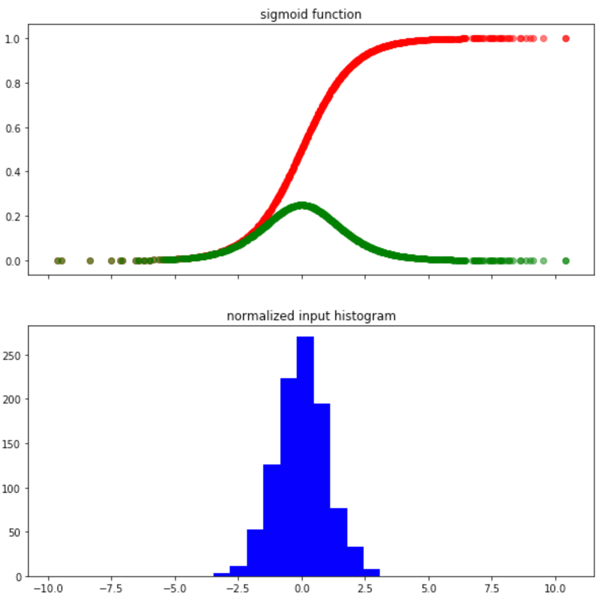

# Batch Normalization

- 참고사이트
  - [황준식님의 블로그](https://jsideas.net/batch_normalization/)
  - [batch normalization paper](https://arxiv.org/abs/1502.03167)
  - [김범수님의 블로그]([https://shuuki4.wordpress.com/2016/01/13/batch-normalization-%EC%84%A4%EB%AA%85-%EB%B0%8F-%EA%B5%AC%ED%98%84/](https://shuuki4.wordpress.com/2016/01/13/batch-normalization-설명-및-구현/))

## 배경

### 정규화

신경망이나 머신러닝 모델을 학습시킬 때 보통 입력값을 0~1 사이, 혹은 평균과 표준편차를 사용해서 정규화나 표준화를 한다. 정규화의 효과에는 다음과 같은 것들이 있다.

- 모델 학습이 피쳐(변수)의 스케일에 너무 민감해지는 것을 막는다.
- Regularization이 스케일의 차이에 다르게 적용된다.
- 모델간 결과 비교가 용이하다.
- **모델 최적화**에 용이하다.

다음은 동일한 데이터에 대해 정규화를 했을 때와 하지 않았을 때의 gradient descent 그림이다.

[이미지출처](https://www.wandb.com/articles/fundamentals-of-neural-networks)

동일한 데이터지만 최적점에 도달하기 위해 정규화를 한 쪽이 훨씬 빠르게 도달할 수 있는 것을 볼 수 있다. 이처럼 인풋의 스케일을 정규화하는 것 만으로도 gradient descent를 빠르게 학습시킬 수 있다. 그런데 인풋데이터만이 아니라 심층 신경망의 중간 중간에 위치한 히든 레이어의 인풋도 정규화시킨다면 훨씬 더 효율적으로 학습이 가능하지 않을까? 이런 생각이 Batch Normalization과 맞닿아있다.

### Batch Norm

weight의 변화가 가중되어 쌓일 때, hidden layer를 다수 거치면서 값이 변하게 되고 이는 우리가 원하는 결과와 다른 결과를 갖게 한다. 즉, $k$ 번째 학습과 $k+1$ 번째 학습에서의 분포의 변화가 심해진다는 것을 의미한다. 이를 **internal covariate shift** 현상이라 칭하고, 각 층의 인풋을 정규화하는 문제라고 정의한다. 이러한 문제는 결국 gradient vanishing과 gradient exploding 문제를 일으킨다.

이 문제를 해결하기 위해 활성화 함수의 변화(ReLU 등), 적절한 가중치 초기화, 작은 학습률, Dropout 등의 방법을 사용할 수 있다. 하지만 이 논문에서는 이런 간접적인 방법보다는 데이터에 직접 관여하여 training 과정 자체를 전체적으로 안정화시켜 학습속도를 가속시킬 수 있는 근본적인 방법을 찾고자 하였다.

#### covariate shift

딥러닝이나 머신러닝 모델들은 학습데이터를 기반으로 학습한다. 여자와 남자를 분류하는 모델을 예로 들자. 만약 학습에 사용한 여자 데이터가 모두 `머리가 긴 사람`이었다면, `머리가 긴 남자` 이미지를 이 모델에 넣으면 모델은 어떤 대답을 내놓을까? 얼굴의 특징을 보고 남자라 판단할 수도 있지만, 머리 길이로 인해 여자라고 판단할 수도 있을 것이다.

이처럼 트레이닝에 사용한 학습 데이터와 추론에 사용한 테스트 데이터의 차이가 생기는 것을 `Covariate Shift` 라고 domain adaptation 논문에서는 말하고 있다.

>  When the input distribution to a learning system changes, it is said to experience covariate shift (Shimodaira, 2000). This is typically handled via **domain adaptation** (Jiang, 2008). However, the notion of covariate shift can be extended beyond the learning system as a whole, to apply to its parts, such as a sub-network or a layer.

#### internal covariate shift

논문에서는 이 `Covariate Shift` 문제를 레이어 레벨로 확장한다. 2개의 히든 레이어 ($F_1, F_2$)를 통해 이미지를 처리하는 모델이 있다고 가정하자.
$$
\hat{y} = F_2(F_1(u))\\
\hat{y} = F_2(x)
$$
로 간단하게 표현할 수 있다. 여기서 문제는 $x = F_1(u)$ 이다. 신경막이 학습하면서 역전파를 통해 $F_1$ 레이어의 $weight, bias$ 값이 업데이트 된다. 그리고 업데이트 된 값은 같은 $u$가 들어오더라도 다른 값을 리턴하게 된다. 즉, $k$ 번째와 $k+1$ 번째에서 학습의 분포가 달라진다는 것을 의미한다.

신경망을 학습할 때 모든 데이터를 한번에 모델에 넣어서 gradient를 구하는 방법보다는 더 효율적으로 추정량을 구할 수 있는 $mini\text{-}batch$ 방법을 사용한다. 즉, 첫번째 배치를 통해 업데이트된 $weight$ 와 $bias$ 는 분포가 다를 수 있는 두번째 배치에 적용되어 뒷 레이어에 이를 전파시키므로, 운이 없어 배치간 데이터 분포가 매우 다른 경우 레이어가 일관된 학습을 하기 어려워진다.

앞에서 언급했듯이 논문에서는 이를 **internal covariate shift** 라 명명한다.

> We refer to the change in the distributions of internal nodes of a deep network, in the course of training, as Internal Covariate Shift.

## 방법

앞에서는 레이어를 기준으로 입력 데이터를 정규화하는 것을 Batch Normalization 이라고 했으나, 실제로는 직전 레이어의 activation 의 입력값에 BN을 적용한다.

- [ ] 이 부분을 논문에서 직접적으로 언급한 부분을 찾으려고 하였으나 찾지 못함...

[이미지출처](http://sanghyukchun.github.io/88/)

입력값($x$)에 대해서는 다음과 같은 방식으로 정규화가 이루어진다. 여기서 $k$ 는 차원을 의미한다.
$$
\begin{align*}
\hat{x}^{(k)} &= \frac{\hat{x}^{(k)}-E[x^{(k)}]}{\sqrt{Var[x^{(k)}]}} \\
y^{(k)} &= \gamma^{(k)}\hat{x}^{(k)} + \beta^{(k)}
\end{align*}
$$
$mini\text{-}batch$ 를 사용한다고 했을 때, 위의 식을 다음과 같이 표현할 수 있다.
$$
Input:\Beta = \{x_{1...m}\}\\
Parameters: \gamma, \beta\\
Output: \{y_i = BN_{\gamma,\beta}(x_i)\}\\
\begin{align*}
\mu_\Beta &\leftarrow \frac{1}{m}\sum x_i \implies mini\text{-}batch\ mean \\
\sigma^2_\Beta &\leftarrow \frac{1}{m}\sum (x_i-\mu_\Beta)^2 \implies mini\text{-}batch\ variance \\
\hat{x}_i &\leftarrow \frac{x_i-\mu_\Beta}{\sqrt{\sigma^2_\Beta+\epsilon}} \implies normalize \\
y_i &\leftarrow \gamma\hat{x}_i + \beta \equiv BN_{\gamma,\beta}(x_i) \implies scale\ and\ shift
\end{align*}
$$

#### scale and shift

그렇다면 왜 평균과 분산을 이용한 정규화 외에 별도의 파라미터 $\gamma,\beta$ 를 사용하는 것일까? sigmoid 활성화 함수를 예를 들어 설명해보도록 하겠다.

$x$를 평균 0, 분산이 1인 값으로 고정하여 정규화한 값을 sigmoid 활성화 함수에 전달하면, 그 값들은 그림과 같이 항상 sigmoid 함수의 중간(선형적인 부분)에 위치하게 되고 출력값과 gradient가 해당 구간에만 한정되게 된다. 이렇게 되면 출력에서 가장 최적화된 신호를 전달한다고 볼 수 없을 뿐더러 비선형성을 잃어버려 층을 깊게 쌓는 이유가 사라진다. 

이처럼 정규화가 잘못된 것이라면 어떻게 하는 것이 좋을까? 정규화를 다시 원래대로 돌려 원본 입력값을 그대로 출력으로 내보내면 되지 않을까? 만약 그대로 내보내는 identity function이 모델이 학습해야할 옵티멀이라면 우리는 어떤 파라미터를 사용해서 BN을 수정하면 될 것이다. 여기서 사용하는 파라미터가 $\gamma$와 $\beta$이다.

우리가 학습을 통해 $\gamma=\sqrt{\sigma^2_\Beta}$ 로, $\beta = \mu_\Beta$ 로 파라미터가 설정되었다고 하자. 이를 위의 식에 대입해보면
$$
y_i = \sqrt{\sigma^2_\Beta}\frac{x_i-\mu_\Beta}{\sqrt{\sigma^2_\Beta}} + \mu_\Beta
$$
결국 $y_i = x_i$ 가 되어 BN의 입력값이 그대로 출력값으로 넘어가게 된다.

## Test에서의 Batch Normalization

BN이 모델에 들어온 데이터 배치별로 정규화를 하는 개념이라는 것을 확인하였다. 그렇다면 학습이 끝난 후 테스트 데이터에 대한 추론은 어떻게 수행하는 것일까? 만약 테스트시의 데이터가 1개라면?

이런 상황을 해결하기 위해 테스트 데이터를 처리할 때 BN은 학습시 배치별로 뽑았던 평균과 분산들을 평균내거나 이동평균하는 식으로 계산한다음 테스트 데이터에 적용하는 방식으로 사용한다.

## 효과

- 높은 학습률의 사용: 더 빠른 트레이닝
- regularizer 역할을 하여, 케이스에 따라 Dropout의 필요성을 줄여준다.
- learning rate decay를 더 느리게 설정 가능

state-of-the-art 이미지 분류 문제에서 적용했을 때, Batch Normalization은 14배나 작은 훈련 단계로 같은 정확률을 얻거나 높였다.

결국 가장 중요한 효과는 **학습 속도를 개선**시켰다는 점에 있는 것 같다.

## Layer Normalization

참고사이트

- [Understanding and Improving Layer Normalization paper](https://papers.nips.cc/paper/8689-understanding-and-improving-layer-normalization.pdf)
- [Layer Normalization paper](https://arxiv.org/pdf/1607.06450.pdf)
- [normalization 소개](https://subinium.github.io/introduction-to-normalization/)

### 배경

batch normalization은 $mini\text{-}batch$ 크기에 의존적이고 RNN에서 어떻게 적용시켜야하는지가 명확하지 않다. 논문에서는 결국 layer normalization은 batch normalization의 단점들을 보완하고자 나오게 되었다고 말하고 있다.

### 방법

layer normalization의 방법은 batch normalization의 방법과 결국 크게 다르지 않다. LN도 BN처럼 활성화 함수를 적용하기 전 단계에서 수행된다.
$$
\mu^l = \frac{1}{H}\displaystyle\sum_{i=1}^Ha_i^l ~~~~\sigma^l = \sqrt{\frac{1}{H}\displaystyle\sum_{i=1}^H(a_i^l - \mu^l)^2}
$$
여기서 $H$ 는 한 레이어의 은닉 노드들의 개수를 의미한다. batch normalization 과의 차이점은 한 레이어의 모든 은닉 노드들이 같은 정규화 term인 $\mu$와 $\sigma$를 공유한다는 것이다.

$x = (x_1,x_2,x_3,...,x_H)$ 를 은닉 노드들의 개수가 $H$ 인 normalization layer의 입력값이라고 할 때, 다음과 같이 다시 표현할 수 있다. 
$$
h = g\odot N(x) + b, ~ N(x) = \frac{x-\mu}{\sigma}, ~ \mu=\frac{1}{H}\displaystyle\sum_{i=1}^Hx_i, ~ \sigma = \sqrt{\frac{1}{H}\displaystyle\sum_{i=1}^H(x_i - \mu)^2}
$$
BN의 $\gamma, \beta$ 와 같은 역할을 파라미터 $g, b$ 가 수행하게 된다.

[이미지출처](https://subinium.github.io/introduction-to-normalization/)

즉 BN은 **Batch 차원에서 정규화** LN은 **Feature 차원에서 정규화**라는 차이가 있다. LN은 $mini\text{-}batch$ 크기에 의존적이지 않기 때문에 RNN에서 좋은 성능을 보인다고 알려져 있다.