# Logistic Regression

Logistic Regression과 Linear Regression은 독립 변수들의 선형 결합으로 종속 변수의 값을 예측합니다. 하지만 Logistic Regression은 범주형 데이터를 예측하므로 classification 문제에 사용되며, Linear Regression은 연속형 데이터를 예측하므로 주가 예측과 같은 문제에 사용합니다.

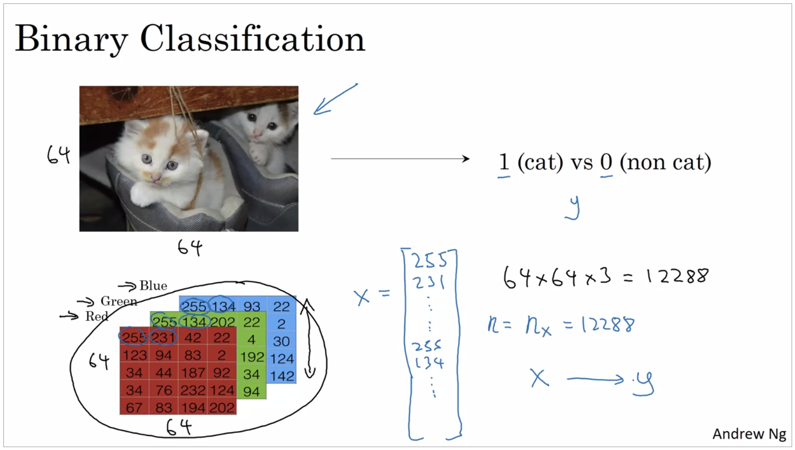

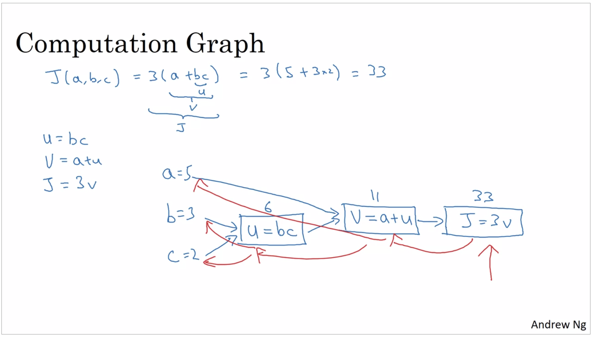

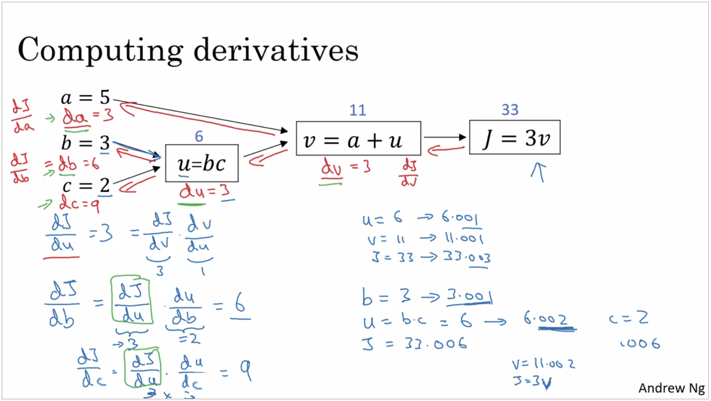

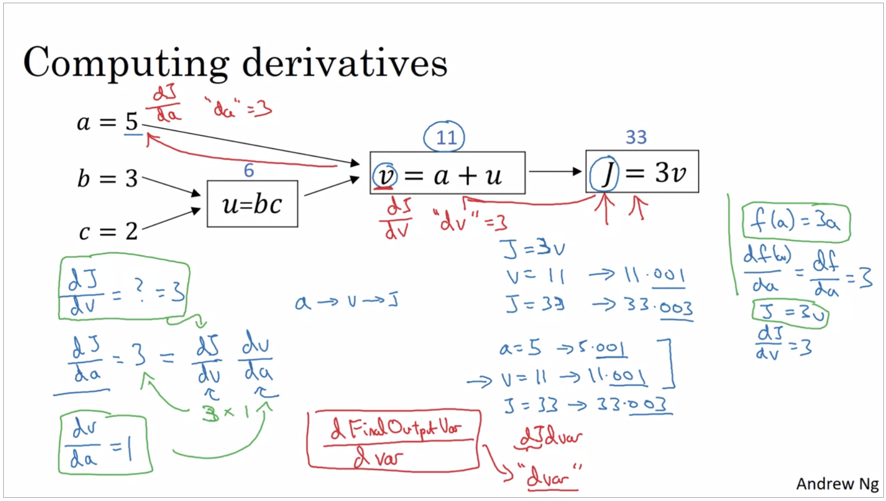

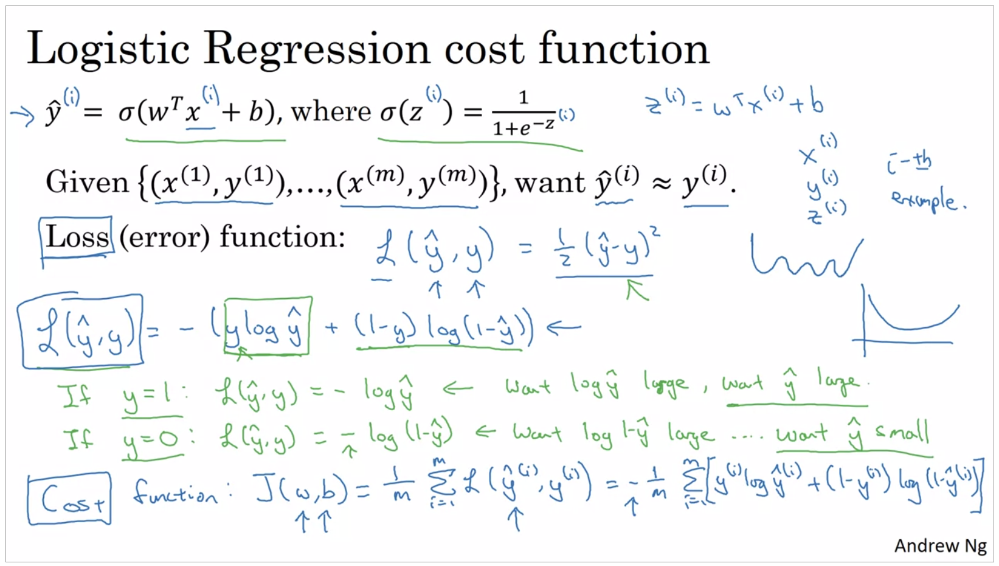

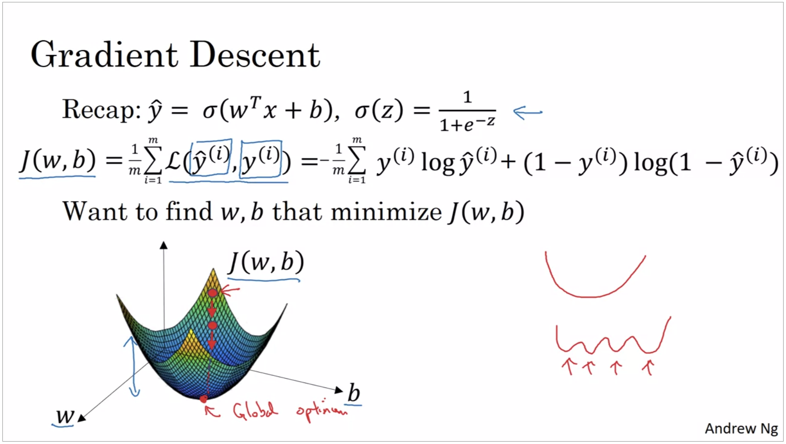

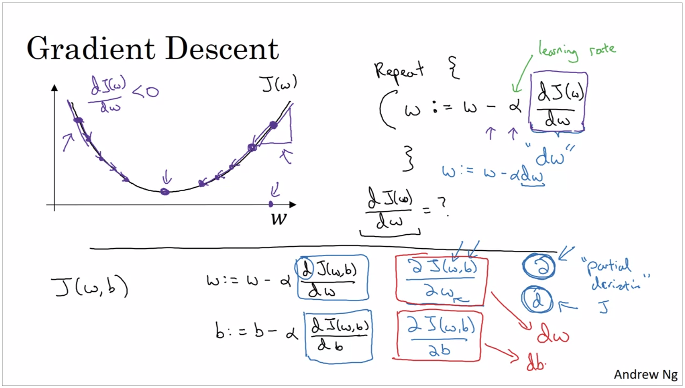

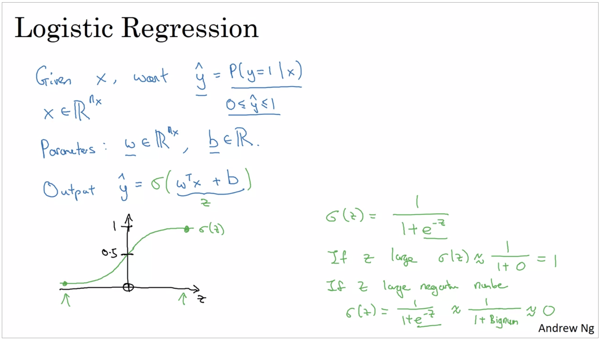

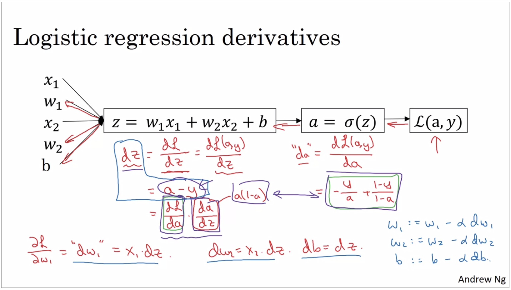

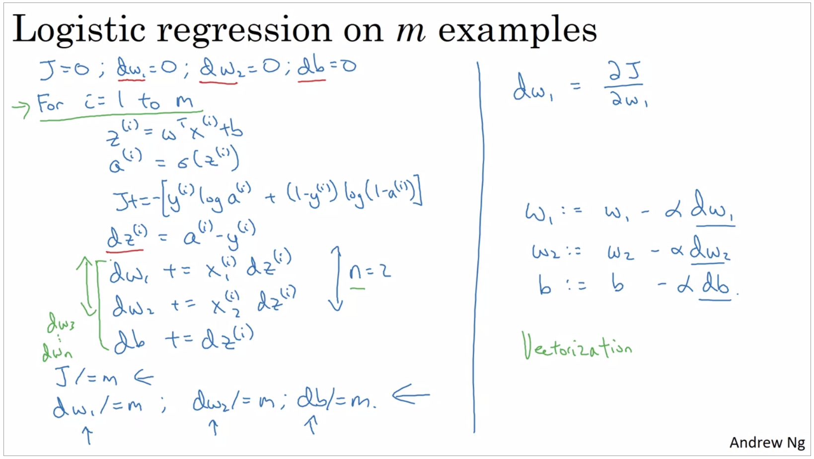

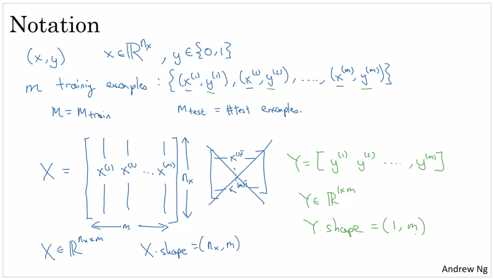