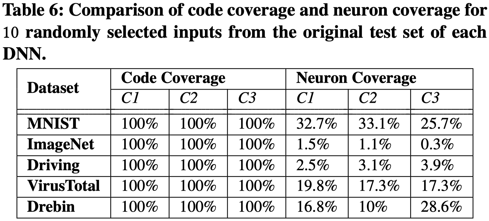
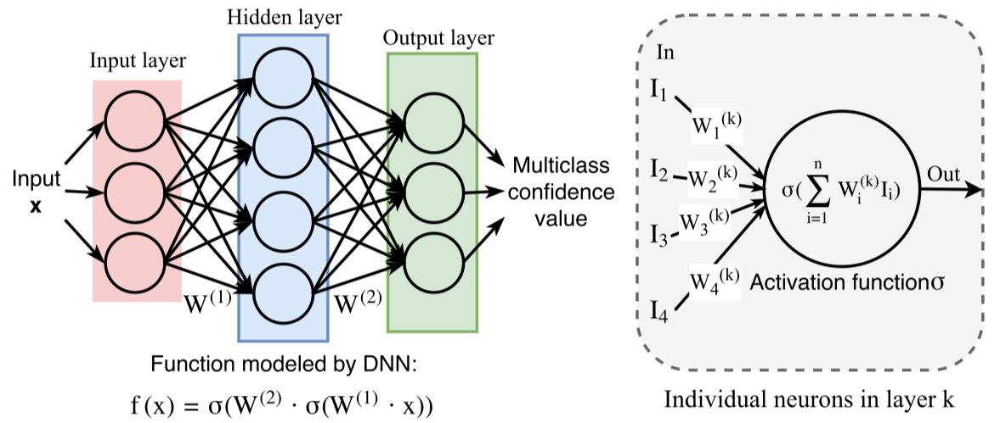
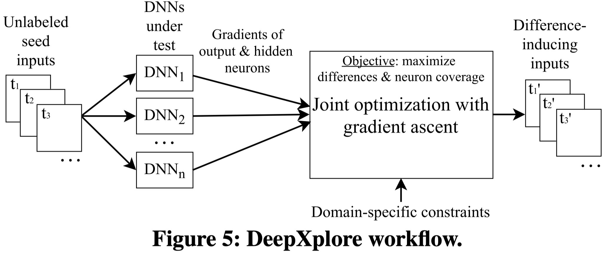
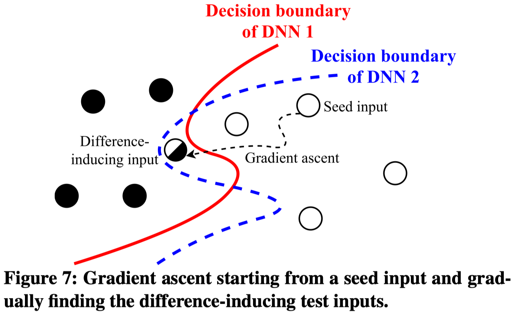
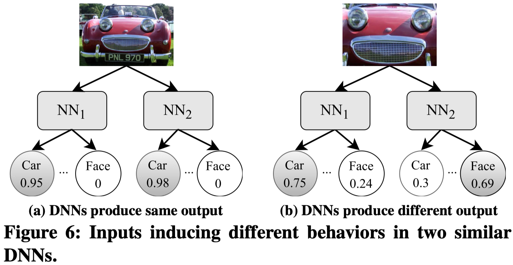
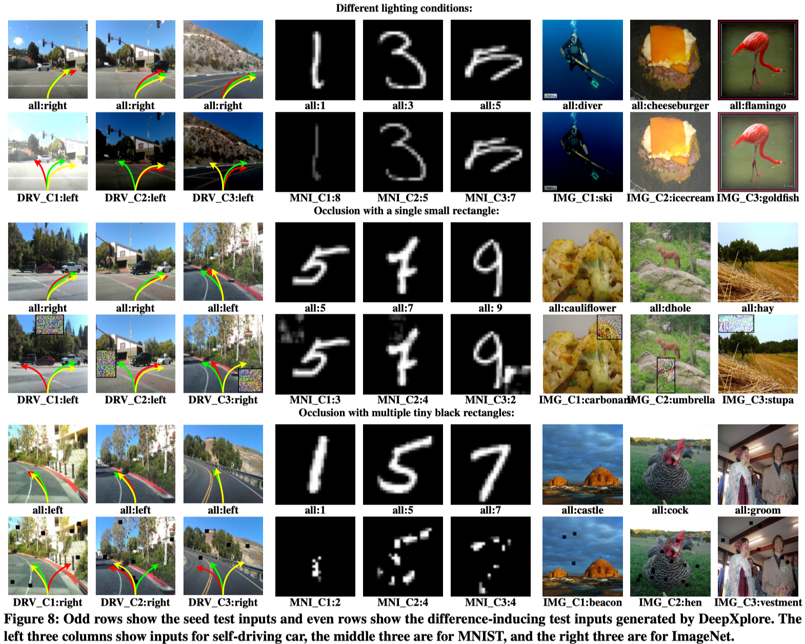
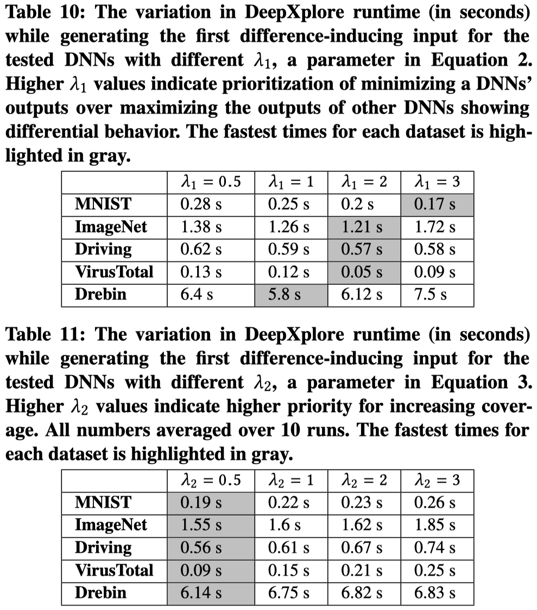
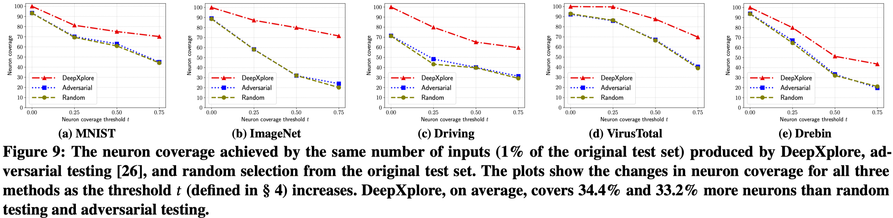
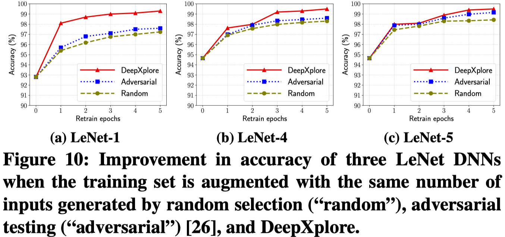

# DeepXplore Review

[DeepXplore: Automated Whitebox Testing of Deep Learning Systems](https://arxiv.org/abs/1705.06640)

[TOC]

---

## 1. Introduction

DeepXplore는 Deep Learning 네트워크의 최초의 whitebox testing 기법이며, 연구 초점은 다음 두 가지이다.

1. **Neuron Coverage**

   : DL 시스템 내부적으로, input 데이터에 따라 활성화/비활성화 된 뉴런을 구분

2. **Test input generation**

   예측 오류를 야기하는 요소(Erroneous behavior)들을 자동으로 파악

 Neuron coverage이 test input을 생성하기 위해 고안한 기법은 아니지만, test data 별로 neuron들에게 어떤 영향을 미치는가를 확인함으로서 적절한 test dataset인지의 여부를 판단할 수 있게 된다. 그리고 이를 이용하여 DL 시스템 내부 요소들을 골고루 확인할 수 있는, 최대한 많은 errorneous behavior에 대한 점검이 가능한 별도의 test dataset을 만드는 방법을 제안한다.

<br>

### 1-1. Code Coverage

[코드 커버리지의 정의]([https://ko.wikipedia.org/wiki/%EC%BD%94%EB%93%9C_%EC%BB%A4%EB%B2%84%EB%A6%AC%EC%A7%80](https://ko.wikipedia.org/wiki/코드_커버리지))는 다음과 같다.

> 코드 커버리지(Code Coverage)는 소프트웨어의 테스트를 논할 때 얼마나 테스트가 충분한가를 나타내는 지표중 하나다. 말 그대로 코드가 얼마나 커버되었는가이다. 소프트웨어 테스트를 진행했을 때 코드 자체가 얼마나 실행되었냐는 것이다.
>
> 코드의 구조를 이루는 것은 크게 구문(Statement), 조건(Condition), 결정(Decision)이다. 이러한 구조를 얼마나 커버했느냐에 따라 코드커버리지의 측정기준은 나뉘게 된다. 일반적으로 많이 사용되는 커버리지는 구문(Statement)커버리지이며, 실행 코드라인이 한번 이상 실행 되면 충족된다. 조건(Condition)커버리지는 각 내부 조건이 참 혹은 거짓을 가지면 충족된다. 결정(Decision) 커버리지는 각 분기의 내부 조건자체가 아닌 이러한 조건으로 인해 전체 결과가 참 혹은 거짓이면 충족된다. 그리고 조건과 결정을 복합적으로 고려하는 MC/DC 커버리지 또한 있다.

 간단하게 정리하자면, 코드를 실행했을 때 코드 한줄 한줄이 몇 회 사용되는가로 평가하는 것이 코드 커버리지이다. 만약 딥러닝 네트워크에 코드 커버리지를 적용하여 테스트할 경우, 100%의 코드 커버리지를 얻는다. 즉, 코드 커버리지로는 딥러닝 네트워크의 요소 별 영향력을 측정할 수 없으며, 연구진은 이를 대신할 neuron coverage를 제안한다.



<br><br>

## 2. Methodology

### 2-1. Neuron Coverage

 Neuron coverage는 어떤 데이터셋의 데이터들을 이용하여 inference를 진행했을 때, 네트워크 내 전체 뉴런들 중 활성화 됐던 뉴런들의 비율을 말한다. 여기서 '**활성화** 됐다'라는 말의 정의는 다음과 같다.

 Input data(`x_data` 혹은 이전 layer의 `activation`)가 뉴런(operation)을 거쳐 activation function까지 적용된 상태, 즉, 현재 layer의 `activation` 값이 특정 값(하이퍼 파라미터) 이상이다.




 논문에서는 test dataset을 사용하여 inference를 진행했을 때, neuron coverage가 100%인 데이터셋을 좋은 test dataset으로 간주한다. Neuron Coverage가 100%라는 것은, 모델이 예측을 진행할 때 사용하는 모든 요소들에 대해 테스트한 것을 의미하기 때문이다.

<br>

### 2-2. Test input generation



`<Figure 5>`는 DeepXplore의 전체 흐름을 설명하고 있으며, 구성은 다음과 같다.

- `Unlabeled seed inputs`: 현재 보유하고 있는 test dataset
- `DNNs under test`: 현재 보유하고 있는, 같은 기능(e.g., car-human image classification)을 수행하는 딥러닝 모델들
- `Gradients of output & hidden neurons`: 위의 test dataset을 사용하여 inference 했을 때 발생하는 loss의 gradient와 특정 neuron의 activate 여부에 대한 정보
- `Joint optimization with gradient ascent`: loss와 neuron coverage가 커지도록 **input data**를 조정
- `Difference-inducing inputs`: 앞의 DNN 모델들이 서로 다른 output을 내도록 하는 새로운 input data를 생성

`<Figure 5>` 내용 중 '**DNN 모델들이 서로 다른 output을 내도록**'에 대한 부연 설명으로 `<Figure 7>`을 제시한다. 동일 기능을 하는 네트워크이면서도 조금씩은 다른 decision boundary를 갖으므로, 데이터에 따라 서로 다른 결과를 제시할 수 있다.



 만약 seed input에 대해 딥러닝 모델들 중 다른 output을 보이는 모델이 있다면, 이는 test data로 활용하기에 적절하다. 하지만 모든 딥러닝 모델들이 같은 output을 보인다면, 해당 데이터를 gradient ascent를 통해 해당 output을 내지 않는 방향으로 조정한다.

 계속해서 seed input을 변경하면서, 모델들 중 하나 이상의 모델이 다른 output을 낼 때, 변경된 seed input을 새로운 test data로 저장한다. 아래 `<Figure 6>`가 그 예시이며, $NN_1$과 $NN_2$ 모두 `Car`라고 판별하는 seed input에 대해 gradient ascent를 진행하여 $NN_1$은 `Car`, $NN_2$는 `Face`라고 인식하도록 변경했다.



<br>

### 2-3. Domain-specific Constraints

 자동으로 생성해 내는 test dataset들이 domain에 맞게 설정되어야 한다. 예를들어, 이미지의 경우 `[0, 255]` 사이의 값을 가져야 하며, PDF는 PDF viewer가 읽을 수 있는 양식을 유지해야 한다.



 위와 같이 발생 가능한 error 상황을 유도할 수도 있다. 이미지를 전체적으로 어둡거나 밝게 만들수 있으며, occlusion을 발생시켜 정상적이지 않은 환경을 테스트 할 수 있도록 설정할 수 있다. 검은 점을 만드는 occlusion의 경우 특정 구역의 픽셀 값을 0으로 만드는 등의 방법을 사용한다.

<br>

### 2-4. Algorithm

```bash
# Inputs & H-params
seed_set ← unlabeled inputs as the seeds
dnns ← multiple DNNs under test
λ1 ← parameter to balance output differences of DNNs (Equation 2)
λ2 ← parameter to balance coverage and differential behavior
s ← step size in gradient ascent
t ← threshold for determining if a neuron is activated
p ← desired neuron coverage
cov_tracker ← tracks which neurons have been activated
```

```python
# Algorithm
gen_test := empty set
for cycle(x ∈ seed_set) do
	"""모든 dnn 모델들이 같은 class로 분류하는 seed data에 대해서 진행"""
	c = dnns[0].predict(x) # 0번째 모델의 예측 결과(obj1에서의 c)
	d = randomly select one dnn from dnns # 타겟 dnn 설정(obj1에서의 j)
	while True do # 예측 class와 target dnn을 고정
		obj1 = COMPUTE_OBJ1(x, d, c, dnns, λ1)
		obj2 = COMPUTE_OBJ2(x, dnns, cov_tracker)
		obj = obj1 + λ2 · obj2 # Joint Optimization
		grad = ∂obj / ∂x
		grad = DOMAIN_CONSTRNTS(grad)
		x = x + s · grad
		if d.predict(x) ≠ (dnns-d).predict(x) then # target이 다른 class로 예측
			gen_test.add(x)
			update cov_tracker
			break
  if DESIRED_COVERAGE_ACHVD(cov_tracker) then
		return gen_test
```

```python
# Objective Functions
procedure COMPUTE_OBJ1(x, d, c, dnns, λ1)
	rest = dnns - d
	loss1 := 0
	for dnn in rest do # d가 아닌 모델들에 대해
			loss1 += dnn_c(x) # class c에 대한 confidence score
	loss2 := d_c(x) # d 모델의 class c에 대한 confidence score
	return (loss1 - λ1 · loss2)

procedure COMPUTE_OBJ2(x, dnns, cov_tracker)
	loss := 0
	for dnn ∈ dnns do # 모든 dnn 모델들에 대해
  	select a neuron n # n: cov_tracker로 탐색한 아직 활성화되지 않은 뉴런(iter 마다 달라짐)
		loss += n(x) # the neuron n’s output when x is the dnn’s input
  return loss
```

위 pseudo-code에 등장하는 `obj1`과 `obj2`, `obj`는 다음과 같다.

- $obj_1(x) = \left( \sum_{k \neq j} F_k(x)[c] \right) - \lambda_1 \cdot F_j(x)[c]$
  - target dnn `d` 가 아닌 다른 dnn 모델들이 예측한 `c` label에 대한 확률과, `d` 가 예측한 확률의 차이를 최대화
  - $\lambda_1$: `d` 가 다른 class로 예측하게 하는 것과, `d` 가 아닌 다른 모델들이 같은 class로 예측하는 것을 유지하는 현상을 조절
    - Larger: Target dnn의 `c`에 대한 예측값을 더 많이 감소시킴
    - Smaller: Target dnn이 아닌 dnn들의 결과를 유지하는 것을 선호
- $obj_2(x) = f_n(x)$
  - 활성화되지 않은 뉴런을 선택하여, 해당 뉴런의 `activation` 값을 최대화
  - $f_n(x)$: 비활성화된 특정 neuron `n`이 input seed `x`에 대해 갖는 `activation` 값
- $obj_{joint} = \left( \sum_{i \neq j}F_i(x)[c] - \lambda_1F_j(x)[c] \right) + \lambda_2 \cdot f_n(x)$
  - $\lambda_2$: $obj_1(x)$에 의한 **다른 결과값을 갖도록 하는 행위**와 $obj_2(x)$에 의한 **뉴런 커버리지 상승** 중 어느것에 집중할 것인가
    - Larger: 보다 더 다양한 neuron의 활성화를 유도하는 것에 집중
    - Smaller: 예측 결과 값이 다른 test input들을 더 많이 만드는 것에 집중

아래 `<Table 10>`과 `<Table 11>`은 각각 $\lambda_1$과 $\lambda_2$ 값의 변화에 따라 첫 difference-inducing input을 생성하는 속도에 대해 나타낸다.



<br><br>

## 3. Result

| Dataset             | Dataset Desciption   | DNN Description                    |
| ------------------- | -------------------- | ---------------------------------- |
| MNIST               | Hand-written digits  | LeNet variations                   |
| Imagenet            | General images       | sota image classifiers from ILSVRC |
| Driving             | Driving video frames | Nvidia DAVE self-driving systems   |
| Contagio/Virustotal | PDFs                 | PDF malware detectors              |
| Derbin              | Android apps         | Android app malware detectors      |

DeepXplore는 image data 뿐만 아니라, 다양한 데이터셋과 모델들에 적용 가능함을 보이기 위해 논문에서는 위와 같은 데이터셋들과 모델들에 대해 실험을 진행했다. 자세한 실험 방법과 사용한 h-param들은 논문을 참고하라.

<br>

### 3-1. Neuron Coverage 비교



`<Figure 9>` 은 세 가지 방법으로 생성한 test dataset에 대해 neuron coverage를 비교한다.

- DeepXplore
- Adverserial testing
- Original test set

뉴런이 '활성화 되었다'라고 판단하는 값의 기준인 `t` 가 높아질 수록, 비활성화 상태였던 뉴런이 활성화되었다고 판단하기 어려워진다. `t` 값이 계속해서 높아지더라도 neuron coverage가 다른 모델들에 비해 덜 감소하는 것은, 해당 test dataset이 다른 dataset에 비해 보다 다양한 특성들에 대한 내용을 담고 있음을 의미한다.

<br>

### 3-2. Augmenting training data to improve accuracy

아래 `<Figure 10>`은 `DeepXplore`, `Adversarial testing`, `Random`(test dataset에서의 임의 선택) 데이터들을 train dataset에 추가하여 다시 학습했을 때, DeepXplore data들이 추가된 train dataset을 사용하는 것이 가장 큰 Accuracy 상승을 야기했음을 보여준다.



