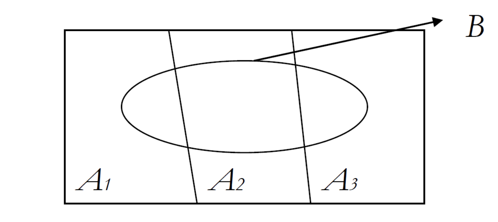

# 사전 확률과 사후 확률

### 베이즈 정리, Bayes' theorem

사전 확률과 사후 확률을 알아보기 전, 사후 확률 계산에 사용될 베이즈 정리는 다음과 같습니다.

$P(A|B) = \frac{P(A\cap B)}{P(B)} = \frac{P(B|A) P(A)}{P(B)}$

 

 

### 사전 확률, Prior Probability

현재 보유하고 있는 데이터를 기초로하여 구한 초기 확률입니다.

확률 시행 전, 이미 가지고 있는 지식을 통해 부여한 확률이며, 동전을 던졌을 때 앞면이 나올 확률이 ${\frac{1}{2}}$인 것은 이미 알고 있는 사전 확률의 예시입니다.

 

### 사후 확률, Posteriori Probability

확률 시행 후, 어떤 원인으로부터 일어난 것이라고 생각되는 확률입니다.

추가된 데이터로부터 사전 정보(사전 확률)를 새롭게 수정한 확률이며, 이는 조건부 확률로 표현할 수 있습니다.

 

 

## 추가 설명

### 예시

출처: [ratsgo's blog](https://ratsgo.github.io/statistics/2017/07/01/bayes/)

일반적으로 사건 $A_{1}, A_{2}, A_{3}$가 서로 배반(mutually exclusive)이고 $A_{1}, A_{2}, A_{3}$의 합집합이 표본공간(sample space)과 같으면 사건 $A_{1}, A_{2}, A_{3}$는 표본공간 $S$의 **분할**이라고 정의합니다. 우리가 관심있는 사건 $B$가 나타날 확률을 그림과 식으로 나타내면 다음과 같습니다.

$P(B)=P(A_{1} \cap B)+P(A_{2}∩B)+P(A_{3}∩B)$

$P(B)$를 조건부확률의 정의를 이용해 다시 쓰면 아래와 같습니다. 이를 **전확률 공식(Law of Total Probability)** 또는 **베이즈 법칙**이라고 합니다.

$P(B)=P(A_{1})P(B|A_{1})+P(A_{2})P(B|A_{2})+P(A_{3})P(B|A_{3})=\sum^{3}_{i=1}P(A_{i})P(B|A_{i})$

보통 $P(A_{1}), P(A_{2}), P(A_{3})$는 미리 알고 있다는 의미의 **사전 확률(prior probability)**로 불립니다. $P(B|A_{1}), P(B|A_{2}), P(B|A_{3})$는 **우도(likelihood probability)**라 부릅니다.

그럼 **우리가 관심있는 사건인 $B$가 $A_{1}$에 기인했을 조건부확률**은 어떻게 구할까요? 바로 아래와 같이 구할 수 있습니다.

$P(A_{1}|B)=\frac{P(A_{1})P(B|A_{1})}{P(B)}=\frac{P(A_{1})P(B|A_{1})}{P(A_{1})P(B|A_{1})+P(A_{2})P(B|A_{2})+P(A_{3})P(B|A_{3})}$

$P(A_{1}|B)$는 **사건 $B$를 관측한 후에 그 원인이 되는 사건 $A$의 확률**을 따졌다는 의미의 **사후 확률(posterior probability)**로 정의됩니다. 사후 확률은 사건 $B$의 정보가 더해진, 사전 확률의 업데이트 버전 정도라고 생각하면 좋을 것 같습니다. *(Posterior probability is an updated version of prior probability)* 같은 방식으로 $P(A_{2}|B), P(A_{3}|B)$도 구할 수 있습니다.

그런데 왜 이렇게 복잡하게 사후 확률을 구하는거냐고요? 실제로 **사후 확률은 구하기 어려운 경우가 많다**고 합니다. 그에 반해 **사전 확률은 우리가 이미 알고 있는 값**이고, **우도는 비교적 계산하기 수월**합니다. 그래서 **베이즈 법칙과 사전 확률, 그리고 우도를 활용**해 사후 확률을 도출해내는 것이죠.

다시 말해 우리가 알고 싶은 확률을 단박에 계산하기가 까다로울 때 조건과 결과를 뒤집어서 우회적으로 계산하는 것, 이것이 베이즈 모델의 강점이라고 말할 수 있겠습니다.

 

### 부연 설명

$P(A|B) = \frac{P(A\cap B)}{P(B)} = \frac{P(B|A) P(A)}{P(B)}$

위 식은 베이즈 정리의 식입니다. 즉, 사후 확률 $P(A|B)$를 사전 확률 $P(A)$와 우도 $P(B|A)$를 이용하여 구할 수 있습니다. 

- 사전 확률: 사건 $B$의 발생 원인을 제공하는 $P(A)$
- 사후 확률: 사건 $B$가 발생했다는 조건 하에 사건 $A$가 발생할 확률인 $P(A|B)$
- 우도: 사건 $A$가 발생했다는 조건 하에 $B$가 발생할 확률인 $P(B|A)$

$B$ 또한 이미 일어난 사건이며, $A$는 $B$가 나올 수 잇게 한 과거의 또 다른 사건입니다.