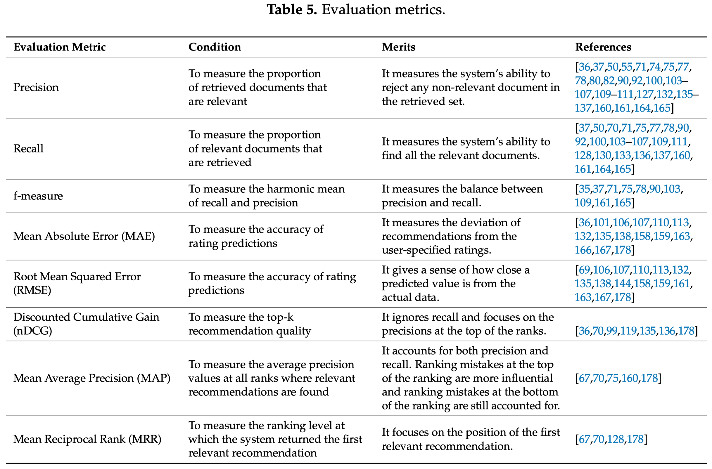

# Metrics

참고 자료: [Context-Aware Recommender System: A Review of Recent Developmental Process and Future Research Direction](https://www.researchgate.net/publication/321581444_Context-Aware_Recommender_System_A_Review_of_Recent_Developmental_Process_and_Future_Research_Direction)

위 논문에서는 추천 시스템에서 활용되고 있는 metric 들에 대해 소개하고 있습니다. 논문에 등장하는 metric들은 크게 세 가지로 나눌 수 있습니다.

- Error Metrics
- Accuracy Metrics
- Rank Metrics

 

 

## Error Metrics

- Mean Absolute Error (MAE)
- Root Mean Squared Error (RMSE)

 

 

## Accuracy Metrics

- Accuracy
- **Precision**
- Recall
- f-measure(F1-score)
- Jaccard coefficient

출처: [wikipedia](https://ko.wikipedia.org/wiki/%EC%A0%95%EB%B0%80%EB%8F%84%EC%99%80_%EC%9E%AC%ED%98%84%EC%9C%A8)

 

### Precision & Recall

Precision은 아래 그림에서의 `True Positive`와 `False Positive`를 통해 우리의 예측이 얼마나 정확했는가를, recall은 `True Positive`와 `False Negative`를 사용하여 전체 `True` 데이터 중 몇 개의 `True` 데이터를 우리가 예측해 냈는가를 알 수 있는 지표이다.

헷갈리지 말아야 할 것은, `True Positive` 에서의 `True` 와 `False Positive` 에서의 `False` 는 실제 정답 데이터의 값이 `True`/`False`인 것과는 관련이 없다. 그 둘은 각각 `Positive`(`True`)라고 예측했는데 결과값이 정말 `True`인 경우, 그리고 `Positive`라고 예측했는데 결과값이 `False`인 경우를 말한다. 즉, `True Positive`와 `False Positive` 에서의 `True`와 `False`는 예측이 맞았다/틀렸다, 참이다/거짓이다를 의미한다.

Precision과 recall의 차이는 `False Positive`를 고려할 것인가, 혹은 `False Negative`를 고려할 것인가에 있다. Precision은 False 데이터를 True라고 잘 못 예측하지 않는 능력을 측정하며, recall은 True 데이터를 False라고 잘 못 판단하지 않는 능력에 대해 측정한다. 그 의미와 중요도는 데이터의 도메인마다 다르다.

 

 

## Rank Metrics

- Discounted Cumulative Gain (nDCG)
- Mean Reciprocal Rank (MRR)
- Mean Average Precision (MAP)