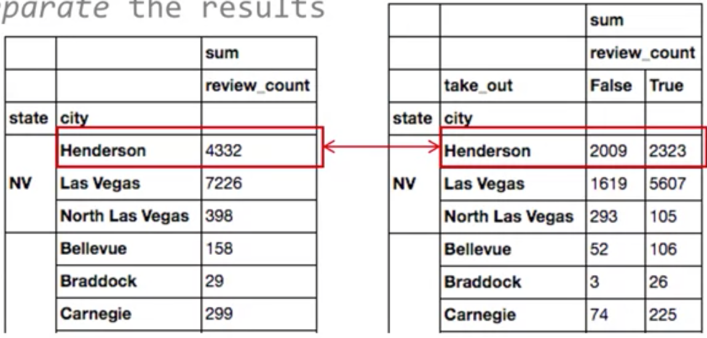

## Missing Values

```python
# replace the $ character in the description column of a DataFrame d
df["description"] = df["description"].str.replace('$','')

# inplace means the changes are made in the DataFrame itself
df.dropna(inplace = True)

# the 0 means all NaN (Not a Number) elements will be replaced with 0s
df.fillna(0)
```

<br><br>

## Merge

### Join City ID and City Name

```python
import pandas as pd
xls = pd.ExcelFile('yelp.xlsx')
df = xls.parse('yelp_data')
df.head()
```


```python
df_cities = xls.parse('cities')
df_cities.head()
```


```python
df = pd.merge(left=df, right=df_cities, how='inner', left_on='city_id', right_on='id')
df.head()
```


### Join State ID and State Name

```python
df_states = xls.parse('states')
df_states.head()
```


```python
df = pd.merge(left=df, right=df_states, how='inner', left_on='state_id', right_on='id')
df.shape # (600, 12)
df.head()
```


### Remove duplicated ID columns

```python
del df['id_x']
del df['id_y']
df.head()
```


<br><br>

## Querying data using boolean indexing

조건을 만족하는 boolean 타입의 1차원 객체인 Series 객체를 생성한 후 이를 DF 인덱싱에 사용

```python
pitts = df['city'] == 'Pittsburgh'
type(pitts) # pandas.core.series.Series
pitts
```


```
df[pitts]
```


### Multiple Conditions

```python
cat_0_bars = df["category_0"] == "Bars"  # another example: cat_0_bars = df["stars"] >= 4.0
cat_1_bars = df["category_1"] == "Bars"
carnegie = df["city"] == "Carnegie"
df[(cat_0_bars | cat_1_bars) & carnegie]
```


### Multiple Values for a Condition

```python
bars_rest = df["category_0"].isin(["Bars", "Restaurants"])
```

<br><br>

## Updating & Creating data

```python
# Make new colum 'rating'
df["rating"] = df["stars"] * 2

# Check if value(Pizza in here) exist
df[df['categories'].str.contains('Pizza')]

# Add 'categories' column that combines 'category_0' and 'category_1' as a comma-separated
df['categories'] = df['category_0'].str.cat(df['category_0'], sep=',')
```

### Use fuctions by `.apply()`

```python
def convert_to_rating(x):
    return (str(x) + " out of 10")

df["rating"] = df["rating"].apply(convert_to_rating)
df.head()
```


<br><br>

## Methods

```python
df['review_count'].sum()
df['rating'].mean()
df['city'].unique()
df['city'].value_counts() # unique value count
df['category_0'].nunique() # unique values without null
```

<br><br>

## Pivot Table

`city` 이라는 `index` column을 부여할 시, 컬럼의 유니크 값 별로 summraization dataframe을 제공한다. **Default로 each column을 average**.

```python
pivot_city = pd.pivot_table(df, index='city')
pivot_city = pd.pivot_table(df, index='city', aggfunc=[np.mean]) # 위와 동일. default가 mean
pivot_city
```


### Multiple Columns to Pivot

주어진 column 순서대로 집계

```python
bars_rest = df["category_0"].isin(["Bars", "Restaurants"])
df_bars_rest = df[bars_rest]
df_bars_rest
```


```python
pivot_state_cat = pd.pivot_table(df_bars_rest, index = ["state", "city", "category_0"])
pivot_state_cat[["review_count", "stars"]]
```


### Different Aggregate Functions

```python
pivot_1 = pd.pivot_table(
		df,
		index=["state", "city"],
		values=['review_count'],  # Specifying columns to aggregate
		aggfunc=[np.sum]					# Specifying aggregating function
)
```

### Aggregating per

```python
# Segmenting results with 'columns' argument
# 'take_out'의 값인 true/false를 따로 집계
pivot_2 = pd.pivot_table(
		df,
		index=["state", "city"],
		values=['review_count'],
	  columns=["take_out"],  # Specifying the columns to be used to separate the results
		aggfunc=[np.sum]
)
```



### Multiple Aggregating Functions

```python
pivot_3 = pd.pivot_table(
		df,
		index=["state", "city"],
	  columns=["take_out"],
		aggfunc={
      "review_count": np.sum,
      "stars": np.mean
    }
)
```


<br><br>

## Visualization

`%pylab inline` 을 jupyter notebook에 작성 후 실행 시, 이후 `plt.show()` 를 통해 바로 그래프 확인 가능

```python
df_pitt = df[df["city"] == "Pittsburgh"]
df_vegas = df[df["city"] == "Las Vegas"]
pitt_stars = df_pitt["stars"]
vegas_stars = df_vegas["stars"]
vegas_stars.head()
```


```python
%pylab inline
import matplotlib.pyplot as plt

plt.hist(
    [pitt_stars, vegas_stars],
    alpha = 0.7,
    color = ['red', 'blue'],
    label = ['Pittsburgh', 'Las Vegas'],
    bins = 'auto'  # PLT chooses
)

plt.xlabel('Rating')
plt.ylabel('Number of Rating Scores')

plt.legend(loc = 'best') # PLT chooses the best position

plt.title('Review distribution of Pittsburgh and Las Vegas')

plt.show()
```

