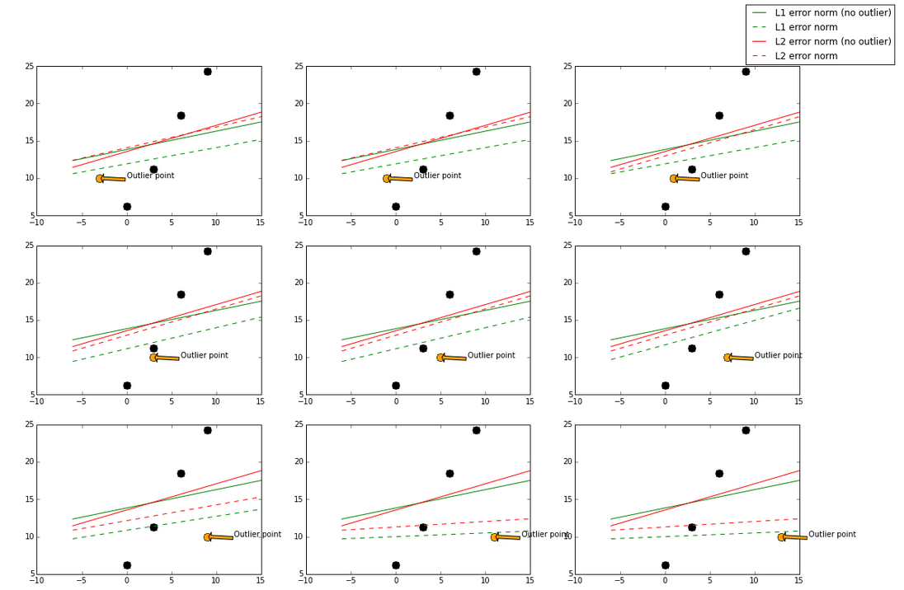
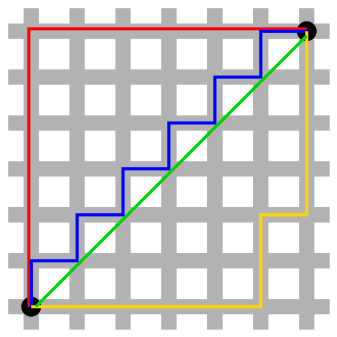
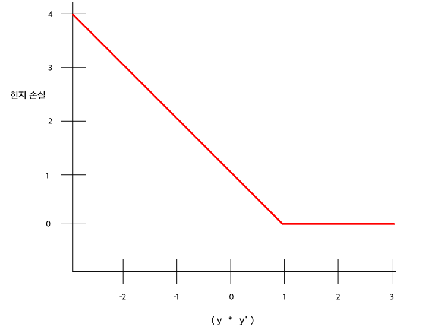

# Loss Functions

## 1. Definition of loss function

[위키백과]([https://ko.wikipedia.org/wiki/%EC%86%90%EC%8B%A4_%ED%95%A8%EC%88%98](https://ko.wikipedia.org/wiki/손실_함수))에서는 손실 함수를 다음과 같이 정의한다.

> [통계학](https://ko.wikipedia.org/wiki/통계학), [결정이론](https://ko.wikipedia.org/wiki/결정이론) 및 [경제학](https://ko.wikipedia.org/wiki/경제학) 분야에서 **손실 함수**(損失函數) 또는 **비용 함수**(費用函數)는 [사건](https://ko.wikipedia.org/wiki/확률공간)(기술적으로 [표본 공간](https://ko.wikipedia.org/wiki/표본_공간)의 한 요소)을 그 사건과 관련된 경제적 손실을 표현하는 [실수](https://ko.wikipedia.org/wiki/실수)로 사상하는 함수이다.

머신러닝에서의 손실 함수는 데이터셋의 입력값이 주어졌을 때, 입력값에 대한 정답을 반환할 수 있도록 모델의 가중치들을 학습시키는데에 사용된다. 손실 함수는 가중치들의 집합인 $\theta$ 를 사용하여 값을 예측하며, 관측값과 예측값의 차이를 계산하여 반환한다. 모델은 손실 함수의 결과값을 최소화 하는 방향으로 $\theta$ 를 수정한다.

손실 함수는 보통 회귀 분석과 범주 분류, 두 카테고리로 나뉜다. 분류에서는 한정된 범주 값으로 예측값을 출력하는 것을 목표로 하며, 회귀 분석에서는 연속적인 값을 예측하는 것을 목표로 한다.

- 회귀, Regression
  - 대표적인 함수: MSE, Mean Sqaure Error
- 분류, Classification
  - 대표적인 함수: ACE, Averaged Cross Entropy

 

 

## 2. In Regression

**산술 손실 함수**: 산술값을 예측할 때 데이터 대한 예측값과 실제 관측 값을 비교하는 함수

회귀식에서 사용되는 손실 함수들은 다음과 같다.

- MBE, Mean Bias Error
- MAE, Mean Absolute Error
- MSE, Mean Square Error

 

### Mean Bias Error

$MBE = \frac{\sum^{n}_{i=1}(y_{i} - \hat{y}_{i})}{n}$

여기서 소개하는 다른 함수들에 비해, 가장 덜 사용되는 함수이다. 뒤의 MAE와 다르게 절대값을 씌우지 않으며, 양의 손실값과 음의 손실값이 상쇄되어 의미를 잃는다. 만약 이것이 의도한 것이 아니라면, 모델 학습에 큰 악영향을 미칠 수 있다. 의도적으로 사용하는 경우의 예로, 모델이 양의 편차를 갖는지, 혹은 음의 편차를 갖는지 판단하는 것이 있다.

 

### Mean Absolute Error / L1 Loss / Least Absolute Deviations(LAD)

$MAE = \frac{\sum^{n}_{i=1}|y_{i} - \hat{y}_{i}|}{n}$

MSE와 마찬가지로 direction(양/음)을 무시한 채 손실을 측정할 수 있으며, 차이점으로는 제곱 연산이 없다는 것이다. 제곱 연산은 작은 손실값을 더 작게 하며, 큰 손실값을 더 크게한다. 그런데 제곱 연산은 손실값이 비정상적으로 크게 나타나는 이상치(outlier)를 더욱 크게 만드며, 학습을 방해한다. 하지만 L1 loss의 경우 제곱 연산을 사용하지 않기 때문에 이상치의 영향(robustness)에 덜 민감하다고 할 수 있다.

MAE는 값이 0인 지점에서 미분이 불가능하여 gredient를 계산할 수 없다는 단점이 있다.

 

### Mean Square Error / Quadratic Loss / L2 Loss / Least square error(LSE)

$MSE = \frac{\sum^{n}_{i=1}(y_{i} - \hat{y}_{i})^2}{n}$

제곱 연산의 의미는 가중화에 있다. 관측값과 예측값의 차이가 클 수록 손실값이 커진다. 따라서 효율적인 학습을 도울 수 있지만, MAE에서 언급한 이상치에 대한 문제가 발생한다. 이상치는 전처리 과정에서 제외되지 않은 모델의 학습을 방해하는 요소인데, 제곱으로 인해 이상치가 모델에 미치는 영향이 더 커지게 된다. 물론 이상치의 존재 여부를 파악하기 위해 이러한 L2 loss의 특징을 활용할 수 있다.

학습 성능에 있어서, 제곱 연산으로 인해 연산량이 많아지는 단점이 존재한다.

- least squares regression

  : L2 loss를 최소화함으로써 학습된 선형회귀 모델.

 

### Robustness(L1 > L2)

Robustness는 outlier, 즉 이상치가 등장했을 때 loss function이 얼마나 영향을 받는가에 대한 용어로, 영향을 덜 받을 수록 robust 하다고 한다. 위에서 언급한 제곱 연산의 유무로 인해 L1 loss가 L2 loss 보다 robust하다.

 

### Stability(L1 < L2)

Stability는 모델이 비슷한 데이터에 대해 얼마나 일관적인 예측을 할 수 있는가로 생각하면 된다. 다음 그림(출처: [chioka](http://www.chioka.in/differences-between-l1-and-l2-as-loss-function-and-regularization/))에서의 점선은 이상치를 부여했을 때 변화하는 손실값의 형태이며, 순서는 위에서 부터 아래로, 좌에서 우로 진행된다.

- 초록색 선/점섬: L1 loss
- 주황색 선/점선: L2 loss
- 검은점: 실제 데이터

위 그림은 실제 데이터(검은점)와 Outlier point인 주황색 화살표의 점이 움직임에 따라 어떻게 각 L1과 L2에 따라 예측 모델이 달라지는지를 실험해 본 결과이다. Outlier point가 검은 점들에 비교적 비슷한 위치에 존재할 때 L1 loss 그래프는 변화하며 움직이지만, L2 loss 그래프에는 그러한 변화가 없다. 이러한 특성때문에 L1이 L2보다는 unstable하다고 표현한다.

위 그림에서 또한 robustness도 관찰 가능한데, outlier point가 검은점들의 경향성이 이어지는 선을 기준으로 왼쪽이서 오른쪽으로 이동할 때 L2 error line이 L1보다 더 먼저 움직이는것을 확인 할 수 있다. 즉, L1보다 L2가 먼저 반응하므로 L1이 robust하고, outlier의 움직임에 L2보다 L1이 더 많이 움직이기에 L2가 stable하다.

 

### L2 Loss가 Stable한 이유

출처: [Archie Jain](https://medium.com/@er.archiejain/l1-and-l2-regularization-loss-function-scenarios-b840c5a932a), [Wikipedia]([https://ko.wikipedia.org/wiki/%EB%A7%A8%ED%95%B4%ED%8A%BC_%EA%B1%B0%EB%A6%AC](https://ko.wikipedia.org/wiki/맨해튼_거리))

형태를 보면, 이상치의 존재 여부에 따른 L2 error line의 값의 차이가 덜한 것을 알 수 있다. 이는 이상치의 여부와 관계 없이 L2 loss funtion이 보다 덜 반응했음을 알 수 있다. 가운데 그림처럼 이상치가 원래 데이터와 유사했을 경우에도, 좌상 혹은 우하의 그림과 같이 그 차이가 컸을 경우에도 L1 loss의 차이가 L2 loss의 차이보다 크다.

L2 provides **solution uniqueness** as it uses Eucledian distance as compared to L1 which uses Manhattan distance

> **유클리드 거리**(Euclidean distance)는 [두 점 사이의 거리](https://ko.wikipedia.org/wiki/두_점_사이의_거리)를 계산할 때 흔히 쓰는 방법이다. 이 거리를 사용하여 [유클리드 공간](https://ko.wikipedia.org/wiki/유클리드_공간)을 정의할 수 있으며, 이 거리에 대응하는 [노름](https://ko.wikipedia.org/wiki/노름)을 유클리드 노름(Euclidean norm)이라고 부른다.
>
> 맨해튼 거리의 원은 중심 점에서 [반지름](https://ko.wikipedia.org/wiki/반지름) 이라고 불리는 일정한 거리만큼 떨어져 있는 점들의 집합이다. 유클리드 기하학과 맨해튼 거리의 원은 모양이 다르다. 맨해튼 거리에서 원은 좌표의 축으로 45° 기울어진 정사각형이다. 모눈의 크기가 줄어들면 수많은 점들은 연속적인 정사각형의 모양을 만드는데, [유클리드 거리](https://ko.wikipedia.org/wiki/유클리드_거리)를 이용한 각 변이 길이가 √2*r*이면 이 원의 반지름은 *r*이다. 각 변의 길이를 맨해튼 거리로 측정한 값은 2*r*이 된다.

위 그림에서 초록색을 제외한 선의 길이는 모두 동일하다. 빨간색, 파란색, 노란색 선은 길이가 12로 같으며, 유클리드 거리와 맨해튼 거리 양쪽 모두 가지고 있다. **유클리드 기하학**의 경우 **초록색 선**의 길이는 6×√2 ≈ 8.48로, 선들 가운데 유일하게 길이가 가장 짧으며, **맨해튼 거리**의 경우 **파란색 선**의 길이는 12로, 이보다 길이가 더 짧은 선은 없다.

 

### 결론?

제곱 연산이 없으므로, 이상치에 의한 손실 함수 계산값의 변화는 L1 Loss가 더 적다. 하지만, 유클리드 거리를 계산하는 L2 Loss의 특성상 계산값의 변화로부터 영향을 덜 받는다.

 

 

## 3. In Classification

**확률 손실 함수 - 특정 항목을 나누는 분류에서 사용**

분류 모델에서 사용되는 대표적인 손실 함수들은 다음과 같다.

- Hinge Loss
- ACE, Averaged Cross Entropy

 

### Hinge Loss/Multi class SVM Loss

참고 자료: [Google 머신러닝 용어집](https://ratsgo.github.io/machine learning/2017/10/12/terms/)

학습데이터 각각의 범주를 구분하면서 데이터와의 거리가 가장 먼 결정경계(decision boundary)를 찾기 위해 고안된 손실 함수이며, 데이터와 경계 사이의 마진(margin)을 최대화한다. KSVMs이 바로 hinge loss를 손실함수로 쓴다.

$SVMLoss = \sum max(0, y\prime * y)$

여기서 $y$는 분류자 모델의 원시 출력이며,

- $y′=b+w_{1}x_{1}+w_{2}x_{2}+…w_{n}x_{n}$
- $y$: 참 라벨($-1$ 또는 $+1$)

따라서 힌지 손실과 $(y * y')$로 그래프를 그리면 다음과 같다.

 

### Averaged Averaged Cross Entropy(ACE) / Negative Log Likelihood

**확률론적 접근 - 로그 우도를 사용하는 이유**

딥러닝 모델을 학습시키기 위해 최대우도추정(Maximum Likelihood Estimation) 기법을 사용한다. 주어진 데이터로 최적의 파라미터 $\theta$ 를 찾는 것이 목표이다. 입력값 $X$ 와 파라메터 $\theta$가 주어졌을 때 정답 $Y$가 나타날 확률, 즉 우도 $P(Y|X;θ)$를 최대화하는 $\theta$가 바로 목표하는 결과이다.

그런데 최대가 되는 우도를 찾기 각각의 우도를 스케일(평균 내기, log 씌우기)해도 전체 *argmax*의 결과는 바뀌지 않으므로 다음이 성립한다.

[ **우도의 곱**을 최대로 만드는 $\theta$ ] == [ **로그 우도의 기대값**을 최대로 만드는 $\theta$ ]

> 로그 우도의 기대값 = $\sum_{x}P(y|x) \log P(y|x;θ)$

**정보이론의 접근 - 음의 로그 우도를 사용하는 이유**

두 확률분포 $p$ 와 $q$ 의 차이를 계산하는 데에는 크로스 엔트로피(cross entropy)라는 함수가 사용된다.

$CrossEntropy = -\sum_{x}p(x)\;log\,q(x)$

여기서, $p$를 우리가 가진 데이터의 분포 $P(Y|X)$, $q$를 모델이 예측한 결과의 분포 $P(Y|X;θ)$로 설정할 경우, 크로스 엔트로피는 파라미터 $θ$ 하에서의 음의 로그우도의 기대값이라고 해석할 수 있다. 그리고 $-\sum_{x}P(y|x) \log P(y|x;θ)$ 를 최소화하는 $θ$가 바로 우리가 찾고 싶은 모델이 된다.

$CrossEntropyLoss = -\sum_{x}P(y|x) \log P(y|x;θ)$

 

### 정리

딥러닝 모델은 우도를 최대화하는 것을 목표로 한다. 그런데 우도를 음수화 하여 Negative Log-likelihood를 사용한다면 이는 크로스 엔트로피를 사용하는 것과 같으며, 다음과 같은 크로스 엔트로피의 이점을 활용할 수 있다.

**크로스 엔트로피는 두 확률 분포의 차이를 계산하는 함수이며, 비교 대상 확률 분포의 종류를 특정하지 않는다.** 따라서 크로스 엔트로피를 활용한다면 만들고자 하는 모델에 다양한 확률 분포를 가정할 수 있게 되고, 유연하게 대응할 수 있다.

 

 

## 4. Why ACE in Classification, not MSE

출처: [ratsgo]([https://ratsgo.github.io/deep%20learning/2017/09/24/loss/](https://ratsgo.github.io/deep learning/2017/09/24/loss/))

만약 학습시키고자 하는 모델이 가우시안 분포를 전제로 한다면, 크로스 엔트로피 최소화는 우리가 가진 데이터의 분포와 모델의 가우시안 분포 사이의 차이를 최소화한다는 의미이며, 특히 가우시안 분포를 가정할 때 크로스 엔트로피의 최소화는 **평균제곱오차(Mean Squared Error)**의 최소화와 본질적으로 [동일](https://ratsgo.github.io/statistics/2017/09/23/MLE/)하다. 모델을 베르누이 분포로 가정한다면 우리가 가진 데이터의 분포와 모델의 베르누이 분포 간 차이가 최소화하는 방향으로 학습이 이뤄집니다. 이는 다항분포 또한 마찬가지입니다.

한편 딥러닝 모델의 최종 출력을 어떤 숫자 하나(예컨대 영화 관객 수)로 둘 경우 우리가 구축하려는 모델이 정규분포라고 가정하는 것과 깊은 관련을 맺고 있습니다. 최종 출력이 O, X로 이뤄진 이진변수(binary variable)일 경우 모델을 베르누이 분포로 가정하는 것과 사실상 유사합니다. 다범주 분류를 하는 딥러닝 모델은 다항분포를 가정하는 것과 비슷합니다.

위 세 종류 모델의 최종 output node는 각각 Linear unit, Sigmoid unit, Softmax unit이 되며, output node의 출력 분포와 우리가 가진 데이터의 분포 사이의 차이가 곧 크로스 엔트로피가 됩니다. 이 차이만큼을 loss로 보고 이 loss에 대한 그래디언트를 구해 이를 역전파하는 과정이 딥러닝의 학습이 되겠습니다. 바꿔 말하면 각각의 확률분포에 맞는 손실을 따로 정의할 필요가 없이 음의 로그우도만 써도 되고, output node의 종류만 바꾸면 세 개의 확률분포에 대응할 수 있게 된다는 이야기입니다. 매우 편리한 점이죠.

세 종류 간 구분은 다음 그림과 같습니다(출처 : 하용호 님의 [자료](https://www.slideshare.net/yongho/ss-79607172)) 다시 말씀드리지만 셋 모두 손실함수로 음의 로그우도, 즉 크로스 엔트로피를 쓰면 됩니다.

크로스 엔트로피를 쓰면 딥러닝 역전파시 그래디언트가 죽는 문제를 어느 정도 해결할 수 있고, 그래디언트를 구하는 과정 역시 비교적 간단하다고 합니다. 우리가 구축하는 모델을 다항분포라고 두고, 최종 output node는 3차원짜리 벡터를 입력으로 받는 소프트맥스, loss는 크로스 엔트로피인 경우를 그림으로 도식화하면 다음과 같습니다.

Softmax-with-Loss 노드는 $a$를 입력으로 받아서 소프트맥스를 취해 확률값으로 만든 뒤 이를 바탕으로 크로스 엔트로피 Loss $L$을 출력합니다. 반대로 역전파하는 그래디언트는 $y_{k} − t_{k}$가 됩니다. 예컨대 정답이 $t_{3}$ 이라면 역전파되는 그래디언트는 각각 $y_{1}, y_{2}, y_{3} − 1$ 로 간단하게 구할 수 있습니다. 뿐만 아니라 정답이 아닌 노드의 손실에 대한 그래디언트는 소프트맥스 확률값이고, 정답 레이블에 해당하는 노드의 그래디언트는 여기에서 $1$을 빼준 값이기 때문에 그래디언트가 완전히 $0$으로 되는 경우는 많지 않으리라고 기대할 수 있습니다.

 

### Derivation

출처: [funMV](http://funmv2013.blogspot.com/2017/01/cross-entropy.html)

학습 과정 동안 나타나는 평균 제곱 오차(MSE)와 교차 엔트로피 오차(ACE)를 비교해 보자. 역전파 학습 중에 목표 값(label)에 따라 출력 노드 값을 1.0 또는 0.0으로 설정하려고 한다.

이 때, MSE를 사용하면 가중치 계산에서 기울기 값에 $(output) * (1 - output)$ 이라는 조정 요소가 포함된다. 계산 된 출력이 0.0 또는 1.0에 가깝거나 가까워짐에 따라 $(output) * (1 - output)$ 의 값은 점점 작아진다.

$output = 0.6$ 일 때,  $(output) * (1 - output) = 0.24$ 

$output = 0.95$ 일 때, $(output) * (1 - output) = 0.0475$

조정 요소가 점점 작아지면서 가중치 변화도 점점 작아지므로, 기울기 소실 문제가 발생할 수 있다. 그러나 ACE를 사용하면 $(output) * (1 - output)$ 항이 사라진다.

 

 

## 5. 기타

**랭킹 손실 함수 - 모델이 예측해낸 결과값에 순서가 맞는지만 판별**

- pairwise zero-one - 관계가 잘못된 경우를 카운팅
- edit distance - 몇 번의 맞바꿈을 해야 원래 순서로 돌아갈 수 있는지 측정