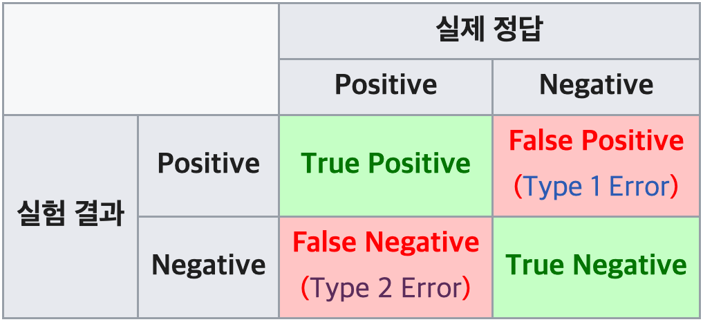

# Accuracy Metrics

출처: [wikipedia](https://ko.wikipedia.org/wiki/%EC%A0%95%EB%B0%80%EB%8F%84%EC%99%80_%EC%9E%AC%ED%98%84%EC%9C%A8)

 

## Precision & Recall

Precision은 아래 그림에서의 `True Positive`와 `False Positive`를 통해 우리의 예측이 얼마나 정확했는가를, recall은 `True Positive`와 `False Negative`를 사용하여 전체 정답 데이터 중 몇 개의 정답 데이터를 우리가 예측해 냈는가를 알 수 있는 지표이다.

즉, precision과 recall의 차이는 `False Positive`를 고려할 것인가, 혹은 `False Negative`를 고려할 것인가에 있다. Precision은 False 데이터를 True라고 잘 못 예측하지 않는 능력을 측정하며, recall은 True 데이터를 False라고 잘 못 판단하지 않는 능력에 대해 측정한다. 그 의미와 중요도는 데이터의 도메인마다 다르다.