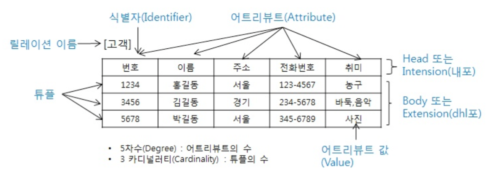

# Database

Wikipedia 데이터베이스

>데이터베이스는 체계화된 데이터의 모임이다.
>여러 사람이 공유하고 사용할 목적으로 통합 관리되는 정보의 집합이다.
>논리적으로 연관된 하나 이상의 자료의 모음으로 그 내용을 고도로 구조화함으로써 검색과 갱신의 효율화를 꾀한 것이다.
>즉, 몇 개의 자료 파일을 조직적으로 통합하여 자료 항목의 중복을 없애고 자료를 구조화하여 기억시켜 놓은 자료의 집합체라고 할 수 있다.

- Berkeley Database 강의에서는 DBMS 활용이 아닌, 제작하는 법을 배운다.

  [CS 186. Introduction to Database Systems](https://www2.eecs.berkeley.edu/Courses/CS186/)

  현재 공부하는 대부분의 자료구조를 활용하게 된다.

- DB의 장점

  - 데이터 중복 최소화
  - 데이터 무결성을 확보하여 정확한 정보를 저장
  - 데이터 일관성
  - 데이터 독립성(물리적 독립성과 논리적 독립성)
  - 데이터 표준화
  - 데이터 보안 유지

- RDBMS, 관계형 데이터베이스 관리 시스템

  관계형 모델을 기반으로하는 데이터베이스 관리시스템

  i.g., 오픈 소스 RDBMS(MySQL, SQLite, PostgreSQL), ORACLE, MS SQL

- 연습용 csv 파일

  <http://zzu.li/hello_db>

 

 

## 관계형 데이터 베이스, Relational Database

관계(relation)를 표현하기 위하여 2차원의 표(table)를 사용

 

### SQLite

SQLite는 서버가 아닌 응용 프로그램에 넣어 사용하는 비교적 가벼운 데이터베이스이다.  
구글 안드로이드 운영체제에 기본적으로 탑재된 데이터베이스이며, 임베디드 소프트웨어에도 많이 활용이 되고 있다. 
로컬에서 간단한 DB 구성을 할 수 있으며, 오픈소스 프로젝트이기 때문에 자유롭게 사용할 수 있다. 