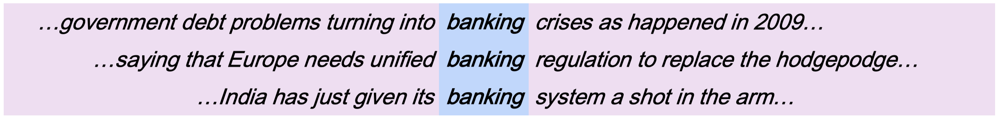
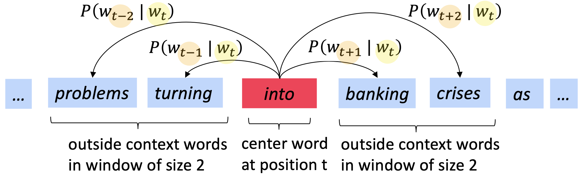
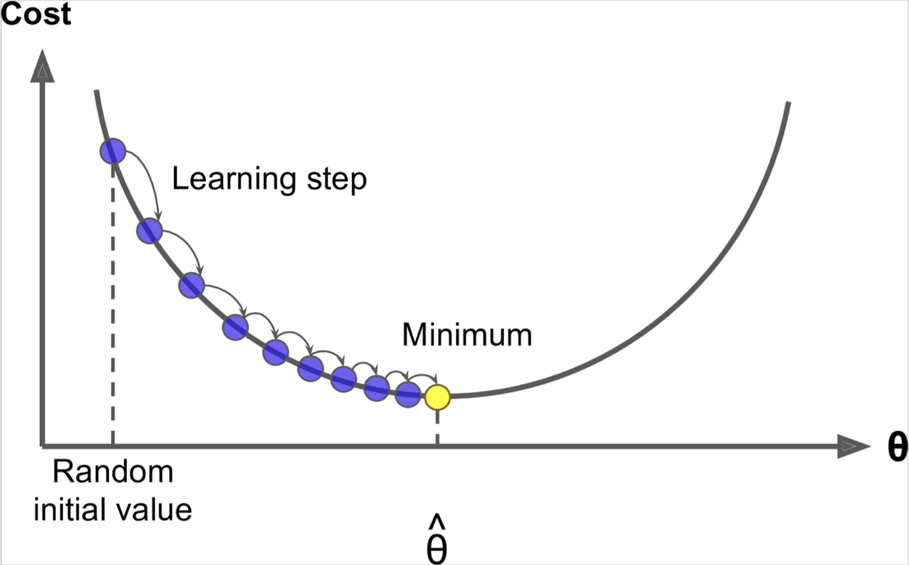
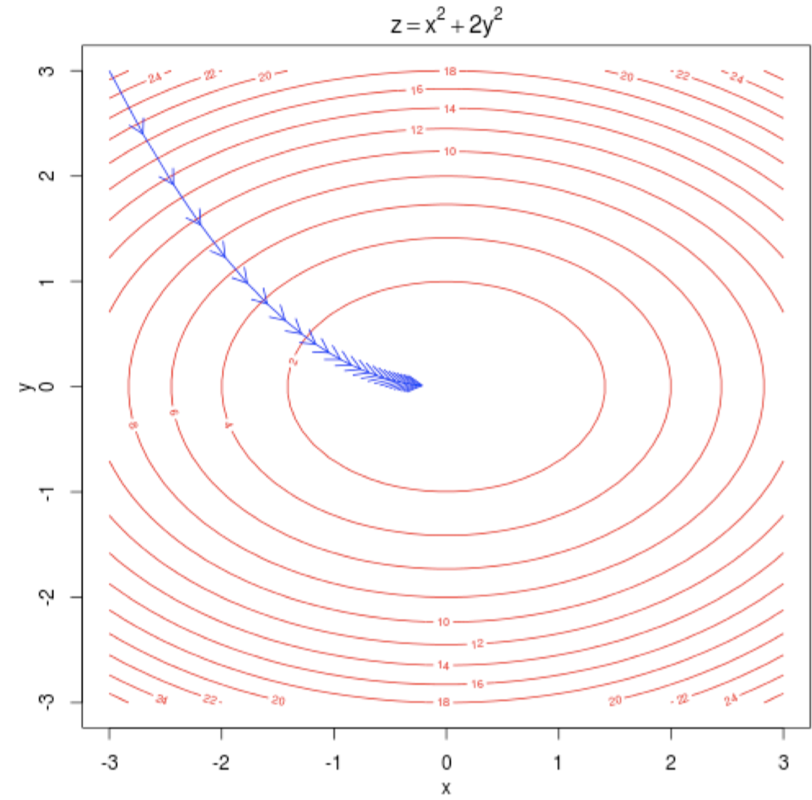

# 1. Word2Vector

## 1-1. How do we represent the meaning of a word?

### meaning, 의미란?

Webster Dictionary의 '의미'에 대한 정의입니다.
- the idea that is represented by a word, phrase, etc

  단어, 구절과 같은 것으로 표상되는 생각

- the idea that a person wants to express by using words, signs, etc

  사람이 단어, 표식과 같은 것으로 나타내고 싶은 생각

- the idea that is expressed in a work of writing, art, etc

  글쓰기, 예술과 같은 것으로 나타내고 싶은 생각

 

### 언어학적 의미

가장 언어학적인 '의미'에 대한 정의는 다음과 같습니다.

- `signifier(symbol) <=> signified(idea or thing)`

이러한 해석을 **표시적 의미론(denotational semantics)**라고 합니다.

 

 

## 1-2. Denotaional Semantics

### WordNet 형태의 문제점

- Great as a resource but missing nuance
  - good과 proficient는 일부 문맥에서는 동의어이지만, 다른 문맥에서는 아닐 수 있다.
  - 즉, nuance를 고려하지 못한다.
- Missing new meanings of words
  - 직접 사람이 업데이트 해야한다.
- Subjective
- Can't compute accurate word similarity
  - 사람이 지정한 대로 의미가 정의되며, 사람이 생각하지 못한 동의어와 같은 관계들이 존재한다.

 

### Discrete symbols

- In traditional NLP, we regard words as discrete symbols

  - hotel conference, motel (a **localist representation**)

  - 벡터 끼리는 직교(orthogonal)하며, **관계를 표현할 수 없다**.

    $W_{house}\cdot W_{hotel} = 0$

- Words can be represented by one-hot vectors

  - one-hot vector를 사용할 경우 단어 별 벡터의 **차원 크기(Vector dimension)가 단어 개수만큼으로, 매우 크다**.

    $[0, 0, ... , 0, 0 , 1, 0 , 0, ... , 0, 0 ]$

  - 만약 관계를 표현하려 할 경우,벡터의 `(차원 크기) * (차원 크기)`의 테이블이 필요하다.

 

 

## 1-3. Distributional Semantics

Denotaional Semantics는 단어 별로 고정된 별개의 벡터(one-hot vector)를 소유하며, 단어 간의 관계를 표현하기가 어렵습니다. 사람이 직접 정의해 주거나, 단어 집단 전체의 제곱에 해당하는 크기의 유사도 테이블을 생성하는 등의 작업이 필요합니다. 반면에 Distributional Semantics의 경우, 단어에 단순히 one-hot vecotr를 부여하는 것이 아니라, 단어의 벡터를 문맥(context)과의 관계로 학습하여 생성합니다. 즉, 같은 문맥에서 사용되는 단어들 끼리는 유사한 값을 갖게 됩니다.

 

### Representing words by their context

**Distributional semantics**: A word's meaning is given by the words that frequently appear close-by

단어의 의미는 단어 주변에 자주 등장하는 다른 단어들에 의해 정해집니다.

 

### Word vectors

단어 별 dense vector를 구축할 것이며, 유사한 문맥에서 등장하는 단어들 끼리는 유사한 벡터를 지니게 합니다. 최소 50 차원에서, 큰 규모의 경우 2000-3000 차원으로 제작하기도 합니다. **Word Vectors는 Distributed Representation이며, Word Embeddings 혹은 Word Representations라고도 합니다**.

 

 

## 1-4. Word2vec overview

Word2vec([Mikolov et al.2013](https://arxiv.org/pdf/1301.3781.pdf))은 word vectors를 학습하는 프레임워크입니다. Word2vec의 과정은 다음과 같습니다.

- 큰 규모의 텍스트 말뭉치(courpus)가 있으며, 모든 단어들이 벡터로 표상되어 있다.
- 모든 텍스트들의 위치($t$)들을 순회하는데, 이 때 중심 단어($t$ 위치에서의)를 $c$, 그리고 문맥 단어(주변 단어)를 $o$라고 칭한다.
- $c$에 대한 $o$, $o$에 대한 $c$의 확률을 계산하기 위해 $c$와 $o$의 유사도를 사용한다.
- 위의 확률을 최대화 하기 위해 word vector들의 값을 조정한다.

 

### 예시

$P(w_{t+j}|w_{t})$ 값을 구하는 것에 대한 그림입니다. 즉, 중심 단어가 $w_{t}$일 때 주변 단어가 $w_{t+j}$일 확률입니다.

 

 

## 1-5. Word2vec: Objective Function

매 위치 $t(= 1, ... , T)$에서 중심 단어 $w_{t}$에 대한 고정된 window size($m$) 개의 주변 단어들을 예측합니다.

 

(maximize) **Likelihood** = $L(\theta) = \prod^T_{t=1}\prod_{-m≤j≤m(j≠0)}\log P(w_{t+j}|w_{t};\theta)$

 

$\theta$ 는 최적화 되어야 할 모든 변수들을 의미하며, Likelihood를 최대화 시키는 것을 목표로 합니다. 목적 함수는 최대화 혹은 최소화 시키는 것을 목적으로 하는 모든 함수를 말합니다.

 

(minimize) $J(\theta) = -\frac{1}{T}\sum^T_{t=1}\sum_{-m≤j≤m(j≠0)}\log P(w_{t+j}|w_{t};\theta)$

 

Likelihood는 다시 **목적 함수(Objective Function)**이자 **손실 함수(Loss Function)**인 $J(\theta)$ 로 변환할 수 있습니다. $J(\theta)$ 는 **Average of Negative Log Likelihood**입니다. 목적 함수, 손실 함수를 최소화 하는 것은 Predictive Accuracy를 최대화하는 것과 같은 역할을 합니다.

 

### 단어 별 벡터들

Word2vec 프레임워크를 사용하는 최종 목적은 단어 별로 단어를 표상하는 벡터를 하나씩 구축하기 위해서입니다. 그런데 **Prediction Function**, $P(w_{t+j}|w_{t};\theta)$ 의 값을 구하기 위해서는 단어 별로 두 개의 벡터들이 필요합니다. 즉, $\theta$ 는 단어 별로 하나의 vector를 갖는 것이 아니라, 주변 단어와 중심 단어일 때로 나누어집니다.

- $v_{w}$: 단어 $w$ 가 중심 단어일 때의 벡터
- $u_{w}$: 단어 $w$ 가 주변 단어일 때의 벡터

현재 참조하려는 단어 $w$ 가 중심 단어로써 사용되고 있다면 $v_{w}$ 벡터를, 주변 단어로써 사용되고 있다면 $u_{w}$ 벡터를 사용합니다. 이를 이용하여 중심단어 c와 주변 단어 o의 관계를 식으로 표현하면, 다음과 같습니다.

$P(o|c) = \frac{\exp(u^{T}_{o}v_{c})}{\sum_{w\in V}\exp(u^{T}_{w}v_{c})}$

 

 

## 1-6. Word2vec: Prediction Function

$P(o|c) = \frac{\exp(u^{T}_{o}v_{c})}{\sum_{w\in V}\exp(u^{T}_{w}v_{c})}$

위 식의 분모와 분자에서 사용되는 계산의 의미는 다음과 같습니다.

- 분자: 주변 단어와 중심 단어의  dot product를 통해 유사도를 계산

- 분모: 모든 단어 집단을 정규화(normalize)하여 확률 분포를 구성

  (단어 집합 전체의 단어와 중심 단어의 dot product한 결과들의 합)

 

### Softmax Function

이러한 계산 방식은 softmax function $\R ^{n} \to \R^{n}$ 의 활용한 것입니다.

$softmax(x_{i}) = \frac{\exp(x_{i})}{\sum^{n}_{j=1}\exp(x_{j})} = p_{i}$

Softmax function은 임의의 값 $x_{i}$ 를 확률 분포 $p_{i}$ 로 매핑합니다.

Softmax의 이름이 'soft' + 'max'인 이유는, 'soft'는 매우 작은 $x_{i}$ 값 또한 버리지 않고 확률을 할당하기 때문이며, 'max'는 큰 $x_{i}$ 값들을 증폭하여 더 큰 확률 값을 할당받도록 하기 때문입니다. 'Hardmax'의 경우 큰 값을 증폭시키고, 작은 값을 0으로 만듭니다.

Softmax function에서 exponentation을 사용하는 데에는 두 가지 의미가 있습니다.

- 모든 값을 양수로 설정
- 작은 값은 더 작게, 큰 값은 더 크게하여 분포의 차이를 극대화

 

 

## 1-7. Word2vec: Optimization

우리는 loss function인 $J(\theta) = -\frac{1}{T}\sum^T_{t=1}\sum_{-m≤j≤m(j≠0)}\log P(w_{t+j}|w_{t};\theta)$ 를 최소화 해야 하며, $J(\theta)$ 는 $\log  P(w_{t+j}|w_{t};\theta)$를 최대화 하는 것으로 최소화 할 수 있습니다.

$P(o|c) = \frac{\exp(u^{T}_{o}v_{c})}{\sum_{w\in V}\exp(u^{T}_{w}v_{c})}$

즉, 분모의 계산인 **중심 단어와 주변 단어**와의 dot product 값을 **최대화** 하며, 분자의 계산인 **중심 단어와 나머지 단어들**과의 dot product 값을 **최소화** 해야 합니다.

 

### Chain Rule

최소화 과정을 설명하기에 앞서, 학습 과정에서 사용되는 유용한 법칙인 Chain Rule에 대해 설명해 보겠습니다. $y=f(u)$ 와 $u=g(x)$, 즉 $y=(g(x))$가 있습니다. 이 때, Chain Rule을 사용하면 $x$ 에 대한 $y$ 의 변화량 간단히 계산할 수 있습니다.

$\frac{dy}{dx} = \frac{dy}{du} \frac{du}{dx} = \frac{df(u)}{du} \frac{dg(x)}{dx}$

Chain rule을 사용하여 당장 구할 수 없는 값을, 구할 수 있는 값들로 분해하여 계산할 수 있습니다.

 

### Gradient

$\log P(o|c)$ 는 $\log\frac{\exp(u^{T}_{o}v_{c})}{\sum_{w\in V}\exp(u^{T}_{w}v_{c})}$  라고 표현할 수 있으며, 그 변화량을 계산해 보겠습니다.

1. $\frac{d}{dv_{c}}log\frac{\exp(u^{T}_{o}v_{c})}{\sum_{w\in V}\exp(u^{T}_{w}v_{c})}$

2. $= \frac{d}{dv_{c}}\log \exp(u^{T}_{o}v_{c}) - \frac{d}{dv_{c}}\log\sum^{V}_{w=1}\exp(u^{T}_{w}v_{c})$

3. $=\frac{d}{dv_{c}}u^{T}_{o}v_{c} - \frac{d}{dv_{c}}\log\sum^{V}_{w=1}\exp(u^{T}_{w}v_{c})$

   - **분자** 부분 $\frac{d}{dv_{c}}u^{T}_{o}v_{c}$
     
     $= \frac{d}{dv_{c}}[u_{o_{1}}v_{c_{1}}, u_{o_{1}}v_{c_{2}}, ... , u_{o_{100}}v_{c_{100}}]$
     
     $= [u_{o_{1}}, u_{o_{2}}, u_{o_{3}}, u_{o_{100}}]$
     
     $= u_{o}$
     
      
     
   - **분모** 부분 $\frac{d}{dv_{c}}\log\sum^{V}_{w=1}\exp(u^{T}_{w}v_{c})$
     
     $f = \log()$와 $g(v_{c}) = \sum^{V}_{w=1}\exp(u^{T}_{w}v_{c})$ 으로 구분하여 **Chain Rule**을 적용
     
     $(\log x)' = \frac{1}{x}$ 이며, $\frac{df(v_{c})}{dv_{c}} = \frac{df(g(v_{c}))}{dg(v_{c})} \frac{dg(v_{c})}{dv_{c}} = f'(g(v_{c})) \cdot g'(v_{c})$ 이므로,
     
      
     
     $= \frac{1}{\sum^{V}_{w=1}\exp(u^{T}_{w}v_{c})}\cdot \frac{d}{dv_{c}}\sum^{V}_{X=1}\exp(u^{T}_{X}v_{c})$
     
     $= \frac{1}{\sum^{V}_{w=1}\exp(u^{T}_{w}v_{c})}\cdot \sum^{V}_{X=1}\frac{d}{dv_{c}}\exp(u^{T}_{X}v_{c})$
     
      
     
     다시 시그마 뒤의 $f = \exp()$와 $g(v_{c}) = u^{T}_{X}v_{c}$에 **Chain Rule**을 적용
     
     $= \frac{1}{\sum^{V}_{w=1}\exp(u^{T}_{w}v_{c})} \cdot\sum^{V}_{X=1}\exp(u^{T}_{X}v_{c})\cdot \frac{d}{dv_{c}}u^{T}_{X}v_{c}$
     
     $= \frac{1}{\sum^{V}_{w=1}\exp(u^{T}_{w}v_{c})} \cdot\sum^{V}_{X=1}\exp(u^{T}_{X}v_{c})\cdot u_{X}$

따라서 전체 식을 다시 정리해 보면 다음과 같습니다.

$\frac{d}{dv_{c}}\log P(o|c)$

$= u_{o} - \sum^{V}_{X=1}\frac{\exp (u^{T}_{X}v_{c})}{\sum^{V}_{w=1}\exp (u^{T}_{w}v_{c})}\cdot u_{X}$

$= u_{o} - \sum^{V}_{X=1}P(X|c) \cdot u_{X}$

여기서 $u_{o}$는 **실제 문맥 단어(observed, actual context word)**의 벡터이며, $\sum^{V}_{X=1}P(X|c) \cdot u_{X}$는 **예상 단어(expected context word)**의 벡터입니다.

$u_{X}$인 **각 단어들의 표상**에 **현재 모델에서의 현재 단어의 확률 값**인 $P(X|c)$를 곱해주고, (표상 * 확률)들의 합($\sum^{V}_{X=1}$)을 구하여 **weighted average**를 계산합니다.

그 후 정답 단어의 표상과 예상 단어의 표상의 차이를 구함으로써 표상 변화의 방향과 값(**gredient**)을 설정합니다.

*"Weighted average($\sum^{V}_{X=1}$) of the representations of each word($u_{x}$), multiplied by the probability of the word in the current model."*

 

### Learning Rate

우리에게는 최소화 하고 싶은 $J(\theta)$ 가 있으며, Gredient Descent는 $J(\theta)$ 를 최소화하기 위해 gredient를 목적 함수에 적용하는 알고리즘입니다. 우리는 Gredient Descent의 다음과 같은 과정을 통해 목적 함수를 최소화 합니다.

1. 현재의 $\theta$ 값에 대해 $J(\theta)$ 의 기울기를 계산
2. **Negative gradient**의 방향으로 작은 step만큼 적용
3. 위의 1-2 단계를 반복

$\theta$ 를 update하는 식은 다음과 같습니다.

$\theta ^{new} = \theta ^{old} - \alpha \nabla_{\theta}J(\theta)$

- $\alpha$: Step Size 혹은 Learning Rate

현재 $\theta$ 에 대한 loss를 계산하고, 현재 $\theta$에 $\alpha$ 의 비율만을 적용합니다. 만약 변화량이 클 경우, 최적해를 갖게 하는 $\hat \theta$ 으로 접근하지 못한 채 변화 무쌍한 gredient를 갖게 됩니다. 즉, 아래의 그림처럼 차근차근 접근하여 최적해를 탐색해야 합니다.

