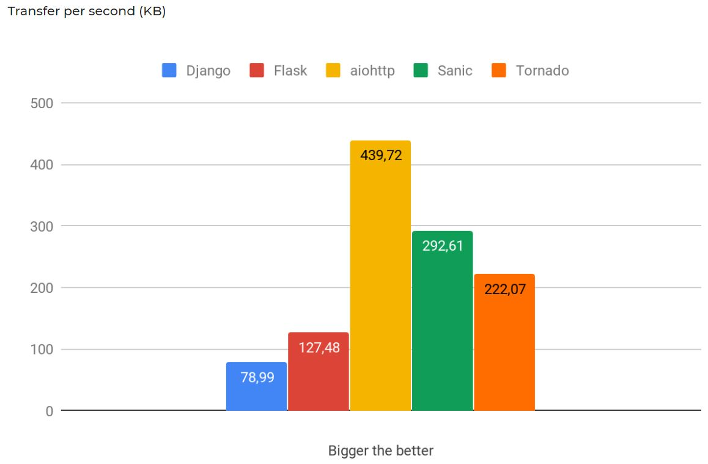

# Django Intro

- Django's Vision

  - Versatile, 다용도의
    Complete, 완결성있는
    Secure, 안전한
    Scalable, 확장성있는
    Maintainable, 쉬운유지보수
    Portable, 포터블한

- Django의 성격

  Opinionated, 독선적
  django에서 문법을 지정하여, 초기 문법 공부가 요구됨

  - Unopinionated, 관용적

    많은 것들을 허용하지만, 차후 많은 것들이 제한되거나 충돌

- Youtube, Instagram, Mozilla, NASA 등에서 사용하여 Web App 제작

- <https://hotframeworks.com/>

  framework 순위 확인 가능

- Static Web

  누구에게나 같은 contents를 보여주는 page

- Dynamic Web, Web Application Program(Web App)

  유저 별, 상황 별 다른 페이지를 return

- Framework

  기본적인 구조나 필요한 코드들을 알아서 제공

  웹 서비스를 만드는데에 집중 가능

- Flask

  ```python
  @app.route('url')
  def index():
      return render_template
  ```

  page 별로 위의 패턴을 적용하여 작성해야함

  e.g., post, posts, posts/edit, posts/delete.... 기능 별로 모두 제작하는 **Micro Framework**

  - Maintenance 또한 복잡해짐

<br>

<br>

## Django의 **MTV**

> 다른 Framework에는 MVC가 존재하며, Django는 차별화를 위해 MTV를 사용

- Model

  데이터를 관리하며, Database로 접근

- Template

  사용자가 보는 화면(HTML)을 관리

  - Flask의 `render_template()` 역할

- **View**

  Model과 Template의 **중간 관리자**

  - URLS를 통해 `url`을 받고, 이를 Model 혹은 Template으로 전송하여 작업을 진행

<br>

### 대형 Project를 진행할 때의 기획 순서

1. Model 제작
2. Workflow
   1. Url 정의
   2. View 함수 정의
   3. Template 제작

<br>

<br>

## TPS, Transfer Per Second

이미지 출처: [StartMatter](https://blog.startmatter.com/top-fast-python-web-frameworks-in-2019/)



### Django's TPS

현재 운영되는 대형 서버들의 경우, 처음 시작을 장고로 했으나 다른 프레임워크로 변경한 서비스들이 많습니다. 그 이유는 장고의 TPS가 비교적 제한되어 있기 때문입니다. 따라서 글로벌 서비스를 제공하기 어려우며, Instagram 또한 일부를 제외하고는 모두 다른 프레임워크로 교체했습니다.

그렇다고 장고의 사용 자체가 제한되는 것은 아닙니다. 국내 사용에서는 그 성능의 한계를 발견하기가 힘듭니다. 국내 서비스에 비교하자면, 카카오톡 정도의 사용량이 되어야 그 한계를 발견할 수 있을 것입니다.

<br>

### MSA, Micro Service Area

카카오톡 또한 Rails라는 프레임워크를 사용하던 중 서비스 제공이 제한됨을 느꼈으며, 서비스 중 일부를 다른 프레임워크로 대체하여 사용하게 됐습니다. 이러한 부분적 사용을 MSA라고 합니다.

