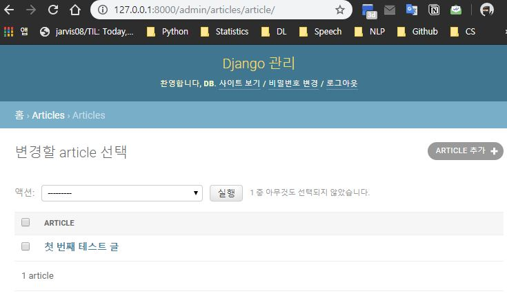
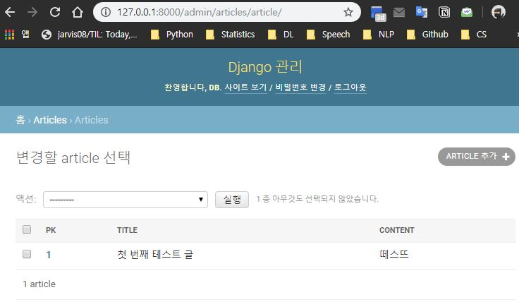

# Administration

## Django Admin에서 Data 관리하기

### Admin 계정 생성하기

- admin 계정 생성 명령어

  ```bash
  $ python manage.py createsuperuser
  ```

  - 결과

    ```bash
    Username (leave blank to use 'student'): #admin
    Email address: #Enter(생략)
    Password: #12341234
    Password (again): #12341234
    This password is too common.
    This password is entirely numeric.
    # 비밀번호가 너무 쉽다고 경고
    Bypass password validation and create user anyway? [y/N]: y
    Superuser created successfully.
    ```

  - http://localhost:8000/admin/ 접속 가능

<br>

### Admin에서 DB의 data를 다룰 수 있도록 설정하기

- `PROJECT_NAME/AppName/admin.py`에서 Article Class 추가

  ```python
  from django.contrib import admin
  from .models import Article
  
  # Register your models here.
  admin.site.register(Article)
  ```



<br>

<br>

## Admin Customization

참고자료: [초보몽키](https://wayhome25.github.io/django/2017/03/22/django-ep8-django-admin/)

```python
from django.contrib import admin
from .models import Article

# Register your models here.
class ArticleAdmin(admin.ModelAdmin):
    # admin에서 무엇을 볼 지 지정
    list_display = ('pk', 'title', 'content',)
    
    # list_display_links = ['title',]
    

admin.site.register(Article, ArticleAdmin)
```

