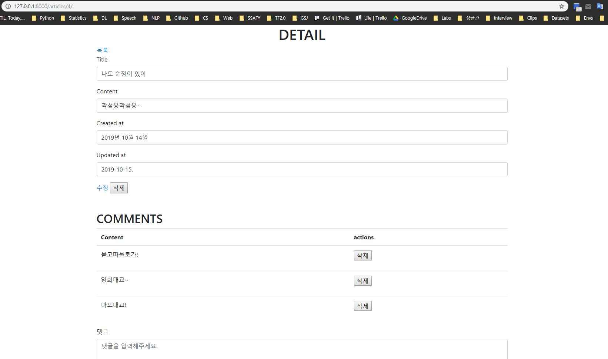

# ModelForm Application

## Comments

### Urls

```python
# urls.py

urlpatterns = [
    path('', views.index, name='index'),
    path('<int:article_pk>/', views.detail, name='detail'),
    path('<int:article_pk>/update/', views.update, name='update'),
    path('<int:article_pk>/delete/', views.delete, name='delete'),
    path('create/', views.create, name='create'),
    path('<int:article_pk>/comments/', views.comments, name='comments'),
    path('<int:article_pk>/comments_delete/<int:c_id>/', views.comments_delete, name='comments_delete'),
]
```

<br>

### Model

```python
class Comment(models.Model):
    content = models.TextField()
    created_at= models.DateTimeField(auto_now_add=True)
    updated_at= models.DateTimeField(auto_now=True)
    article = models.ForeignKey(Article, on_delete=models.CASCADE)

    class Meta:
        ordering = ('-pk',)
```

<br>

### ModelForm

```python
# forms.py
from .models import Comment

class CommentModelForm(forms.ModelForm):
    class Meta:
        model = Comment
        fields = ('content',)
    
    content = forms.CharField(
        label='댓글',
        widget=forms.Textarea(
            attrs={
                'class': 'form-control my-content',
                'placeholder': '댓글을 입력해주세요.',
                'rows': 5,
            }
        )
    )
```

<br>

### Views

```python
# views.py
from django.shortcuts import render, redirect, get_object_or_404
from .models import Article, Comment
from .forms import ArticleForm, ArticleModelForm, CommentModelForm
from django.http import Http404
from django.views.decorators.http import require_POST

def detail(request, article_pk):
    # article = get_object_or_404(Article, pk=article_pk)
    # 직접 만들어 보기
    try:
        article = Article.objects.get(pk=article_pk)
    # except:
    ## 에러 지정하기
    except Article.DoesNotExist:
        raise Http404('해당하는 ID의 글이 존재하지 않습니다.')
    
    form = CommentModelForm()
    context = {
	    	'article': article,
    		'form': form,
      	'comments': article.comment_set.all(),
    }
    return render(request, 'articles/detail.html', context)


def comments(request, article_pk):
  	article = Article.objects.get(pk=article_pk)
    if request.method == 'POST':
        form = CommentModelForm(request.POST)
        
        if form.is_valid():
          	# commit: Database Commit
            # Foreign Key가 아직 등록되지 않았으므로, DB에 바로 넣으려 하면 에러 발생
            comment = form.save(commit=False)
            comment.article = article
            # comment.article_id = article_id
            comment.save()
    return redirect(article)


@require_POST
def comments_delete(request, article_pk, c_id):
    comment = get_object_or_404(Comment, pk=c_id)
    if request.method == 'POST':
        comment.delete()
    return redirect('articles:detail', article_pk)
```

<br>

### HTML

```html


  <div class="container">
    <h1 class="text-center">DETAIL</h1>
    <a href="">목록</a>
    
    <br>
    <label>Title</label>
    <p class="form-control">{{ article.title }}</p>
    <label>Content</label>
    <p class="form-control">{{ article.content }}</p>
    <label>Created at</label>
    <p class="form-control">{{ article.created_at | date:"Y년 m월 d일" }}</p>
    <label>Updated at</label>
    <p class="form-control">{{ article.updated_at | date:"SHORT_DATE_FORMAT" }}</p>

    <a href="">수정</a>
    <form class="d-inline" action="" method="POST">
      
      <button type="submit">삭제</button>
    </form>

    <br>
    <br>
    <br>
    <h2>COMMENTS</h2>

    <table class="table">
      <thead>
        <tr>
          <th scope="col">Content</th>
          <th scope="col">actions</th>
        </tr>
      </thead>
      <tbody>
        
          <tr>
            <td>{{ comment.content }}</td>
            <td><form action="" method="POST">
                
                <button type="submit">삭제</button></form></td>  
          </tr>
        
      </tbody>
    </table>

    <form action="" method="POST">
      
      
      <button type="submit">댓글달기</button>
    </form>
  </div>

```



<br>

<br>

## model-`related_name`

related_name은 **내가 참조하는 모델**이 **나를 어떤 이름으로 관리할 것인가**를 설정합니다. 우리는 이전에 게시글을 형성할 때, 1:N 관계인 User-Article에서 Article 모델을 다음과 같이 설정했습니다.

```python
class Article(models.Model):
    title = models.CharField(max_length=50)
    content = models.TextField()
    created_at = models.DateTimeField(auto_now_add=True)
    updated_at = models.DateTimeField(auto_now=True)
    user = models.ForeignKey(settings.AUTH_USER_MODEL, on_delete=models.CASCADE)
    like_users = models.ManyToManyField(settings.AUTH_USER_MODEL, related_name='like_articles', blank=True)

    def __str__(self):
        return self.title
    
    class Meta:
        ordering = ('-pk',)
    
    def get_absolute_url(self):
        # reverse('어느 뷰 함수로 가는지', '인자')
        return reverse('articles:detail', kwargs={'article_pk': self.pk})
```

여기서 user에 `related_name`을 설정하지 않았으며, User 입장에서 자신이 작성한 article을 검색할 때엔 다음과 같이 코드를 작성했습니다.

```python
articles = UserName.article_set.all()
```

여기서 `article_set`은 생성되는 **queryset**에 대해 django가 자동으로 생성한 이름입니다.

<br>

### Customizing 하기

하지만 우리는 model에서 `related_name`을 설정하여 **우리가 원하는 이름**을 할당할 수 있습니다.

```python
user = models.ForeignKey(settings.AUTH_USER_MODEL, related_name='articles', on_delete=models.CASCADE)
```

위 코드와 같이 `related_name='articles'`라고 설정해 준다면, 우리는 작성글 목록을 조회할 때 다음과 같이 사용할 수 있게 됩니다.

```python
articles = UserName.articles.all()
```

이렇게 설정한다면, 개발자로서는 훨씬 가시적으로 기능을 사용할 수 있게 됩니다.

