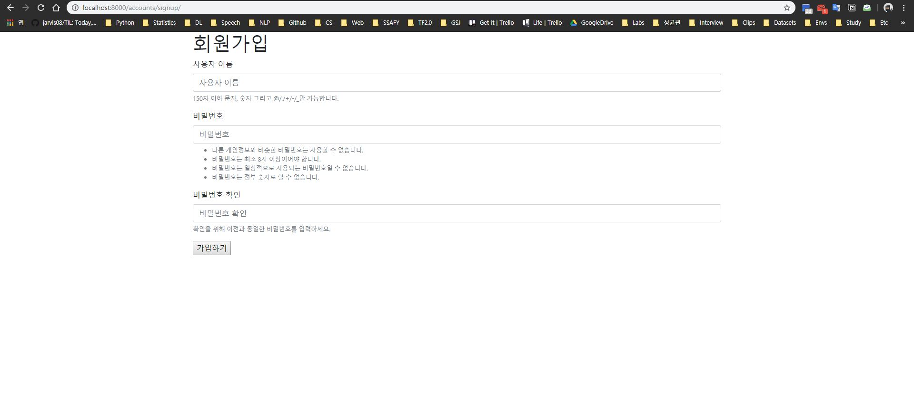
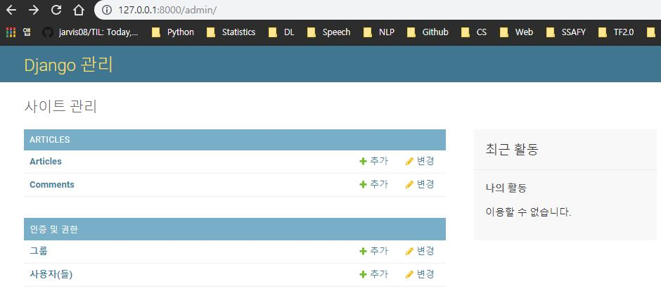
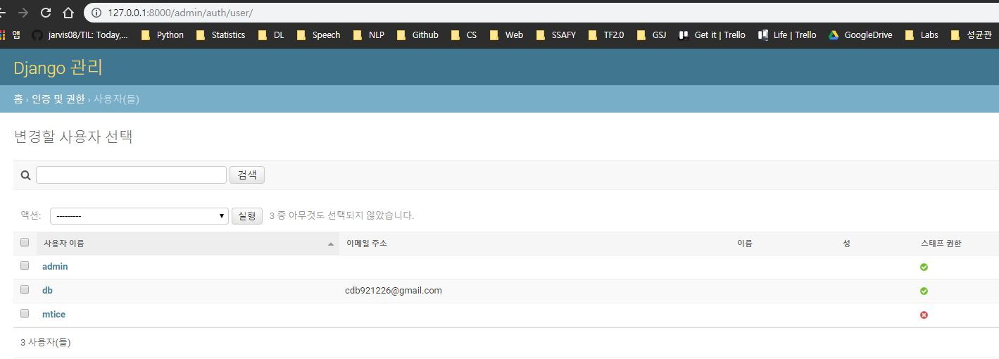
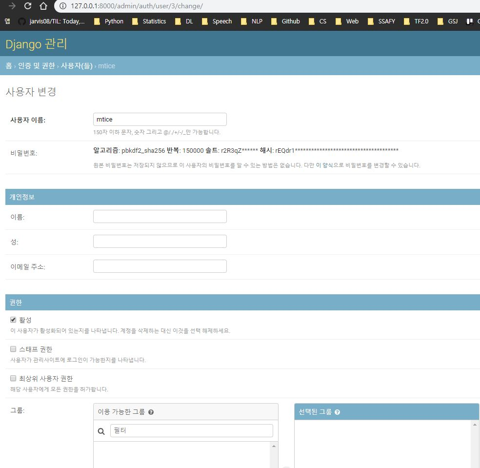
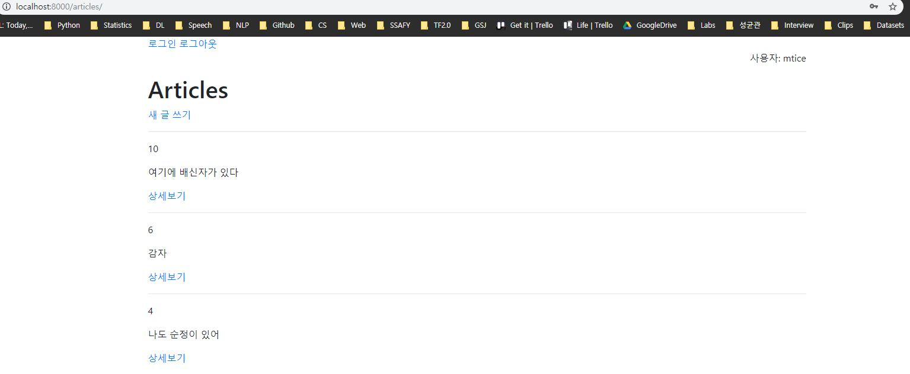
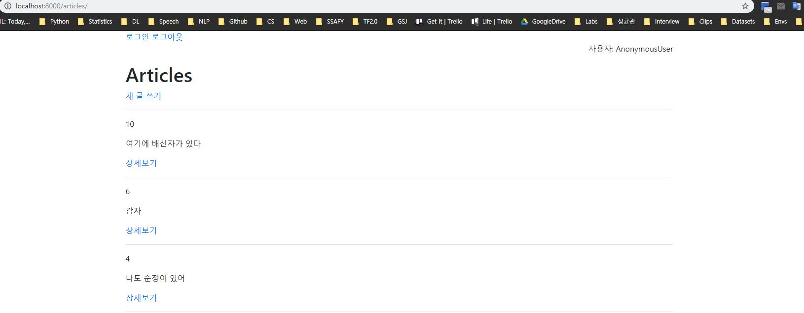

# Django Auth

### 설정하기

```python
INSTALLED_APPS = [
    'django_extensions',
    'articles',
    'django.contrib.admin',
    'django.contrib.auth',
    'django.contrib.contenttypes',
    'django.contrib.sessions',
    'django.contrib.messages',
    'django.contrib.staticfiles',
    'bootstrap4',
]
```

django에서는 auth 모듈을 이미 연동하고 디폴트로 사용하고 있다.

SQLite Extension을 활용하여 DB를 연동했을 때, 이미 auth에 대한 많은 내용이 있다.

`python manage.py startapp accoutns`

앱 생성후 추가

```python
INSTALLED_APPS = [
    'accounts',
    'django_extensions',
    'articles',
    'django.contrib.admin',
    'django.contrib.auth',
    'django.contrib.contenttypes',
    'django.contrib.sessions',
    'django.contrib.messages',
    'django.contrib.staticfiles',
    'bootstrap4',
]
```

```python
# pjt/urls.py
urlpatterns = [
    path('admin/', admin.site.urls),
    path('articles/', include('articles.urls')),
    path('accounts/', include('accounts.urls')),
]
```

```python
# accounts/urls.py
from django.urls import path
from . import views

app_name = 'accounts'

urlpatterns = [
    path('signup/', views.signup, name='signup'),
]
```

```html
<!-- signup.html -->



<h1>회원가입</h1>
<form action="">
  
  
</form>

```



다른 앱에서 게시글을 만들듯이, 유저 정보를 저장하면 된다. Model의 경우 django가 제공해주며, 따로 신경쓰지 않아도 된다.

`User`에서 `AbstractUser`(일반적 내용)로, 그리고 다시 `AbstractBaseUser`(핵심, 필수 내용)로 들어가야 django의 user 코드에 대해 자세히 알 수 있다.  이렇게 모듈화로 구분해 둔 이유는, 여러 곳에서 user의 정보를 사용할 때, 권한의 차이가 필요하기 때문이다.

django는 `Email` field를 `black=True`로 설정하며, 로그인 아이디를 닉네임(`UserName`)으로 설정해 두었다. 만약 email로 로그인을 하고 싶다면, `AbstractUser`가 아니라 `AbstractBaseUser`를 사용하여 Customizing 할 수 있다.

<br>

### User Creation

`action=""`는 없어도 된다!

action이 없다면, 알아서 자기 자신으로 보낸다.

```html
<button type="submit" class="btn btn-primary">가입하기</button>
```

는 다음으로 대체 가능하다.

```html

```

최종적인 html 내용은 다음과 같다.

```html



<h1>회원가입</h1>
<form method="POST">
  
  
  
</form>

```

```python
# views.py
from django.shortcuts import render, redirect
from django.contrib.auth.forms import UserCreationForm

# Create your views here.
def signup(request):
    if request.method == 'POST':
        form = UserCreationForm(request.POST)
        if form.is_valid():
            form.save()
            return redirect('articles:index')
    else:
        form = UserCreationForm()
        context = {
            'form': form
        }
        return render(request, 'accounts/signup.html', context)
```

<br>

**admin 접속**



<br>

**admin의 user 목록 확인**



<br>

**계정정보**



<br>

<br>

## 1. Log-in

- Form
  - `ModelForm` - 게시글에 대한 CRUD에 활용했었다.
  - `UserCreationForm` - User에 대한 CRUD
  - `AuthenticationForm` - Session에 대한 CRUD

```python
# accounts/urls.py
from django.urls import path
from . import views

app_name = 'accounts'

urlpatterns = [
    path('signup/', views.signup, name='signup'),
    path('login/', views.login, name='login'),
]
```

**HTML은 sign-up의 파일과 동일한 양식!**

```html



<h1>로그인</h1>
<form method="POST">
  
  
  
</form>

```

<br>

### views.login 방법 1

장고 모듈을 사용하지 않고, 우리가 배운 내용을 토대로 만들어 보기

```python
# views.py
from django.shortcuts import render, redirect
from django.contrib.auth.forms import UserCreationForm, AuthenticationForm

def login(request):
    if request.method == 'POST':
        form = AuthenticationForm(request, request.POST)
        if form.is_valid():
            # 기존의 장고의 모듈을 사용하지 않는 로그인 검증 과정
            username = request.POST.get('username')
            user = User.objects.get(username=username)
            if user:
                if user.passwors == request.POST.get('password'):
                    # 로그인한다 == 세션을 생성한다
                else:
                    # 비밀번호가 틀렸다면,
                    # 1. 다시 로그인창 보여준다
                    # 2. 비번 틀렸다고 경고
            else:
                # 해당하는 사용자 정보가 없다
    else:
        form = AuthenticationForm()
    context = {
        'form': form,
    }
    return render(request, 'accounts/login.html', context)
```

<br>

### views.login 방법 2

**django auth 모듈** 사용하여 간단하게 해결하는 방법

```python
# views.py
from django.shortcuts import render, redirect
from django.contrib.auth.forms import UserCreationForm, AuthenticationForm
from django.contrib.auth import login as auth_login

def login(request):
    if request.method == 'POST':
        form = AuthenticationForm(request, request.POST)
        if form.is_valid():
            # django의 로그인 모듈 활용
            # authentication의 user정보를 빼와서 login 모듈에 넣어줌
            auth_login(request, form.get_user())
            return redirect('articles:index')
    else:
        form = AuthenticationForm()
    context = {
        'form': form,
    }
    return render(request, 'accounts/login.html', context)
```

<br>

### Logged-in 상태임을 표시하기

```html
<p class="text-right">사용자: {{ user.username }}</p>
```

다른 활동 없이, `{{ user.username }}`만 작성해 두면, 장고가 알아서 사용자를 표시



<br>

<br>

## 2. Log-out

단, 아래의 snapshot에서 `사용자:AnonymousUser`가 보이게 하려면, html에서 `{{ user.username }}`이 아닌, {{ user }}로 해야한다!!!

```python
from django.shortcuts import render, redirect
from django.contrib.auth.forms import UserCreationForm, AuthenticationForm
from django.contrib.auth import login as auth_login
from django.contrib.auth import logout as auth_logout

def logout(request):
    # 세션 삭제
    auth_logout(request)
    return redirect('articles:index')
```



<br>

<br>

## 3. Log-in/out 상태 표시

```html
<!-- base.html -->



<!DOCTYPE html>
<html lang="ko">
<head>
  <meta charset="UTF-8">
  <meta name="viewport" content="width=device-width, initial-scale=1.0">
  <meta http-equiv="X-UA-Compatible" content="ie=edge">
  <title>Document</title>
</head>
<body>
  <div class="container">
    <div class="div text-right">
      
        <a href="">로그아웃</a>
        <p class="text-right">Hello, {{ user.username }}</p>
      
        <a href="">회원가입</a>
        <a href="">로그인</a>
      
    </div>
    
    
  </div>
</body>
</html>
```

``: 로그인 되었을 경우

`{{ user.username }}`: 로그인 된 username


<br>

### request.user

IPython의 `embed()`를 활용하여 확인해 보면,

로그인 됐을 경우의 `request.user`를 확인해 보면 user id가 나오며,

```shell
In [2]: request.user
Out[2]: <SimpleLazyObject: <User: mtice>>

In [3]: request.user.is_authenticated
Out[3]: True
```

로그아웃 한 경우 `AnonymousUser`로 처리되어 있다.

```shell
In [1]: request.user
Out[1]: <django.contrib.auth.models.AnonymousUser at 0x5a6a10>

In [2]: request.user.is_authenticated
Out[2]: False
```

따라서, user 정보는 `AnonymousUser`에 Override 되어 기입되며, **로그아웃 상태이더라도 default 객체가 생성되어 있다**는 것을 알 수 있다.

**admin** 또한 일반적인 user와 같은 형태의 객체 중 하나이다.

```shell
In [1]: request.user
Out[1]: <SimpleLazyObject: <User: admin>>

In [2]: request.user.is_superuser
Out[2]: True
```

<br>

### Log-in/out 여부에 따라 차이점 부여하기

```python
# log-in 시 signup과 login 접속 제한
def method_name(request):
    if request.user.is_authenticated:
        return redirect('articles:index')
```

```html
<!-- login 해야만 새글쓰기 가능 -->


<h1 id="title">Articles</h1>


  <a href="">새 글 쓰기</a>



  <hr>
  <p>{{ article.pk }}</p>
  <p>{{ article.title }}</p>
  <a href="{{ article.get_absolute_url }}">상세보기</a>


```

```python
# articles/views.py create 함수
def create(request):
    # 로그인 안한 상태로 url로 접속할 시 생성 불가 조치
    if not request.user.is_authenticated:
        return redirect('accounts:login')
    
    if request.method == 'POST':
```

그런데 이렇게 함수마다 if문을 생성하여 확인하는 것은 매우 번거롭다. 따라서 이를 **Decotrator**를 사용하여 편리하게 사용할 수 있다. **Connectionless, Stateless** 상태일 경우 사용을 제한한다.

```python
from django.contrib.auth.decorators import login_required

@login_required
def create(request):
    if request.method == 'POST':
```

그런데 여기서 우리가 `accounts` app에 로그인하는 view 함수 이름을 `login`으로 설정한 이유를 알 수 있다. 그 이유는 **`@login_required decorator`의 default login 페이지 경로가 `accounts/login/`**이기 때문이다. 따라서 만약 view함수의 url을 다른 이름으로 설정해 두었다면, 이를 아래처럼 설정해야 한다.

`@login_required(login_url='경로')`

```python
from django.contrib.auth.decorators import login_required

@login_required(login_url='/accounts/signin/')
def create(request):
    if request.method == 'POST':
```

혹은 settings.py에 default 경로를 지정해둘 수 있다.

`LOGIN_URL = '경로'`

```python
# settings.py
LOGIN_URL = '/accounts/signin/'
```

<br>

### 로그인 시 이전 작업으로 이동하기

```python
# accounts/views.py
def login(request):
    # 만약 로그인 되어있다면, index로 redirect
    if request.user.is_authenticated:
        return redirect('articles:index')

    if request.method == 'POST':
        form = AuthenticationForm(request, request.POST)
        if form.is_valid():
            # django의 로그인 모듈 활용
            # authentication의 user정보를 빼와서 login 모듈에 넣어줌
            auth_login(request, form.get_user())
            return redirect(request.GET.get('next') or 'articles:index')
```

<br>

<br>

## 4. 401 Error

**Unauthorized Error**이다. 즉, 로그인 정보가 잘못됐음을 의미한다. 서버를 만약 API Call로 사용하게 된다면, token으로 인증되지 않는 정보로 요청이 왔을 때 이를 거절한다. API Call을 사용할 때에는 요청 마다 인증 정보를 보내도록 되어 있다.

`Http404`의 경우 너무 많이 사용되어서 따로 제작되어 있지만, 나머지 요청의 경우 `HttpResponse` 사용한다.

```python
# articles/views.py
from django.http import Http404, HttpResponse

@require_POST
@login_required
def delete(request, article_pk):
    if request.user.is_authenticated:
        article = get_object_or_404(Article, pk=article_pk)
        
        if request.method == 'POST':
            article.delete()
            return redirect('articles:index')
        else:
            return redirect(article)
    
    # 인증된 사용자의 요청이 아닌 경우
    return HttpResponse('검증되지 않은 유저정보', status=401)
```

<br>

<br>

## 5. Session 다루기

세션을 update하는 것은 **로그인 시간 연장** 등에 사용된다.

<br>

<br>

## 6. 회원 탈퇴

```python
# accounts/views.py
from django.views.decorators.http import require_POST

@require_POST
def delete(request):
    # DB에서 user 삭제
    request.user.delete()
    return redirect('articles:index')
```


