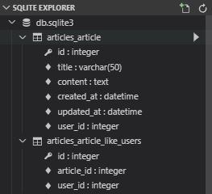
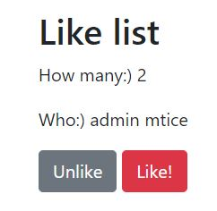

# M:N in Django

## User - Article - Comment 관계

User 1명은 여러 개의 Article과 Comment를 갖을 수 있습니다. 이를 관리하기 위해서는 `Article` 객체들 또한 **User를 Foreign Key로 보유**해야 합니다.

<br>

### 간접 레퍼런스

이를 위해, django의 User Model을 **간접 레퍼런스** 방법을 사용하는 **`AUTH_USER_MODEL`** 메서드로 참조합니다.

```python
# models.py
from django.db import models
from django.urls import reverse
from django.conf import settings


class Article(models.Model):
    title = models.CharField(max_length=50)
    content = models.TextField()
    created_at = models.DateTimeField(auto_now_add=True)
    updated_at = models.DateTimeField(auto_now=True)
    ####################################################
    user = models.ForeignKey(settings.AUTH_USER_MODEL, on_delete=models.CASCADE)
    ####################################################

    def __str__(self):
        return self.title
    
    class Meta:
        ordering = ('-pk',)
    
    def get_absolute_url(self):
        # reverse('어느 뷰 함수로 가는지', '인자')
        return reverse('articles:detail', kwargs={'article_pk': self.pk})
```

settings.py에 default가 지정되어 있다고 생각하면 편합니다.

```python
# settings.py
AUTH_USER_MODEL = 'auth.User'
```

위처럼 지정되어 있다고 생각하면 되는데, **_실제로  settings.py에기입되어 있지는 않다!_**

아래 처럼 **직접 레퍼런스**를 사용할 수 있습니다. 하지만, **간접 레퍼런스**를 참조하여 사용하는 것이 미래에 수정 내용들을 관리하기가 편리합니다.

```python
# 직접 레퍼런스 방법
from django.contrib import User

class Article(models.Model):
    ########################################################
    user = models.ForeignKey(User, on_delete=models.CASCADE)
    ########################################################
```

<br>

### Migrate

```shell
$ python manage.py makemigrations
You are trying to add a non-nullable field 'user' to article without a default; we can't do that (the database needs something to populate existing rows).
Please select a fix:
 1) Provide a one-off default now (will be set on all existing rows with a null value for this column)
 2) Quit, and let me add a default in models.py
Select an option: 1
Please enter the default value now, as valid Python
The datetime and django.utils.timezone modules are available, so you can do e.g. timezone.now
Type 'exit' to exit this prompt
>>> 2
Migrations for 'articles':
  articles\migrations\0003_article_user.py
    - Add field user to article
```

`Article`의 객체들에 Foreign Key에 해당하는 Column을 추가했습니다. 따라서 기존 객체들에 대한 값들을 부여해 줘야 하므로, `2`라는 값을 부여하여 이전 객체들은 모두 User ID가 2번인 계정에게 종속됩니다.

<br>

### Form 수정하기

현재까지 수정된 내용을 통해 새로 글을 작성하려 하면 Not Null Constraint Error가 발생합니다.

```python
# views.py
@login_required
def create(request):
    if request.method == 'POST':
        form = ArticleModelForm(request.POST)
        if form.is_valid():
            #####################
            article = form.save()
            #####################
            return redirect(article)
        else:
            return redirect('articles:create')
    else:
        form = ArticleModelForm()
        context = {
            'form': form,
        }
        return render(request, 'articles/create.html', context)
```

```python
# 수정 후
@login_required
def create(request):
    if request.method == 'POST':
        form = ArticleModelForm(request.POST)
        if form.is_valid():
            #################################
            article = form.save(commit=False)
            article.user = request.user
            article.save()
            #################################
            return redirect(article)
        else:
            return redirect('articles:create')
    else:
        form = ArticleModelForm()
        context = {
            'form': form,
        }
        return render(request, 'articles/create.html', context)
```

```html
<!-- detail.html -->
<label>User ID</label>
<p class="form-control">{{ request.user }}</p>

<label>User Name</label>
<p class="form-control">{{ request.user.last_name }}{{ request.user.first_name }}</p>
```

<br>

### Comment 수정하기

```python
# models.py
class Comment(models.Model):
    content = models.TextField()
    created_at= models.DateTimeField(auto_now_add=True)
    updated_at= models.DateTimeField(auto_now=True)
    article = models.ForeignKey(Article, on_delete=models.CASCADE)
    ##############################################################
    user = models.ForeignKey(settings.AUTH_USER_MODEL, on_delete=models.CASCADE)
	##############################################################
    
    class Meta:
        ordering = ('-pk',)
    
    def __str__(self):
        return self.content
```

```python
# views.py / CREATE
@login_required
def comments(request, article_pk):
    article = Article.objects.get(pk=article_pk)
    if request.method == 'POST':
        form = CommentModelForm(request.POST)
        if form.is_valid():
            comment = form.save(commit=False)
            comment.article = article
            ###########################
            comment.user = request.user
            ###########################
            comment.save()
    return redirect(article)
```

```html
<!-- detail.html -->
<table class="table">
  <thead>
    <tr>
      <th scope="col">Content</th>
      <th scope="col">Writer</th>
      <!--##############################-->
      
      <!--##############################-->
        <th scope="col">actions</th>
      
    </tr>
  </thead>
  <tbody>
    
      <tr>
        <td>{{ comment.content }}</td>
        <td>{{ comment.user }}</td>
        <td><form action="" method="POST">
            
            <!--##############################-->
            
            <!--##############################-->
              <button class="btn-sm btn-danger" type="submit">삭제</button></form></td>
            
      </tr>
    
  </tbody>
</table>
```

```python
# views.py / UPDATE
@login_required
def update(request, article_pk):
    article = get_object_or_404(Article, pk=article_pk)
    ################################
    if article.user == request.user:
    ################################
        if request.method == 'POST':
            form = ArticleModelForm(request.POST, instance=article)
            if form.is_valid():
                form.save()
                return redirect(article)
        form = ArticleModelForm(instance=article)
        context = {
            'article': article,
            'form': form,
        }
        return render(request, 'articles/update.html', context)
    else:
        return redirect('articles:index')
```

```python
# views.py / DELETE
@require_POST
@login_required
def delete(request, article_pk):
    if request.user.is_authenticated:
        article = get_object_or_404(Article, pk=article_pk)
        ################################
        if article.user == request.user:
        ################################
            if request.method == 'POST':
                article.delete()
                return redirect('articles:index')
            else:
                return redirect(article)
    
    # 인증된 사용자의 요청이 안리 경우
    return HttpResponse('검증되지 않은 유저정보', status=401)
```

<br>

<br>

## Many to Many 구현하기

수강신청, 예약(진료, 미용 등), Like/Follow 기능 등이 M:N 관계의 사용 사례입니다. 1:N은 포함 관계를 의미합니다. 댓글들은 게시글 하나에 포함됩니다. 하지만 M:N의 관계는 포함 관계가 형성될 수 없습니다. 여럿이 여럿을 서로 참조할 수 있습니다.

하지만 기존 1:N 관계는 객체 하나에 Foreign Key를 두어 구현할 수 있었습니다. 하지만 N:M은 단순히 객체관의 관계를 각 객체에서 나타내는 것으로는 구현하기 어렵습니다. 따라서 **중개 테이블** 역할을 하는 **중개 객체**를 생성해야 합니다. 중개 객체 하나 당 다음의 내용을 포함해야 합니다.

- N에 해당하는 객체의 ID
- M에 해당하는 객체의 ID

<br>

### ManyToManyField

그런데 장고에서는 `models.ManyToManyField()`를 사용하여 간단히 구현할 수 있습니다.

```python
class Article(models.Model):
    title = models.CharField(max_length=50)
    content = models.TextField()
    created_at = models.DateTimeField(auto_now_add=True)
    updated_at = models.DateTimeField(auto_now=True)
    user = models.ForeignKey(settings.AUTH_USER_MODEL, on_delete=models.CASCADE)
    #############################################################
    like_users = models.ManyToManyField(settings.AUTH_USER_MODEL, related_name='like_articles', blank=True)
    #############################################################

    def __str__(self):
        return self.title
    
    class Meta:
        ordering = ('-pk',)
    
    def get_absolute_url(self):
        return reverse('articles:detail', kwargs={'article_pk': self.pk})
```

위의 `like_users` 속성은 Article에 추가하는 것과 User에 추가하는 것 모두 가능합니다. 그런데 주어가 목적어를 하는 행위, **User가 Article을 Like하는 행위**를 구현하고 있으므로, **목적어**에 해당하는 Article에 작성하겠습니다. 이는 Convention입니다.

`related_name`은 **User 입장에서 해당 속성을 어떻게 읽을 것**인지, namespace에 저장되는 이름을 지정하는 인자입니다.

이후 `makemigrations` > `migrate`를 진행하면,  `articles_article_like_users` 테이블이 SQLite3 DB에 추가된 것을 확인할 수 있습니다.



<br>

### Shell Plus로 확인해 보기

이를 Django Extention인 Shell Plus를 통해 추가적으로 확인해 보겠습니다.

```bash
$ python manage.py shell_plus
# article 변수에 pk=3번 게시글을 저장
In [1]: article = Article.objects.get(pk=3)

In [2]: article
Out[2]: <Article: 묻고따블로가>

In [3]: article.comment_set.all()
Out[3]: <QuerySet []>

In [4]: article.user
Out[4]: <User: admin>

# adminy 변수에 3번 게시글의 작성자인 admin을 저장
In [5]: adminy = article.user

In [6]: adminy
Out[7]: <User: admin>

# admin 계정이 작성한 article을 모두 출력
In [8]: adminy.article_set.all()
Out[8]: <QuerySet [<Article: 여기에 배신자가 있다>, <Article: 감자>, <Article: 나도 순정이 있어>, <Article: 묻고따블로가>, <Article: 눈을감자>, <Article: 첫 번째 테스트 글>]>

# admin 계정의 가능한 메서드 확인
In [9]: dir(adminy)
Out[9]: 
[...,
 'like_articles',
 ..., 
 ]

# admin 계정의 좋아요 테이블 확인
In [10]: adminy.like_articles
Out[10]: <django.db.models.fields.related_descriptors.create_forward_many_to_many_manager.<locals>.ManyRelatedManager at 0x630fdd0>

# admin 계정의 좋아요로 등록한 article 목록 확인
In [11]: adminy.like_articles.all()
Out[12]: <QuerySet []>

# admin 계정의 like_articles 테이블에 3번 Article을 등록
In [13]: adminy.like_articles.add(article)

In [14]: adminy.like_articles.all()
Out[14]: <QuerySet [<Article: 묻고따블로가>]>

# 3번 Article을 좋아요 테이블(like_users)에 등록한 사용자들을 조회
In [15]: article.like_users.all()
Out[15]: <QuerySet [<User: admin>]>

In [16]: adminy.like_articles.add(Article.objects.get(pk=2))

In [17]: adminy.like_articles.all()
Out[17]: <QuerySet [<Article: 묻고따블로가>, <Article: 눈을감자>]>

# like_articles 테이블에서 3번 Article을 제외
In [18]: adminy.like_articles.remove(article)

In [19]: adminy.like_articles.all()
Out[19]: <QuerySet [<Article: 눈을감자>]>
```

<br>

### Like 기능 구현하기

```python
# urls.py
urlpatterns = [
    path('<int:article_pk>/like/', views.like, name='like'),
    path('<int:article_pk>/unlike/', views.unlike, name='unlike'),
]
```

```python
# views.py
@login_required
def like(request, article_pk):
    # 현재 접속 중인 request.user를 article의 like_users에 추가
    article = Article.objects.get(pk=article_pk)
    # 아래 코드 대신, request.user.like_articles.add(article) 가능
    article.like_users.add(request.user)
    return redirect(article)


@login_required
def unlike(request, article_pk):
    article = Article.objects.get(pk=article_pk)
    article.like_users.remove(request.user)
    return redirect(article)
```

```html
<!-- detail.html -->
<h2>Like list</h2>
<p>How many:) {{ article.like_users.count }}</p>
<p>Who:) 
  
    {{ liker }}
  
</p>
<p>{{ article.like_users. }}</p>
<a href="" class="btn btn-secondary">Unlike</a>
<a href="" class="btn btn-danger">Like!</a>
```



<br>

<br>

## Follow 기능

Follow 기능의 경우 User가 User를 Reference 하는 특수한 기능이자, M:N의 관계 구현에 있어서의 궁극의 기능입니다. 왜냐하면 M:N 관계에 있어서 M과 N이 모두 User이기 때문입니다.

