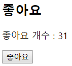

# Vue.js Intro

### Client Side Rendering

JavaScript의 사용 목적은 **Client Side Rendering**입니다. Django가 하는 rendering은 Server Side Rendering이라고 하며, html 페이지를 render합니다. 사용자는 Browser를 조작하는데, Browser를 조작하여 어떠한 요청을 했을 때 **새로운 페이지 load 없이 render** 할 수 있도록 사용되는 것이 JavaScript입니다. Client Side Rendering의 목적은 두 가지 입니다.

1. User Experience 고려

   페이지 바뀌는 것을 감소시켜 이탈률을 감소시킵니다.

2. 서버의 부하 감소

보다 심화된 내용으로는, Client Side Rendering 작업을 SPA를 통해 서버에서 직접 조작할 수도 있습니다.

<br>

### Declarative Programming

- **명령형 프로그래밍, Imperative Programming**

  모든걸 개발자가 명령합니다.

- **선언적 프로그래밍, Declarative Programming**

  큰 그림만 그려주면, React / Vue와 같은 Framework들이 알아서 자세한 내용을 처리해 줍니다. Django의 ORM도 선언적 프로그래밍을 구사하게 해줍니다.

<br>

### Vue.js

Vue.js는 Evan You가 개발했으며, 웹 어플리케이션을 매우 쉽게 개발할 수 있도록 도와주는 JavaScript Framework입니다. Vue.js는 **선언적 렌더링(Declarative Rendering)** 방식을 사용하며, **보다 쉽게 SPA(Single Page Application)를 구현**할 수 있습니다. 현재 Angular.js를 제치고 React.js 만큼의 popularity를 점유하고 있습니다. 구글의 Angular.js는 무겁지만 고성능을 보유했으며, React.js는 가볍고 Customizing이 잘되는 장점이 있습니다. Vue.js는 이러한 두 프레임워크의 중간 정도의 기능을 수행합니다.

**선언적 프로그래밍**은 모든 작업을 step by step으로 지시해주는 **명령적 프로그래밍**과 다릅니다. 명령적 프로그래밍의 예시로는 흔히 우리가 공부하는 알고리즘이 있습니다. 우리는 알고리즘 공부를 할 때, 순차적으로 모든 행위를 정의해야 합니다. 하지만 선언적 프로그래밍은 무엇을 할 지에 대한 전체적인 그림을 그려줄 뿐(선언), 일일이 명령하지 않습니다. 선언적 프로그래밍은 명령적 프로그래밍 보다 **Readable** 하다는 장점도 있습니다.

VueJS 프레임워크를 로드하는 방법은 두 가지 입니다.

1. Vue CLI

   Node.js의 패키지

2. [CDN](https://kr.vuejs.org/v2/guide/index.html)

<br>

<br>

## Vanilla JS를 Vue.js로 바꿔보기

### Vanilla JS - input event

사용자가 입력하는 텍스트를 브라우저에 그대로 띄워보겠습니다.

```html
<body>
  <h1>댓글 달기</h1>
  <input id="userInput" type="text">
  <p id="inputArea"></p>
  <script>
    const userInput = document.querySelector('#userInput')
    const inputArea = document.querySelector('#inputArea')
    
    userInput.addEventListener('keydown', function (event) {
      inputArea.innerText = event.target.value
    })
  </script>
</body>
```


만약 기존에 사용하던 `addEventListener('keydown')`을 사용할 경우, 한 발자국 늦은 동기화가 실행되어 불편을 야기할 수 있습니다. `keydown`은 키가 눌리는 순간 적용되며, `keyup`은 키가 눌린 후 떼어지는 순간 적용됩니다.

<br>

### Vanilla JS - 좋아요 개수 세기

```html
<body>
  <h2>좋아요</h2>
  <p id="likeCountArea"></p>
  <button id="likeButton">좋아요</button>

  <script>
    const likeButton = document.querySelector('#likeButton')
    const likeCountArea = document.querySelector('#likeCountArea')
    let likeCount = 0

    likeButton.addEventListener('click', function (event) {
      likeCount += 1
      likeCountArea.innerText = `좋아요 개수 : ${likeCount}`
    })
  </script>
</body>
```



<br>

### VueJS - Instance

위에서 진행해 본, input text를 복사하여 보여주는 javascript 코드를 Vue를 사용하여 구현해 보겠습니다.

```html
<head>
  <script src="https://cdn.jsdelivr.net/npm/vue/dist/vue.js"></script>
</head>
<body>
  <!-- view instance를 mount할 div태그 생성 -->
  <div id="app">
    <h1>댓글 달기</h1>
    <!-- directive인 vue-model 지정 -->
    <input type="text">
    <p >{{ msg }}</p>
  </div>

  <script>
    const app = new Vue({
      // Vue의 instance인 app이 조작할 object 지정
      el: '#app',
      data: {
        // instance variable 생성
        msg: 'Vue.js를 사용해 봅시다.',
      },
    })
  </script>
</body>
```


아래에 **Vue의 Instance**를 생성하여, `msg`라는 요소를 직접 작업해 보았습니다. 이제 인풋 텍스트 대로 `msg`를 **동기화**시켜 보겠습니다.

```html
<head>
  <script src="https://cdn.jsdelivr.net/npm/vue/dist/vue.js"></script>
</head>
<body>
  <!-- view instance를 mount할 div태그 생성 -->
  <div id="app">
    <h1>댓글 달기</h1>
    <!-- directive인 vue-model 지정 -->
    <input type="text" v-model="msg">
    <!-- <input type="text"> -->
    <p >{{ msg }}</p>
  </div>

  
  <script>
    const app = new Vue({
      // Vue의 instance인 app이 조작할 object 지정
      el: '#app',
      data: {
        // instance variable 생성
        msg: 'Vue.js를 사용해 봅시다.',
      },
    })
  </script>
</body>
```


**`v-model=""`**은 **Vue Instance의 model(data)**을 지정하는 속성입니다.

<br>

### VueJS - 좋아요 개수 세기

JavaScript를 이용하여 좋아요 개수를 Counting 했었는데, 이를 Vue.js를 이용하여 구현해 보겠습니다.

```html
<head>
  <script src="https://cdn.jsdelivr.net/npm/vue/dist/vue.js"></script>
</head>
<body>
  <div id="app">
    <h1>댓글 달기</h1>
    <input type="text" v-model="msg">
    <p >{{ msg }}</p>
    
    <h2>좋아요</h2>
    <p>좋아요 개수 : {{ likeCount }}</p>
    <!-- v-on을 통해 EventListener 기능을 수행 -->
    <button v-on:click="like">좋아요</button>
  </div>
  
  <script>
    const app = new Vue({
      el: '#app',
      data: {
        msg: 'Vue.js를 사용해 봅시다.',
        likeCount: 0,
      },
      methods: {
        // likeCount를 1씩 증가시켜 주는 instance method 작성
        like: function() {
          this.likeCount += 1
        }
      }
    })
  </script>
</body>
```

method를 vue instance에 작성 후 button에서 이를 사용하도록 합니다. `v-on:click="like"` 속성은, click됐을 때 `like` method를 실행하도록 합니다.


