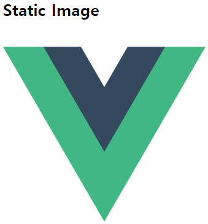
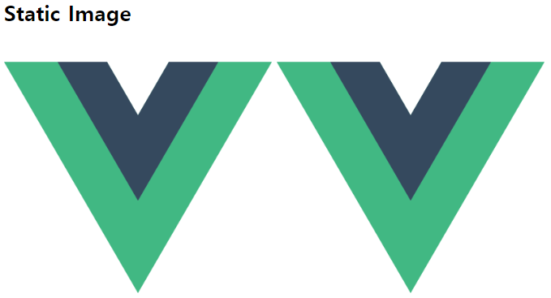
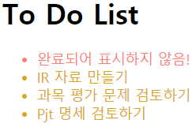

# Expressions

### 표현식 넣기

```html
<li v-for="todo in todos" v-if="!todo.completed" 
    v-on:click="todo.completed=true">{{ todo.content }}</li>
```

위와 같이 `v-on:click="행위"`를 정의하여 클릭 시 완료처리를 할 수 있습니다만, 이는 매우 코드를 복잡하게 하므로 다음과 같이 method를 정의하는 것이 좋습니다.

<br>

### methods 정의하기

```html
<li v-for="todo in todos" v-if="!todo.completed" 
    v-on:click="check(todo)">{{ todo.content }}</li>
```

```html
<body>
  <!-- View -->
  <!-- <div id="app">
    <p>{{ message }}</p>
  </div> -->

  <div id="app">
    <h1>To Do List</h1>
    <ul>
      <li v-for="todo in todos" v-if="!todo.completed" v-on:click="check(todo)">{{ todo.content }}</li>
      <li v-else v-on:click="check(todo)">완료되어 표시하지 않음!</li>
    </ul>
  </div>


  <script src="https://cdn.jsdelivr.net/npm/vue/dist/vue.js"></script>
  <script>
    // ModelView
    const app = new Vue({
      el: '#app',
      data: {
        todos: [
          {content: '꽃 배달 시키기', completed: true},
          {content: 'IR 자료 만들기', completed: false},
          {content: '과목 평가 문제 검토하기', completed: false},
          {content: 'Pjt 명세 검토하기', completed: false},
        ],
      },
      methods: {
        check(todo) {
          todo.completed = !todo.completed
        },
      }
    })
  </script>
</body>
```

위 코드의 `methods`는 클릭 시 완료시키고, 완료한 내용을 다시 클릭하면 미완으로 만들어 줍니다.

<br>

### Static Data 처리하기

`v-bind:속성값="_data 내용"`을 통해 static 파일을 render할 수 있습니다.

```html
<body>
  <div id="app">
    <h1>To Do List</h1>
    
    
  </div>


  <script src="https://cdn.jsdelivr.net/npm/vue/dist/vue.js"></script>
  <script>
    // ModelView
    const app = new Vue({
      el: '#app',
      data: {
        imgSrc: "https://joshua1988.github.io/images/posts/web/vuejs/logo.png",
        height: 300,
        width: 300,
      },
    })
  </script>
</body>
```



<br>

<br>

## 축약형

- `v-bind:속성`은 `:속성`으로 줄여서 사용할 수 있습니다.

  `v-bind`는 **Vue instance에서 html tag에 attribute를 부여**할 때 사용합니다.

  - ``
  - ``

  

- `v-on`의 경우 `@`로 줄여 쓸 수 있으므로, 위에서 사용했던 `v-on:click`을 `@click`으로 사용할 수 있습니다.
  
  - `v-on:click="check(todo)"`
  - `@click="check(todo)"`
  
- `:class` 축약

  ```html
  <head>
    <meta charset="UTF-8">
    <meta name="viewport" content="width=device-width, initial-scale=1.0">
    <meta http-equiv="X-UA-Compatible" content="ie=edge">
    <title>Document</title>
  <!-- ///////////////// -->
    <style>
      .yellow {
        color: goldenrod;
      }
  
      .red {
        color: salmon;
      }
    </style>
  <!-- ///////////////// -->
  </head>
  
  <body>
    <div id="app">
      <h1>To Do List</h1>
      <ul>
  <!-- /////////////////////////////////////////////////// -->
        <li :class="yellow" v-for="todo in todos" v-if="!todo.completed" v-on:click="check(todo)">{{ todo.content }}</li>
        <li :class="red" v-else v-on:click="check(todo)">완료되어 표시하지 않음!</li>
  <!-- /////////////////////////////////////////////////// -->
      </ul>
    </div>
  
    <script src="https://cdn.jsdelivr.net/npm/vue/dist/vue.js"></script>
    <script>
      // ModelView
      const app = new Vue({
        el: '#app',
        data: {
          todos: [
            {content: '꽃 배달 시키기', completed: true},
            {content: 'IR 자료 만들기', completed: false},
            {content: '과목 평가 문제 검토하기', completed: false},
            {content: 'Pjt 명세 검토하기', completed: false},
          ],
  //////////////////////////////////////////////////////////
          yellow: 'yellow',
          red: 'red',
  //////////////////////////////////////////////////////////
        },
        methods: {
          check(todo) {
            todo.completed = !todo.completed
          },
        }
      })
    </script>
  ```

  


