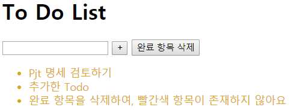
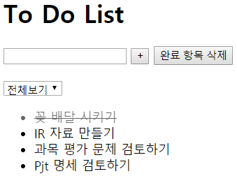
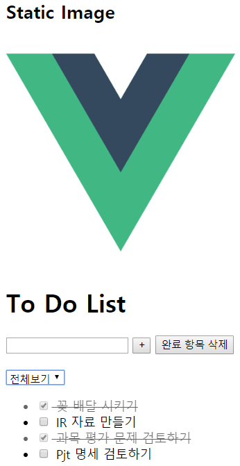

# v-model

**Vanilla JS**의 data 입력 과정은 다음과 같습니다.

1. `<input>` tag를 `querySelector('#id')`로 선택
2. `addEventListener()`를 통해 event를 캐치하고, 내용물을 삽입(`event.target.value`)
3. 혹은, `let 변수 += 1` 형태로 변수 조정

우리는 v-model을 사용하여 data를 입력받고, `Enter key` 입력 혹은 `Button Click`에 의해 `addTodo()` method를 실행하여 새로운 todo 항목을 생성하는 코드를 작성해 보겠습니다. 또한, `clearCompleted()` method를 실행하여 `completed`가 `true`인, 완료 항목을 삭제하는 버튼을 만들어 보겠습니다.

```html
<body>
  <div id="app">
    <h1>To Do List</h1>
<!-- ////////////////////////////////////////////////////////// -->
    <input type="text" v-model="newTodo" @keydown.enter="addTodo">
    <button @click="addTodo">+</button>
    <button @click="clearCompleted">완료 항목 삭제</button>
<!-- ////////////////////////////////////////////////////////// -->
    <ul>
      <li :class="yellow" v-for="todo in todos" v-if="!todo.completed" v-on:click="check(todo)">{{ todo.content }}</li>
      <li :class="red" v-else v-on:click="check(todo)">완료되어 표시하지 않음!</li>
    </ul>
  </div>


  <script src="https://cdn.jsdelivr.net/npm/vue/dist/vue.js"></script>
  <script>
    // ModelView
    const app = new Vue({
      el: '#app',
      data: {
        todos: [
          {content: '꽃 배달 시키기', completed: true},
          {content: 'IR 자료 만들기', completed: false},
          {content: '과목 평가 문제 검토하기', completed: false},
          {content: 'Pjt 명세 검토하기', completed: false},
        ],
///////////////////////////////////////////////////////////
        newTodo: '',
      },
      methods: {
        check(todo) {
          todo.completed = !todo.completed
        },
        addTodo() {
          this.todos.push({
            content: this.newTodo,
            completed: false,
          })
          this.newTodo = ''
        },
        clearCompleted() {
          // completed가 false인 todo만 남기기(return)
          // filter method는 각각의 모든 요소(todo)들에 대해 적용
          const notCompleted = this.todos.filter(function (todo) {
            return !todo.completed
          })
          // 미완성 todo들로만 새로 저장한 notCompleted를 this.todos에 저장
          this.todos = notCompleted
        }
      }
///////////////////////////////////////////////////////////
    })
  </script>
</body>
```



<br>

### Style 조정하기

```html
<body>
  <div id="app">
<!-- /////////////////////////////////////////////////////// -->
    <div :style="{color: activeColor, fontSize: fontSize}">
        HTML Styling Test
    </div>
<!-- /////////////////////////////////////////////////////// -->
  </div>
    <script src="https://cdn.jsdelivr.net/npm/vue/dist/vue.js"></script>
  <script>
    // ModelView
    const app = new Vue({
      el: '#app',
      data: {
////////////////////////////////////
        activeColor: 'magenta',
        fontSize: '30px',
////////////////////////////////////
      },
    })
  </script>
</body>
```

일반적인 html에서의 style 표기 방식은 `font-size`이지만, Vue.js는 JavaScript의 Convention에 맞게 camelCase인 `fontSize`와 같은 속성명을 사용합니다. 

만약 `Vue({data: {fontSize: '30'}})`와 같이 단위를 생략하고 싶다면, 다음과 같이 html 태그에서 `+ '단위'`를 작성하여 단위를 명시해줄 수 있습니다.

`<div :style="{color: activeColor, fontSize: fontSize + 'px'}">`


<br>

<br>

## status 참조하기

```html
<head>
<!-- //////////////////////////////////////////////////// -->
  <!-- 줄긋기 및 투명도 부여 -->
  <style>
    .completed{
      text-decoration: line-through;
      opacity: 0.6;
    }
  </style>
<!-- //////////////////////////////////////////////////// -->
</head>

<body>
  <div id="app">
    <h2>Static Image</h2>
    

    <h1>To Do List</h1>
    <input type="text" v-model="newTodo" @keydown.enter="addTodo">
    <button @click="addTodo">+</button>
    <button @click="clearCompleted">완료 항목 삭제</button><br><br>
<!-- //////////////////////////////////////////////////////////// -->
    <select v-model="status">
      <option value="all" selected>전체보기</option>
      <option value="active">진행중</option>
      <option value="completed">완료</option>
    </select>
    <ul>
      <li :class="{completed: todo.completed}" @click="check(todo)" v-for="todo in todoByStatus()">{{ todo.content }}</li>
    </ul>
  </div>
<!-- //////////////////////////////////////////////////////////// -->
    
  <script src="https://cdn.jsdelivr.net/npm/vue/dist/vue.js"></script>
  <script>
    // ModelView
    const app = new Vue({
      el: '#app',

      data: {
        newTodo: '',
        todos: [
          {content: '꽃 배달 시키기', completed: true},
          {content: 'IR 자료 만들기', completed: false},
          {content: '과목 평가 문제 검토하기', completed: false},
          {content: 'Pjt 명세 검토하기', completed: false},
        ],
        imgSrc: "https://joshua1988.github.io/images/posts/web/vuejs/logo.png",
        height: 300,
        width: 300,
/////////////////////////////
        status: 'all',
/////////////////////////////
      },

      methods: {
        check(todo) {
          todo.completed = !todo.completed
        },
        addTodo() {
          this.todos.push({
            content: this.newTodo,
            completed: false,
          })
          this.newTodo = ''
        },
        clearCompleted() {
          // completed가 false인 todo만 남기기(return)
          // filter method는 각각의 모든 요소(todo)들에 대해 적용
          const notCompleted = this.todos.filter(function (todo) {
            return !todo.completed
          })
          // 미완성 todo들로만 새로 저장한 notCompleted를 this.todos에 저장
          this.todos = notCompleted
        },
//////////////////////////////////////////////////////////
        // Status에 따라 항목 표시
        todoByStatus() {
          // active, 진행중
          if (this.status === 'active') {
            return this.todos.filter(function (todo) {
              return !todo.completed
            })
          }
          // completed, 완료
          if (this.status === 'completed') {
            return this.todos.filter(function (todo) {
              return todo.completed
            })
          }
          // all, 전체
          return this.todos
        }
//////////////////////////////////////////////////////////
      }
    })
  </script>
</body>
```



<br>

### li요소에 id 부여하기

JS는 **for문에 key값을 지정해주어야** 합니다. 만약 key 값 없이 없는 상태로 for문을 사용할 경우, iter을 수행할 때 **마구잡이로 mapping**을 하게 됩니다. 따라서 원치 않는 indexing이 진행된 후 작업이 처리될 수 있으며, 이는 문제를 야기할 것입니다. Key 값을 기준으로 Unique하게 만들어 줍시다.

```html
<!DOCTYPE html>
<html lang="en">
<head>
  <meta charset="UTF-8">
  <meta name="viewport" content="width=device-width, initial-scale=1.0">
  <meta http-equiv="X-UA-Compatible" content="ie=edge">
  <title>Document</title>
  <style>
    .completed{
      text-decoration: line-through;
      opacity: 0.6;
    }
  </style>
</head>

<body>
  <div id="app">
    <h2>Static Image</h2>
    

    <h1>To Do List</h1>
    <input type="text" v-model="newTodo" @keydown.enter="addTodo">
    <button @click="addTodo">+</button>
    <button @click="clearCompleted">완료 항목 삭제</button><br><br>

    <select v-model="status">
      <option value="all" selected>전체보기</option>
      <option value="active">진행중</option>
      <option value="completed">완료</option>
    </select>
    <ul>
<!-- /////////////////////////////////////////////// -->
      <li :class="{completed: todo.completed}" @click="check(todo)" v-for="todo in todoByStatus()" :key="todo.id">
        <input type="checkbox" v-model="todo.completed">
        {{ todo.content }}</li>
<!-- /////////////////////////////////////////////// -->
    </ul>
  </div>

  <script src="https://cdn.jsdelivr.net/npm/vue/dist/vue.js"></script>
  <script>
    const app = new Vue({
      el: '#app',

      data: {
        newTodo: '',
        todos: [
///////////////////////////////////////////////
          {id: 1, content: '꽃 배달 시키기', completed: true},
          {id: 2, content: 'IR 자료 만들기', completed: false},
          {id: 3, content: '과목 평가 문제 검토하기', completed: false},
          {id: 4, content: 'Pjt 명세 검토하기', completed: false},
///////////////////////////////////////////////
        ],
        imgSrc: "https://joshua1988.github.io/images/posts/web/vuejs/logo.png",
        height: 300,
        width: 300,
        status: 'all',
      },

      methods: {
        check(todo) {
          todo.completed = !todo.completed
        },
        addTodo() {
///////////////////////////////////////////////
          // if문은 빈 값을 등록하려 했을 경우 무시하기 위해 사용
          if (this.newTodo.length != 0) {
            this.todos.push({
            id: Date.now(),
            content: this.newTodo,
            completed: false,
          })
          }
///////////////////////////////////////////////
          this.newTodo = ''
        },
        clearCompleted() {
          const notCompleted = this.todos.filter(function (todo) {
            return !todo.completed
          })
          this.todos = notCompleted
        },
        todoByStatus() {
          if (this.status === 'active') {
            return this.todos.filter(function (todo) {
              return !todo.completed
            })
          }
          if (this.status === 'completed') {
            return this.todos.filter(function (todo) {
              return todo.completed
            })
          }
          return this.todos
        }
      }
    })
  </script>
</body>
</html>
```

물론 이후 Database와 연동할 때, **Database의 key값을 할당**하면 아무런 문제가 없습니다.




