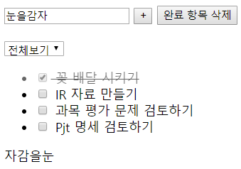
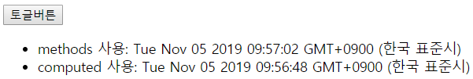

# Property, computed

### `computed: {}` property

```html
<body>
  <div id="app">
    <input type="text" v-model="newTodo">
    <!-- //////////////////////////// -->
    <p>{{ reversedNewTodo }}</p>
    <!-- //////////////////////////// -->
  </div>
  <script src="https://cdn.jsdelivr.net/npm/vue/dist/vue.js"></script>
  <script>
    const app = new Vue({
      el: '#app',
      data: {
        newTodo: '',
      },
      ///////////////////////////////////////////////////
      computed: {
        reversedNewTodo() {
          return this.newTodo.split('').reverse().join('')
        }
      }
      ///////////////////////////////////////////////////
    })
  </script>
</body>
</html>
```



<br>

### methods & computed

1. `methods`: **함수 실행**
2. `computed`: **캐싱된 계산 값을 load**

현재 시간을 나타내는 코드를 작성해 보겠습니다. `methods`에도 `new Date()`를, `computed`에도 `new Date()`를 `return`하도록 합니다. 그리고는 `visible` data를 boolean 타입의 변수로 하여, `토글버튼` 클릭 시 `true/false`를 바꾸어 끄고 켜도록 해 보겠습니다. 

```html
<!DOCTYPE html>
<html lang="en">
<head>
  <meta charset="UTF-8">
  <meta name="viewport" content="width=device-width, initial-scale=1.0">
  <meta http-equiv="X-UA-Compatible" content="ie=edge">
  <title>Document</title>
</head>
<body>
  <div id="app">
    <button @click="visible=!visible">토글버튼</button>
    <ul v-if="visible">
      <li>methods 사용: {{ dateMethod() }}</li>
      <li>computed 사용: {{ dateComputed }}</li>
    </ul>
  </div>

  <script src="https://cdn.jsdelivr.net/npm/vue/dist/vue.js"></script>
  <script>
  const app = new Vue({
    el: '#app',
    data: {
      visible: true,
    },
    methods: {
      dateMethod() {
        return new Date()
      },
    },
    computed: {
      dateComputed() {
        return new Date
      },
    },
  })
  </script>
</body>
</html>
```



토글 버튼을 누르면 아래의 `<li>`의 요소들이 보였다, 안보였다 합니다. 그런데 `methods`를 사용한 `new Date()`는 계속해서 현재 시간을 반환하지만, `computed`의 경우 처음 시간을 유지합니다. 이는 `computed`는 **처음 페이지를 로드 할 때 시간을 캐싱**하여 계속해서 사용하지만, `methods`는 **페이지 로드 없이도 계속해서 불려**지기 때문입니다.


