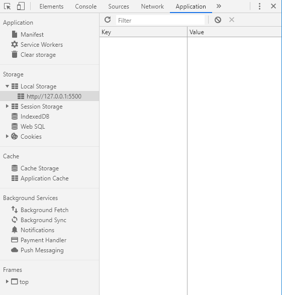
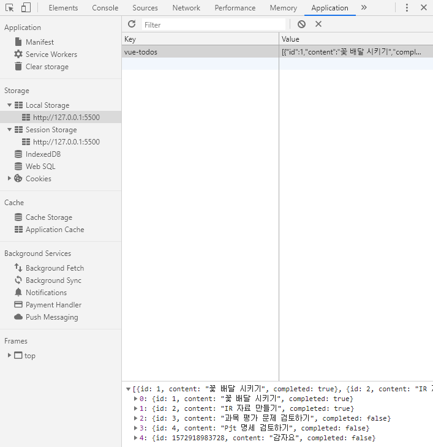

# Browser Local Storage



Key-Value 형태의 데이터가 저장됩니다. **Browser가 켜져있는 상태에서 지속되는 데이터**들은 **Session Storage**에 저장됩니다. 즉, 로그인 정보와 같은 쿠키 데이터들이 저장되게 됩니다. **Local Storage**의 경우 **Browser가 종료돼도 유지**되는 데이터들이 저장됩니다.

<br>

<br>

## localStorage API

- **Create**
  - `localStorage.setItem('key', 'value')`
- **Read**
  - `localStorage.getItem('key')`
- **Delete**
  - `localStorage.removeItem('key')`
- **Count**
  - `localStorage.length`

유의해야 할 점은, value 값으로 저장되는 내용은 모두 string이라는 것입니다.

```javascript
> todos = [
      {id: 1, content: '첫 투두', completed: false}
  ]
> localStorage.setItem('vue-todos', todos)
> localStorage.getItem('vue-todos')
  "[object Object]"
```

그냥 todos를 저장했더니 `object`라는 string의 Object가 저장되었습니다. 따라서 데이터를 저장하기 전에 `JSON.stringify(데이터)`를 통해 json 형태의 string으로 만들어 주어야 합니다.

```javascript
> todos = [
      {id: 1, content: '첫 투두', completed: false}
  ]
> localStorage.setItem('vue-todos', JSON.stringify(todos))
> localStorage.getItem('vue-todos')
  "[{"id":1,"content":"첫 투두","completed":false}]"
```

만약 `getItem()`을 통해 가져온 데이터를 object로서 활용하려면, `JSON.parse(데이터)`를 통해 객체화 시켜주어야 합니다.

<br>

### todo localStorage

위 내용을, 이전에 공부했던 todo application에서 사용해 보겠습니다. 우선 추가해야 하는 내용들에 대해 먼저 알아보겠습니다.

```html
<script>
  // Chrome localStorage에서 사용할 key를 상수화(자주 사용하므로)
  const STORAGE_KEY = 'vue-todos'
  const todoStorage = {
    // todoStorage.save(데이터)
    save(todos) {
      localStorage.setItem(STORAGE_KEY, JSON.stringify(todos))
    },
    // todoStorage.fetch() : read 기능을 수행, 외부의 데이터를 가져옴
    fetch() {
      return JSON.parse(localStorage.getItem(STORAGE_KEY))
    }
  }
    
  const app = new Vue({
    ...
    watch: {
      // 지켜보는 data인 todos
      todos: {
        // todos가 변경될 때마다 localStorage.save()하는 handler
        handler(todos) {
          todoStorage.save(todos)
        },
        deep: true,
      }
    ...
    })
```

localStorage에 저장하는 객체를 위에서 정의했으며, Vue Instance에 `watch` Property를 추가했습니다. `watch` Property에는 `변수: {handler함수}` 를 정의하여 데이터에 변화가 있을 시 localStorage를 조작하도록 합니다.



<br>

<br>

## 페이지 로드 및 fetch()

현재는 코드 상에 초기 데이터를 보유하고 있으며, 페이지 로드시 이 데이터를 사용합니다.

```html
<script>
  ...
    data: {
      newTodo: '',
      todos: [
        {id: 1, content: '꽃 배달 시키기', completed: true},
        {id: 2, content: 'IR 자료 만들기', completed: false},
        {id: 3, content: '과목 평가 문제 검토하기', completed: false},
        {id: 4, content: 'Pjt 명세 검토하기', completed: false},
      ],
    },
  ...
</script>
```

하지만 현실 속에서는 페이지 로드와 함께 데이터를 로드하여 사용해야 합니다. 따라서 이를 이전에 구현해 놓았던 `todoStorage.fetch()`를 사용해 보겠습니다.

```javascript
const todoStorage = {
  fetch() {
      return JSON.parse(localStorage.getItem(STORAGE_KEY))
    }
  }
}

data: {
  newTodo: '',
  todos: todoStorage.fetch(),
},
```

그런데 현재 상태로는 에러가 발생합니다. 만약 localStorage에 데이터가 없다면, `fetch()`함수 사용 시 에러가 발생하게 됩니다. 따라서 데이터가 null일 경우의 행위(`|| []`)를 정의해 주어야 합니다.

```html
<script>
  const STORAGE_KEY = 'vue-todos'
  const todoStorage = {
    // todoStorage.save(데이터)
    save(todos) {
      localStorage.setItem(STORAGE_KEY, JSON.stringify(todos))
    },
    // todoStorage.fetch() : read 기능을 수행, 외부의 데이터를 가져옴
    fetch() {
      return JSON.parse(localStorage.getItem(STORAGE_KEY)) || []
    },
  }
</script>
```

<br>

### 삭제 method까지 붙은 최종 코드

```html
<!DOCTYPE html>
<html lang="en">

<head>
  <meta charset="UTF-8">
  <meta name="viewport" content="width=device-width, initial-scale=1.0">
  <meta http-equiv="X-UA-Compatible" content="ie=edge">
  <title>Document</title>

</head>

<body>
  <!-- View -->
  <div id="app">
    <input type="text" v-model="newTodo" @keyup.enter="addTodo">
    <button @click="addTodo">+</button>
    <li v-for="todo in todos" :key="todo.id">
      <span>{{ todo.content }}</span>
      <button @click="removeTodo(todo.id)">x</button>
    </li>
  </div>

  <script src="https://cdn.jsdelivr.net/npm/vue/dist/vue.js"></script>
  <script>
    // ViewModel
    const app = new Vue({
      el: '#app',
      data: {
        todos: [],
        newTodo: '',
      },
      methods: {
        addTodo: function () {
          if (this.newTodo.length != 0) {
            this.todos.push({
            id: Date.now(),
            content: this.newTodo,
            completed: false,
            })
            this.newTodo = ''
          }
        },
        removeTodo: function (todoId) {
          this.todos = this.todos.filter((todo) => {
            return todo.id !== todoId
          })
        },
      }
    })
  </script>
</body>

</html>
```

