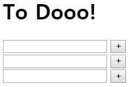
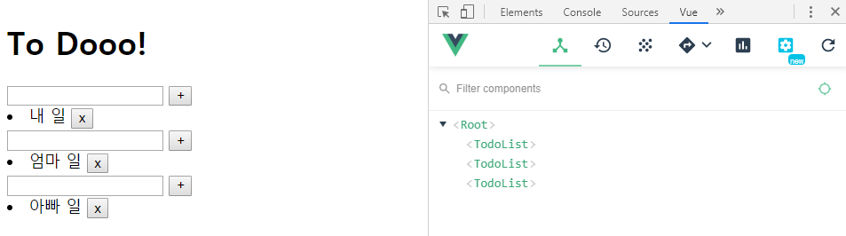

# Component

**Component**의 정의는 reusable software element with a specification입니다. 즉, 재사용 가능하도록 설계된 독립적 단위의 모듈을 말합니다. Trello `Board`의 형태를 보면, `List`를 추가할 수 있으며 `List` 별로 `Card`를 추가하게 됩니다. 그런데 `List`들과 `Card`들은 각각이 동일한 형태가 복사된 형태임을 알 수 있습니다. `Card` component들은 하나의 `List` component에 속하며, 이러한 `List` component의 개수는 계속해서 늘릴 수 있습니다.

`Vue.component(컴포넌트 이름, {컴포넌트 속성})`

컴포넌트 이름은 **kebab-case**(`todo-list`) 혹은 **PascalCase**(`TodoList`) 형태로 사용하여 html과의 namespace 충돌을 방지합니다.

<br>

<br>

### template

아래 코드블록은 컴포넌트 속성에 template을 사용하는 간단한 예시 코드입니다. `<div></div>` 태그로 반복되는 template을 감싸주며, div 태그 또한 backtick(`)으로 감싸줍니다. 

```html
<script>
  // component 작명: 1. kebab-case(todo-list) 2. PascalCase(TodoList)
  Vue.component('todo-list', {
    template:`
    <div>
      <input type="text" v-model="newTodo" @keyup.enter="addTodo">
      <button @click="addTodo">+</button>
      <li v-for="todo in todos" :key="todo.id">
        <span>{{ todo.content }}</span>
        <button @click="removeTodo(todo.id)">x</button>
      </li>
    </div>
    `
  })
</script>
```

아래는 간단한 예시 코드이며, html에 template을 표시하기 까지만 하는 미완성 코드입니다. (아직 data를 추가 및 확인하는 등의 작업 불가)

```html
<body>
  <div id="app">
    <h1>To Dooo!</h1>
    <todo-list></todo-list>
    <todo-list></todo-list>
    <todo-list></todo-list>
  </div>

  <script src="https://cdn.jsdelivr.net/npm/vue/dist/vue.js"></script>
  <script>
    Vue.component('todo-list', {
      template:`
      <div>
        <input type="text" v-model="newTodo" @keyup.enter="addTodo">
        <button @click="addTodo">+</button>
        <li v-for="todo in todos" :key="todo.id">
          <span>{{ todo.content }}</span>
          <button @click="removeTodo(todo.id)">x</button>
        </li>
      </div>
      `,
  </script>

  <script>
    const app = new Vue({
      el: '#app',
    })
  </script>
</body>
```



<br>

### data와 methods 기입

```html
<body>
  <div id="app">
    <h1>To Dooo!</h1>
    <todo-list></todo-list>
    <todo-list></todo-list>
    <todo-list></todo-list>
  </div>

  <script src="https://cdn.jsdelivr.net/npm/vue/dist/vue.js"></script>
  <script>
    // component 작명: 1. kebab-case(todo-list) 2. PascalCase(TodoList)
    Vue.component('todo-list', {
      template:`
      <div>
        <input type="text" v-model="newTodo" @keyup.enter="addTodo">
        <button @click="addTodo">+</button>
        <li v-for="todo in todos" :key="todo.id">
          <span>{{ todo.content }}</span>
          <button @click="removeTodo(todo.id)">x</button>
        </li>
      </div>
      `,
      // component 별로 자기 자신만의 데이터를 갖게 하기 위해 method화
      data: function() {
        return {
          todos: [],
          newTodo: '',
        }
      },
      methods: {
        addTodo: function () {
          if (this.newTodo.length != 0) {
            this.todos.push({
            id: Date.now(),
            content: this.newTodo,
            completed: false,
            })
            this.newTodo = ''
          }
        },
        removeTodo: function (todoId) {
          this.todos = this.todos.filter((todo) => {
            return todo.id !== todoId
          })
        },
      },
    })
  </script>

  <script>
    const app = new Vue({
      el: '#app',
    })
  </script>
</body>
```



<br>

<br>

## Properties 공유, props

**`props`**는 부모(주인)가 자식(세입자)들에게 전달해주는, **일방적인** 데이터(자산) 공유입니다. 반대의 경우(자식 -> 부모)는 **`emit`**을 발생시켜야 가능합니다.

category라는 공간을 할당하여 자식이 props를 관리할 수 있도록 해 보겠습니다. props는 부모가 일방적으로 사용할 수도 있으며, 아래의 코드는 따로 행위를 지정하지 않았습니다.

`<todo-list></todo-list>`에 컴포넌트 별 `category` 공간에 text를 할당해 주었으며, template에 `<h2>{{ category }}</h2>`를 추가하여 `category` 공간의 내용으로 h2 tag를 생성하도록 합니다. 또한 data property 위에 `props` property를 추가하여 자식이 `'category' `공간을 사용할 수 있도록 합니다.

```html
<body>
  <div id="app">
    <h1>To Dooo!</h1>
<!-- //////////////////////////////////// -->
    <todo-list category="생활"></todo-list>
    <todo-list category="탈잉"></todo-list>
    <todo-list category="기타"></todo-list>
<!-- //////////////////////////////////// -->
  </div>

  <script src="https://cdn.jsdelivr.net/npm/vue/dist/vue.js"></script>
  <script>
    // component 작명: 1. kebab-case(todo-list) 2. PascalCase(TodoList)
    Vue.component('todo-list', {
      template:`
      <div>
        <h2>{{ category }}</h2>
        <input type="text" v-model="newTodo" @keyup.enter="addTodo">
        <button @click="addTodo">+</button>
        <li v-for="todo in todos" :key="todo.id">
          <span>{{ todo.content }}</span>
          <button @click="removeTodo(todo.id)">x</button>
        </li>
      </div>
      `,
      // 부모가 상속시키는 데이터
      props: ['category'],
      ///////////////////////
      data: function() {
        return {
          todos: [],
          newTodo: '',
        }
      },
      methods: {
        addTodo: function () {
          if (this.newTodo.length != 0) {
            this.todos.push({
            id: Date.now(),
            content: this.newTodo,
            completed: false,
            })
            this.newTodo = ''
          }
        },
        removeTodo: function (todoId) {
          this.todos = this.todos.filter((todo) => {
            return todo.id !== todoId
          })
        },
      },
    })
  </script>
```

만약 `props`를 **object 형태**로 사용한다면, 이를 **유효성 검사**에 활용할 수 있습니다.

```html
props: {
  props이름: 자료형,
},
```

```html
props: {
  category: String,
},
```

<br>

### props 표현 방법

`props`는 세 가지 방법으로 표현할 수 있습니다.

1. **Array**, 이름만을 표기

   ```javascript
   props: ['category',],
   ```

2. **Object**, 자료형을 표기하여 형태 지정

   ```javascript
   props: {
     category: String,
   },
   ```

3. **Object**, 옵션을 추가하여 정의

   ```javascript
   props: {
     category: {
       type: String,
       required: true,
       validator: function(value) {
         if (value.length !== 0) {
           return true
         } else {
           return false
         }
       },
     },
   },
   ```

   `category`는 String 타입이어야 하며, null값이면 안됩니다.


