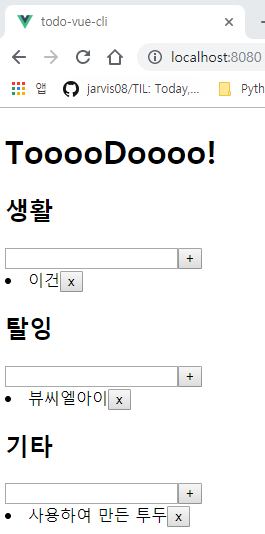
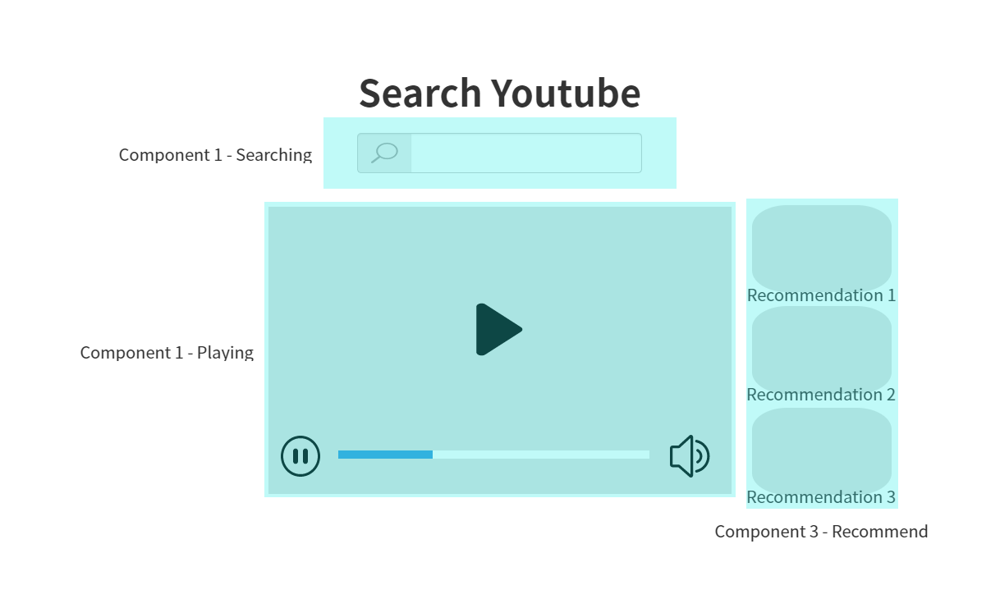

# CLI Component

`App.vue` 파일과 `components/ComponentName.vue`, 두 파일의 구성은 동일합니다. 하지만, 같은 구성이지만 다른 내용을 포함합니다.

- App.vue의 내용
  - `<template>`: View에서 component가 사용될 곳을 정의
  - `<script>`: 사용할 component를 정의
  - `<style>`

`components` 디렉토리 안의 `ComponentName.vue`에는 다음과 같은 형태로 component를 정의합니다.

- `<template>`: View에서 사용 될 요소들
- `<script>`: Component의 `data`, `method`
- `<style>`

<br>

### props 기능 재구현

이전에 Vue의 CDN을 이용하여 `props`를 사용해 보았던 TodoList 앱을 Vue CLI를 사용하여 구현해 보겠습니다. 우선 기존에 hello world 역할을 하던 내용들을 삭제해 줍니다.

1. App.vue 파일의 내용을 삭제
2. components 디렉토리 내의 `HelloWorld.vue` 파일을 삭제
3. TodoList.vue 파일을 생성
4. `vue` + `tab` 을 통해 스켈레톤 자동 완성 기능 사용
5. 아래의 코드블록과 같이 App.vue와 TodoList.vue 코드 작성

```vue
<!-- App.vue -->
<template>
  <div id="app">
    <h1>TooooDoooo!</h1>
    <!-- Self-closing Tag ( /) -->
    <TodoList category="생활" />
    <TodoList category="탈잉" />
    <TodoList category="기타" />
  </div>
</template>

<script>
import TodoList from './components/TodoList.vue'

export default {
  components: {
    // TodoList: TodoList,
    // 사용할 컴포넌트와, 현재 저장하는 key의 이름이 같다면 아래 TodoList처럼 생략 표기 가능
    TodoList,
  }
}
</script>

<style lang="stylus" scoped>

</style>
```

```vue
<!-- components/TodoList.vue -->
<template>
    <div>
      <h2>{{ category }}</h2>
      <input type="text" v-model="newTodo" @keyup.enter="addTodo">
      <button @click="addTodo">+</button>
      <li v-for="todo in todos" :key="todo.id">
          <span>{{ todo.content }}</span>
          <button @click="removeTodo(todo.id)">x</button>
      </li>
    </div>
</template>

<script>
export default {
  props: {
    category: {
      type: String,
      required: true,
      validator: function(value) {
        if (value.length !== 0) {
          return true
        } else {
          return false
        }
      },
    },
  },
  data: function() {
    return {
      todos: [],
      newTodo: '',
    }
  },
  methods: {
    addTodo: function () {
      if (this.newTodo.length != 0) {
        this.todos.push({
        id: Date.now(),
        content: this.newTodo,
        completed: false,
        })
        this.newTodo = ''
      }
    },
    removeTodo: function (todoId) {
      this.todos = this.todos.filter((todo) => {
          return todo.id !== todoId
      })
    },
  },
}
</script>

<style scoped>

</style>
```



<br>

<br>

## Youtube Search Application 만들어보기

**Oven**: Kakao에서 개발한 Mockup application, [링크](https://ovenapp.io/)

Oven은 프로그래밍 언어가 아닌, PPT를 제작하듯이 제작할 페이지를 mockup 해볼 수 있는 웹 어플리케이션 입니다. **Sketch**라는 mockup 프로그램이 디자이너들에게 가장 많이 사용되지만, Mac OS에서만 사용 가능합니다. 아래 그림은 Youtube Searcher에 대한 mockup입니다.



<br>

### SearchBar.vue

`vue` + `tab`을 입력하여 `template`, `script`, `style` 태그들을 생성한 후, `script`의 `export default {}`에 `name`을 다시 `SearchBar`라고 설정해 줍니다.

- Google API, `YouTube Data API v3`

  - `https://www.googleapis.com/서비스명/버전/기능`
  - `https://www.googleapis.com/youtube/v3/search?key=API_KEY&type=video&part=snippet&q=검색어`

- axios

  ```bash
  $ npm install axios
  ```

  API call은 언제 응답이 돌아올지 모르므로, 비동기 함수로 사용됩니다. 따라서 응답을 받은 후 동작을 하게 하도록 조치해야 하며, axios의 경우 `then`을 사용하여 응답 이후 행동을 할 수 있도록 합니다.

`const API_KEY = 'key'` 형태로 API Key를 저장해 두었습니다. Python에서는 decouple과 같은 라이브러리를 사용했지만, Vue CLI에서는 그럴 필요가 없습니다. 프로젝트 생성 시 자동으로 생성된 `.gitignore `에 `.env.local`이 등록되어 있으며, `.env.local` 파일을 생성하여 `VUE_APP_`로 시작하는 이름 하에 토큰을 넣어둔다면 Vue CLI가 알아서 무시됩니다.

이번 프로젝트에서는 Youtube Search에 사용되는 API key를 `VUE_APP_YOUTUBE_API_KEY`라는 이름으로 `.env.local`에 등록해 두었으며, 다음과 같은 코드로 이를 사용할 수 있도록 했습니다.

```javascript
const API_KEY = process.env.VUE_APP_YOUTUBE_API_KEY
```

아래 코드블록들은 완성된 `App.vue`와 `SearchBar.vue`의 코드입니다.

```vue
<!-- App.vue -->
<template>
  <div>
    <h1>Youtube Searcher</h1>
    <!-- inputChange라는 이벤트 발생 시, onInputChange method 실행 -->
    <SearchBar @inputChange="onInputChange" />
  </div>
</template>

<script>
import SearchBar from './components/SearchBar'
import axios from 'axios'
// const axios = require('axios')

const API_KEY = process.env.VUE_APP_YOUTUBE_API_KEY
const API_URL = 'https://www.googleapis.com/youtube/v3/search'

export default {
  name: 'App',
  components: {
    SearchBar,
  },
  methods: {
    onInputChange(inputValue) {
      // API call은 언제 응답이 돌아올지 모르므로, 비동기 함수로 들어온다.
      // 따라서 axios 뒤에는 then을 사용하여 응답 이후 실행하도록 한다.
      const response = axios.get(API_URL, {
        params: {
          key: API_KEY,
          type: 'video',
          part: 'snippet',
          q: inputValue,
        },
      })
      response.then(function(res) {
        console.log(res)
      })
    }
  },
}
</script>
```

```vue
<!-- SearchBar.vue -->
<template>
  <div>
    <input @input="onInput" type="text">
  </div>
</template>

<script>
export default {
  name: 'SearchBar',
  methods: {
    onInput(event) {
      // 부모 컴포넌트에 데이터 전송
      this.$emit('inputChange', event.target.value)
    }
  }
}
</script>

<style>
</style>
```

<br>

### VideoList.vue

Youtube에서 전달받은 response인 video들의 list를 App Component의 data로 저장해 보겠습니다. 만약 data가 업데이트 됐을 때에는 Component가 템플릿을 다시 렌더링합니다(Vue가 알아서). VideoList에서 변경된 결과를 보여줍니다.

기존의 SearchBar.vue가 포함되어 있는 App.vue에 코드를 추가합니다.

```vue
<!-- App.vue -->
<template>
  <div>
    <h1>Youtube Searcher</h1>
    <!-- inputChange라는 이벤트 발생 시, onInputChange method 실행 -->
    <SearchBar @inputChange="onInputChange" />
    <VideoList :videos="videos" />
  </div>
</template>

<script>
// const axios = require('axios')
import axios from 'axios'
import SearchBar from './components/SearchBar'
import VideoList from './components/VideoList'

const API_KEY = process.env.VUE_APP_YOUTUBE_API_KEY
const API_URL = 'https://www.googleapis.com/youtube/v3/search'

export default {
  name: 'App',
  components: {
    SearchBar,
    VideoList,
  },
  data: function() {
    return {
      videos: [],
    }
  },
  methods: {
    onInputChange(inputValue) {
      axios.get(API_URL, {
        params: {
          key: API_KEY,
          type: 'video',
          part: 'snippet',
          q: inputValue,
        },
      }).then(res => {
        this.videos = res.data.items
      })
    }
  },
}
</script>
```

```vue
<!-- VideoList.vue -->
<template>
  <div>
    <h2>Video List</h2>
    <ul>
      <li v-for="video in videos" :key="video.id.videoId">
        
      </li>
    </ul>
  </div>
</template>

<script>
export default {
  name: 'VideoList',
  props: {
    videos: {
      type: Array,
    },
  },
}
</script>

<style>
</style>
```

