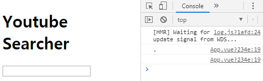

# Data Handling

자식 컴포넌트에서 발생한 모든 데이터들은 바로 사용하는 것이 아니라, **우선적으로 부모 컴포넌트에 모으도록(`$emit()`)** 되어 있습니다. 데이터가 발생된 당사자 자식 컴포넌트를 포함하여, **모든 자식들은 모아진 부모 컴포넌트의 데이터를 참조하여 사용**하게 됩니다.

`$emit('이벤트', 데이터)`

아래 코드는, `SearchBar.vue` 컴포넌트에서 inputChange라는 데이터를 `App.vue`로 전송하며, `App.vue`에서는 그 데이터를 받음과 동시에 메서드를 실행하는 코드입니다.

```vue
<!-- SearchBar.vue -->
<template>
  <div>
    <input @input="onInput" type="text">
  </div>
</template>

<script>
export default {
  name: 'SearchBar',
  methods: {
    onInput(event) {
      // 부모 컴포넌트에 데이터 전송
      this.$emit('inputChange', event.target.value)
    }
  }
}
</script>
```

```html
<!-- App.vue -->
<template>
  <div>
    <h1>Youtube Searcher</h1>
    <!-- inputChange라는 이벤트 발생 시, onInputChange method 실행 -->
    <SearchBar @inputChange="onInputChange" />
  </div>
</template>

<script>
import SearchBar from './components/SearchBar'

export default {
  name: 'App',
  components: {
    SearchBar,
  },
  methods: {
    onInputChange(inputValue) {
      console.log(inputValue)
    }
  }
}
</script>
```



props와 emit으로 나뉘어 사용하는 이유는, **observer pattern**을 공부하면 그 이유를 알 수 있습니다.

<br>

### props

1. 부모 컴포턴트에서 자식 컴포넌트의 `template` 태그에 `v-bind`를 통해 전달

   ```vue
   <!-- App.vue -->
   <template>
     <div>
       <h1>Youtube Searcher</h1>
       <SearchBar @inputChange="onInputChange" />
       <!-- v-bind를 통해 VideoList에 props 전달 -->
       <VideoList :videos="videos" />
     </div>
   </template>
   ```

   ```vue
   <!-- VideoList.vue -->
   <script>
   export default {
     name: 'VideoList',
     // props 저장 방법 세 가지
     // 1. 배열
     // props: ['videos'],
     
     // 2. Object
     // props: {
     //   'videos': Array,
     // }
     
     // 3. 세부 작성
     props: {
       videos: {
         type: Array,
       }
     },
   }
   </script>
   ```

   