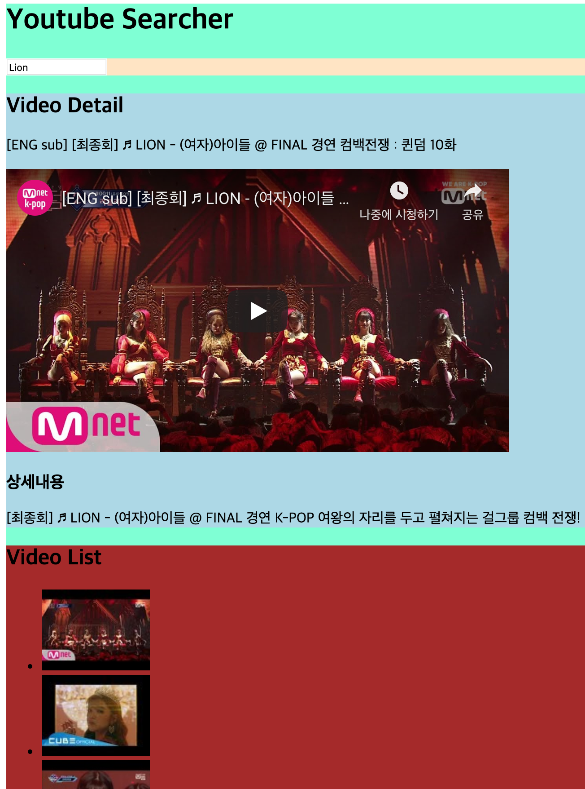

## Components' data transfer

## vue의 scoped 기능

`<style scoped>`: 각 컴포넌트 별 scope를 부여하여, 같은 이름의 속성일 지라도 해당 컴포넌트에만 영향을 주도록 처리

```vue
<style scoped>
  .bg-videolist {
    background-color: brown;
  }
</style>
```

<br>

### VideoList의 li 태그들을 별개의 component들로 관리하기

Searchbar에서 검색한 내용을 VideoList.vue를 통해 나열했었는데, 이를 분리하여 List 자체 컴포넌트와 List 내용들(각각은 List의 자식 컴포넌트)의 컴포넌트(VideoListItem.vue)로 나눠봅시다.

```vue
<!-- VideoList Before -->
<template>
  <div>
    <h2>Video List</h2>
    <ul>
      <li v-for="video in videos" :key="video.id.videoId">
        
      </li>
    </ul>
  </div>
</template>

<script>
export default {
  name: 'VideoList',
  props: {
    videos: {
      type: Array,
    },
  },
}
</script>
```

```vue
<!-- VideoList After -->
<template>
  <div class="bg-videolist">
    <h2>Video List</h2>
    <ul>
      <video-list-item v-for="video in videos" :key="video.id.videoId" :video="video">
      </video-list-item>
    </ul>
  </div>
</template>

<script>
import VideoListItem from './VideoListItem'

export default {
  name: 'VideoList',
  components: {
    VideoListItem,
  },
  props: {
    videos: {
      type: Array,
    },
  },
}
</script>
```

```vue
<!-- VideoListItem -->
<template>
  <li>
    
  </li>
</template>

<script>
export default {
  name: 'VideoListItem',
  props: {
    // VideoList의 for문에서 생성된 각각의 video를 prop으로 받음
    video: {
      type: Object,
      required: true,
    },
  },
  computed: {
    thumbnailUrl() {
      return this.video.snippet.thumbnails.default.url
    }
  }
}
</script>
```

<br>

### 삼촌 Component로 데이터 전송하기

VideoList.vue의 자식 컴포넌트인 VideoListItem.vue로부터 정보를 받고, 새로 생성한 App.vue의 자식인 VideoDetai.vuel로 데이터를 보내도록 해 보겠습니다.

1. VideoListItem.vue에서 VideoList.vue로 emit

   ```vue
   <!-- VideoListsItem.vue -->
   <template>
     <li>
       
     </li>
   </template>
   
   <script>
   export default {
     name: 'VideoListItem',
     props: {
       // VideoList의 for문에서 생성된 각각의 video를 prop으로 받음
       video: {
         type: Object,
         required: true,
       },
     },
     computed: {
       thumbnailUrl() {
         return this.video.snippet.thumbnails.default.url
       }
     },
     methods: {
       // 부모인 VideoList에게 데이터를 보낸 후, VideoList가 할아버지인 App.vue로, App.vue가 다시 삼촌인 VideoDetail로 정보를 보내야 한다.
       onSelect() {
         this.$emit('videoSelect', this.video)
       }
     }
   }
   ```

2. VideoList.vue 에서 App.vue로 emit

   ```vue
   <!-- VideoLists.vue -->
   <template>
     <div class="bg-videolist">
       <h2>Video List</h2>
       <ul>
         <video-list-item v-for="video in videos" :key="video.id.videoId" :video="video" @videoSelect="onVideoSelect">
         </video-list-item>
       </ul>
     </div>
   </template>
   
   <script>
   import VideoListItem from './VideoListItem'
   
   export default {
     name: 'VideoList',
     components: {
       VideoListItem,
     },
     props: {
       videos: {
         type: Array,
       },
     },
     methods: {
       // VideoListItem에서 받은 data를 다시 App.vue로 전송
       onVideoSelect(video) {
         this.$emit('selectedVideo', video)
       }
     }
   }
   </script>
   ```

3. App.vue에서 VideoDetail.vue로 props 전달

   ```vue
   <!-- App.vue -->
   <template>
     <div>
       <h1>Youtube Searcher</h1>
       <!-- inputChange라는 이벤트 발생 시, onInputChange method 실행 -->
       <SearchBar @inputChange="onInputChange" />
       <VideoDetail :video="videoSelected" />
       <VideoList :videos="videos" @selectedVideo="renderVideo" />
     </div>
   </template>
   
   <script>
   // const axios = require('axios')
   import axios from 'axios'
   import SearchBar from './components/SearchBar'
   import VideoList from './components/VideoList'
   import VideoDetail from './components/VideoDetail'
   
   const API_KEY = process.env.VUE_APP_YOUTUBE_API_KEY
   const API_URL = 'https://www.googleapis.com/youtube/v3/search'
   
   export default {
     name: 'App',
     components: {
       SearchBar,
       VideoList,
       VideoDetail,
     },
     data: function() {
       return {
         videos: [],
         videoSelected: null,
       }
     },
     methods: {
       onInputChange(inputValue) {
         axios.get(API_URL, {
           params: {
             key: API_KEY,
             type: 'video',
             part: 'snippet',
             q: inputValue,
           },
         }).then(res => {
           this.videos = res.data.items
         })
       },
       // VideoList로 부터 받은 데이터를 VideoDetail로 전송
       renderVideo(video) {
         this.videoSelected = video
       }
     },
   }
   </script>
   ```

4. VideoDetail.vue에서 iframe 사용하여 영상 표시

   ```vue
   <!-- VideoDetail.vue -->
   <template>
     <div class="bg-detail">
       <h2>Video Detail</h2>
       <p>{{ video.snippet.title }}</p>
       <iframe :src="iframeURL" frameborder="0" width="560" height="315" allowfullscreen></iframe>
       <h3>상세내용</h3>
       <p>{{ video.snippet.description }}</p>
     </div>
   </template>
   
   <script>
   export default {
     name: 'VideoDetail',
     props: {
       video: {
         type: Object,
       }
     },
     computed: {
       iframeURL () {
         const videoId = this.video.id.videoId
         return `https://www.youtube.com/embed/${videoId}`
       }
     }
   }
   </script>
   ```

아래 이미지는 Lion을 검색하여 탐색된 VideoList의 자식(VideoListItem)을 클릭하였을 때, VideoList로 선택된 video의 데이터를 보내고, VideoList는 App으로, App은 VideoDetail로 video를 전달하여 최종적으로 iframe을 통해 youtube 재생 frame을 생성한 모습입니다. 표시된 색은 App.vue 에서는 `<style>` 태그를 통해 `<div>`태그 전체에, Component 별로는 `<style scoped>` 태그로 class 별 bg color를 적용한 모습입니다.



아래는 지금까지 제작된 YouTube Searcher의 structure입니다.

