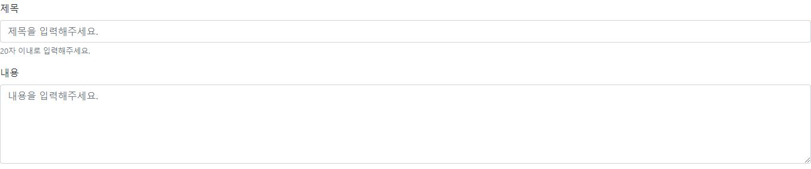

# Django's Form Class

[django](https://docs.djangoproject.com/en/2.2/topics/forms/)의 form class를 활용한다.

<br>

### form 모듈화 및 재사용

사용자의 행위는 예측 불가능하다. 따라서 사용자로 부터 받은 데이터들에는 Validation(검증) 절차가 필요하다.

```python
# App/forms.py 생성
from django import forms


class ArticleForm(forms.Form):
    title = forms.CharField(max_length=50)
    content = forms.CharField(widget=forms.Textarea)
```

```python
# views.py
from django.shortcuts import render, redirect
from .models import Article
##############################
from .forms import ArticleForm
##############################

def create(request):
    if request.method == 'POST':
        title = request.POST.get('title')
        content = request.POST.get('content')
        article = Article.objects.create(title=title, content=content)
        return redirect(article)
    else:
        #######################################################
        form = ArticleForm()
        context = {
            'form': form,
        }
        return render(request, 'articles/create.html', context)
    	#######################################################
```

<br>

html 파일의 수정 전/후는 다음과 같다.

```html
<h1>NEW</h1>
<form action="" method="POST">
  
  <input type="text" placeholder="Title" name="title">
  <br>
  <textarea name="content" id="" cols="50" rows="10" placeholder="Content"></textarea>
  <br>
  <button type="submit">제출</button>
</form>
```

```html
<h1>NEW</h1>
<form action="" method="POST">
  
  {{ form }}
  {{ form.as_p }}
  <br>
  <button type="submit">제출</button>
</form>
<a href="">뒤로가기</a>
```

<br>

### django bootstrap form 사용하기

`pip install django-bootstrap4`

```python
INSTALLED_APPS = [
    'articles',
    'django.contrib.admin',
    'django.contrib.auth',
    'django.contrib.contenttypes',
    'django.contrib.sessions',
    'django.contrib.messages',
    'django.contrib.staticfiles',
    'bootstrap4',
]
```

```html
<!-- base.html -->




<!DOCTYPE html>
<html lang="ko">
<head>
  <meta charset="UTF-8">
  <meta name="viewport" content="width=device-width, initial-scale=1.0">
  <meta http-equiv="X-UA-Compatible" content="ie=edge">
  <title>Document</title>
</head>
<body>
  
  
</body>
</html>
```

```html
<!-- create.html -->





<h1>NEW</h1>
<form action="" method="POST">
  
    
  

  <br>
  <button type="submit">제출</button>
</form>
<a href="">뒤로가기</a>

```

<br>

### 유효성 검사, Data Validation & Form Class 응용

```python
def create(request):
    if request.method == 'POST':
        # form class 사용하기
        form = ArticleForm(request.POST)
        # form.save() 하여 끝낼 수도 있지만, data 검증을 하는 것이 좋다.

        # Validation
        if form.is_valid():
            title = form.cleaned_data.get('title')
            content = form.cleaned_data.get('content')
            article = Article.objects.create(title=title, content=content)
            return redirect(article)
        else:
            return redirect('articles:create')
    else:
        form = ArticleForm()
        context = {
            'form': form,
        }
        return render(request, 'articles/create.html', context)
```

**Form Class의 Validation 기능**

1. Front-end Validation

   max_length, Null과 같은 속성 제한을 웹페이지 상에서 적용(50자 이상 작성이 차단됨)

2. Server-side Validation

   서버 측에서 제한을 적용하여, 검증 과정에서 걸러지는 데이터를 삭제

<br>

<br>

## Form Class 사용하여 Update하기

```python
# views.py

def update(request, article_pk):
    article = get_object_or_404(Article, pk=article_pk)
    if request.method == 'POST':
        form = ArticleForm(request.POST)
        if form.is_valid():
            article.title = form.cleaned_data.get('title')
            article.content = form.cleaned_data.get('content')
            article.save()
            return redirect(article)
	# 1. method == 'GET'
    # 2. update 하는데, form의 내용이 valid 하지 않을 경우
    form = ArticleForm(
        initial={
            'title': article.title,
            'content': article.content,
        }
    )
    context = {
        'article': article,
        'form': form,
    }
    return render(request, 'articles/update.html', context)
```

```html



<h1>UPDATE</h1>
<form action="" method="POST">
  
  
  <br>
  <button type="submit">제출</button>
</form>
<a href="{{ article.get_absolute_url }}">뒤로가기</a>

```

HTML 파일의 경우 `create.html`과 거의 동일하다.



<br>

### Django Session

보다 친절하게 데이터가 valid하지 않음을 알리려면, **django session**을 활용하여 flash message를 작성할 수 있다. **Flash Message**란, 잠시 메세지를 띄우는 것으로, 로그인 정보가 잘 못 됐을 때 문제가 있음을 알려주는 기능이다.

