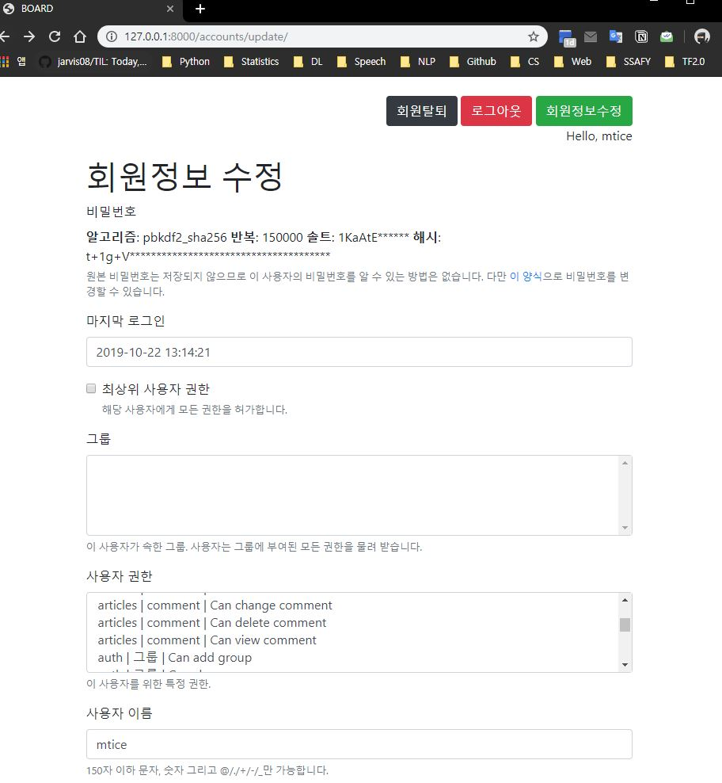
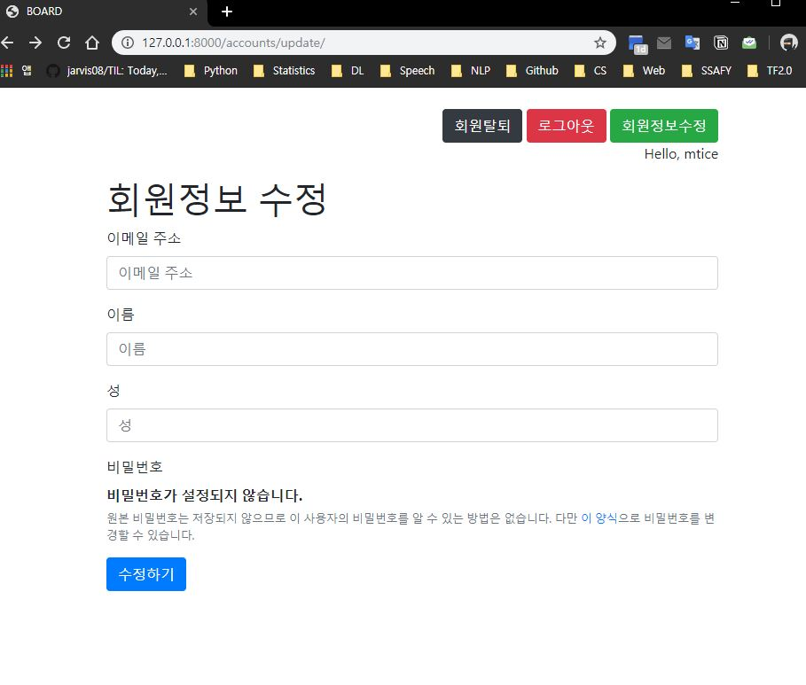
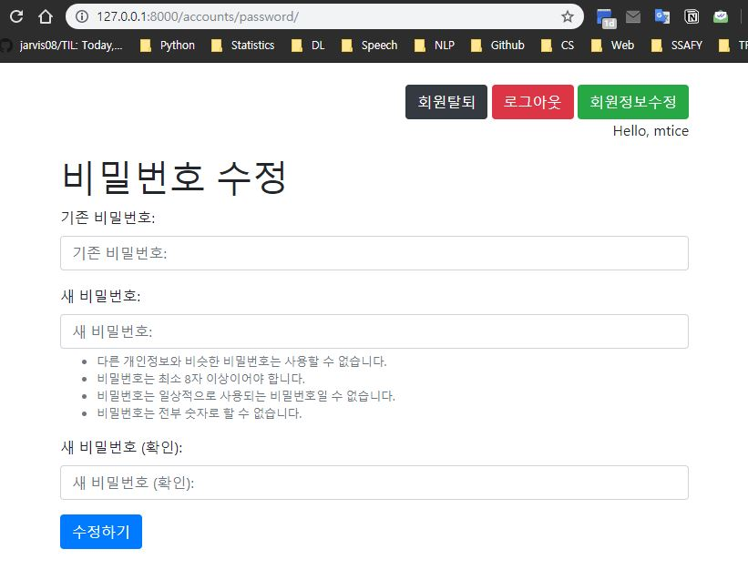

# 회원 정보 수정, Auth Modification

User data를 update하는 과정입니다. Django는 회원 정보 수정을 위한 Form을 따로 제공합니다.

- `UserChangeForm`
- `PasswordChangeForm`

<br>

<br>

## UserChangeForm

사용자 정보 수정을 위한 updating form인 `UserChangeForm()` 입니다.

```python
# django UserChangeForm()
from django.contrib.auth.forms import UserChangeForm
form = UserChangeForm()
```

```python
# views.py
def update(request):
    if request.method == 'POST':
        # 실제 DB에 적용
        pass
    else:
        # 편집하는 페이지 생성
        form = UserChangeForm(instance=request.user)
        context = {
            'form': form,
        }
        return render(request, 'accounts/update.html', context)
```

```html
<!-- accounts/update.html -->



<h1>회원정보 수정</h1>
<form method="POST">
  
  
  
</form>

```

아래 스냅샷은 장고에서 제공하는 default `UserChangeForm()`입니다. Admin 계정일 경우 조금 더 세부적인 내용과 권한 설정에 대한 내용들이 표시됩니다.



<br>

### Customizing UserChangeForm

하지만 이러한 형태는 우리가 원하는 모습이 아니므로, 커스터마이징을 해야합니다.

1. forms.py 생성
2. Customized `UserChangeForm` 작성

custom form 클래스의 Meta class에 사용자 정보를 부여해 주어야 한다. 이때 사용할 수 있는 모델은 다음과 같다.

참고자료:: [django docu, referencing user model](https://docs.djangoproject.com/ko/2.2/topics/auth/customizing/#referencing-the-user-model)

`from django.contrib.auth import get_user_model`

```python
# accounts/forms.py
from django.contrib.auth.forms import UserChangeForm
from django.contrib.auth import get_user_model


class CustomUserChangeForm(UserChangeForm):
    class Meta:
        model = get_user_model()
        fields = ('email', 'first_name', 'last_name')
```

```python
from django.shortcuts import render, redirect
from django.contrib.auth.forms import UserCreationForm, AuthenticationForm, UserChangeForm
from django.contrib.auth import login as auth_login
from django.contrib.auth import logout as auth_logout
from django.views.decorators.http import require_POST
from .forms import CustomUserChangeForm
from django.contrib.auth.decorators import login_required


@login_required
def update(request):
    if request.method == 'POST':
        # 실제 DB에 적용
        form = CustomUserChangeForm(request.POST, instance=request.user)
        if form.is_valid():
            form.save()
            return redirect('articles:index')
    else:
        # 편집하는 페이지 생성
        form = CustomUserChangeForm(instance=request.user)
        context = {
            'form': form,
        }
        return render(request, 'accounts/update.html', context)
```

Customized 된 `UserChangeForm`의 스냅샷은 다음과 같습니다.

<br>



<br>

만약 로그인이 이루어지지 않은 상태로 url을 통해 정보변경 페이지를 접속한다면 `AnonymousUser`는 `Meta` class가 없다며 에러가 발생합니다. 따라서 `@login_required` 데코레이터를 적용해야 합니다.

<br>

<br>

## PasswordChangeForm

Password는 UserChangeForm으로 변경할 수 없습니다. Password는 Hashing이 적용되어야 하며, DB와 비교하는 등 복잡한 과정을 거쳐야 변경할 수 있습니다.

따라서 이러한 복잡한 과정을 간편하게 사용할 수 있게 해주는 `PasswordChangeForm`이 따로 존재합니다.

```python
from django.contrib.auth.forms import PasswordChangeForm
```

```python
# views.py
def change_password(request):
    if request.method == 'POST':
        # 비밀번호 변경
        form = PasswordChangeForm(request.user, request.POST)
        if form.is_valid():
            form.save()
            return redirect('articles:index')
    else:
        # 편집 화면 보여주기(form)
        form = PasswordChangeForm(request.user)
    context = {
        'form': form,
    }
    return render(request, 'accounts/change_password.html', context)
```



만약 비밀번호를 수정하면, 로그아웃 된 상태로 index 페이지로 이동합니다. 로그아웃이 되는 이유는 **비밀번호가 변경되면서 현재 Session의 정보와 사용자 정보가 일치하지 않아 장고가 강제로 로그아웃을 진행**합니다.

<br>

### 세션 유지하며 비밀번호 변경하기

비밀번호를 변경하면서 auth의 hash 값을 변경하여  세션을 유지할 수 있습니다.

```python
from django.contrib.auth import update_session_auth_hash
```

```python
# views.py
def change_password(request):
    if request.method == 'POST':
        # 비밀번호 변경
        form = PasswordChangeForm(request.user, request.POST)
        if form.is_valid():
            form.save()
            ## session auth hash 변경하기
            # request.session.get('auth뭐시기뭐시기') = 변경된해시값
            # 위형태로 직접 변경해줄 수도 있지만, 장고가 제공하는 기능 사용하자!
            update_session_auth_hash(request, form.user)
            return redirect('articles:index')
    else:
        # 편집 화면 보여주기(form)
        form = PasswordChangeForm(request.user)
    context = {
        'form': form,
    }
    return render(request, 'accounts/change_password.html', context)
```

<br>

<br>

## HTML 통합하기

**모든 함수들이 유사한 형태**를 보입니다. 현재는 **views.py**에 **함수형**으로 요청들을 제작하지만, 이후에는 **Class Based View**를 사용하여 **class 형태**로 관리할 예정입니다.

그 전에 HTML Template들을 모두 하나로 통일하는 작업을 해 보겠습니다. **`accounts/templates/accounts/auth_form.html`** 파일을 제외하면 모두 삭제해 줍시다! `accounts/views.py`의 `render()`되는 html 페이지 들도 모두 `accounts/auth_form.html`로 수정해 줍니다.

그 후 `auth_form.html`에 조건문을 사용하여 **`request.resolver_match`의 `url_name`에 따라 `h1` 태그에 어떤 페이지인지 설명**해 주도록 합니다. `url_name`은 우리가 `accounts/urls.py`에서 설정한 `name`을 의미합니다.

```shell
In [1]: request.resolver_match
Out[1]: ResolverMatch(func=accounts.views.update, args=(), kwargs={}, url_name=update, app_names=['accounts'], namespaces=['accounts'], route=accounts/update/)
```

```html
<!-- accounts/templates/accounts/auth_form.html -->




  <h1>회원가입</h1>

  <h1>로그인</h1>

  <h1>회원정보 수정</h1>

  <h1>비밀번호 변경</h1>


<form method="POST">
  
  
  
</form>

```

위의 auth_form.html 템플릿이 모든 auth 관련 활동의 form을 생성할 수 있습니다.

