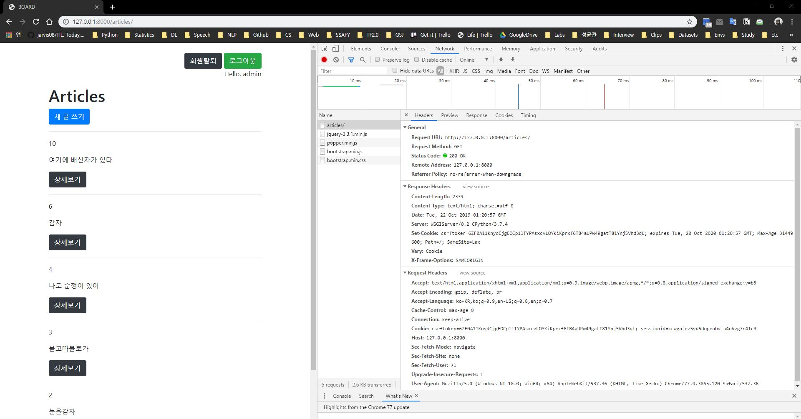
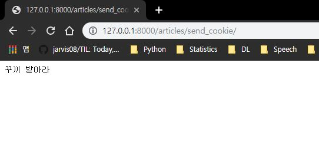
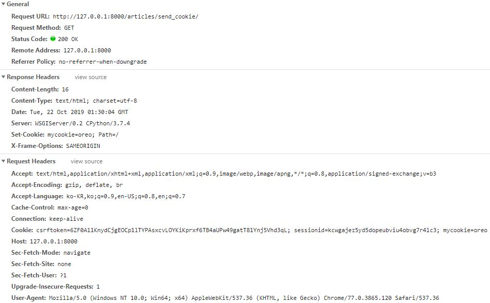
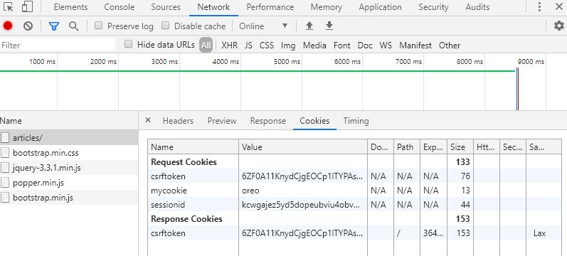

# Django's Cookie & Session

장고에서는 쿠키와 세션을 표현하는 방법이 세 가지가 있습니다.

- [Default] **Cookie Based Session**

- **File Based Session**

- **DB Based Session**

<br>

## Cookie Based Session

Client의 Request 또한 문서 하나로 볼 수 있습니다. Request 문서의 예로는 Git의 문서 정보(Config)가 있습니다.

```bash
$ git config
method=GET/
protocol=HTTP 1.1
host=github.com
```

이러한 문서 내용은 HTTP 프로토콜의 **Header**에 포함되며, **Body**에는 content인 HTML 파일 내용이 저장됩니다.



local host로의 접근 가능 여부는 브라우저 마다 다릅니다. Explorer는 지원하지 않는 기능입니다.

```python
def send_cookie(request):
    """return
    render()      : html 페이지 생성
    redirect()    : render 해주는 url로 보낸다
    reverse()     : redirect가 내부적으로 사용하는 기능
    HttpResponse()
    """
    # 전송 데이터
    res = HttpResponse('꾸끼 받아라')
    # 전송 쿠키(key, value 형태)
    res.set_cookie('mycookie', 'oreo')
    return res
    
```





<br>

전송한 쿠키인 `mycookie=oreo`는 `Request Headers` > `Cookie` 의 말단에서 찾을 수 있습니다. **Chrome**의 경우 Cookie를 저장하는 데에 SQLite를 사용하며, local이 아닌 browser에 저장합니다.

<br>

<br>

## Session

우리는 세션을 항상 사용하고 있었습니다.

```python
# settings.py
INSTALLED_APPS = [
    'accounts',
    'django_extensions',
    'articles',
    'django.contrib.admin',
    'django.contrib.auth',
    'django.contrib.contenttypes',
    ##############################
    'django.contrib.sessions',
    ##############################
    'django.contrib.messages',
    'django.contrib.staticfiles',
    'bootstrap4',
]

MIDDLEWARE = [
    'django.middleware.security.SecurityMiddleware',
    #########################################################
    'django.contrib.sessions.middleware.SessionMiddleware',
    #########################################################
    'django.middleware.common.CommonMiddleware',
    'django.middleware.csrf.CsrfViewMiddleware',
    'django.contrib.auth.middleware.AuthenticationMiddleware',
    'django.contrib.messages.middleware.MessageMiddleware',
    'django.middleware.clickjacking.XFrameOptionsMiddleware',
]
```

만약 `UserName`, `Email` 등을 사용하는 장고의 default Form을 사용하지 않고, 내가 직접 제작한 Form을 사용하고 싶다면, 비밀번호 저장 기능만 존재하는 `AbstractBaseUser`를 사용하여 커스터마이징 할 수 있습니다. 장고가 제공하는 Feature들의 수를 비교하여 Auth Form을 비교한 것은 아래와 같습니다.

`AbstractBaseUser` < `AbstractUser` < `User`

그리고 만약 커스터미이징을 했을 때, 중간 관리 역할을 해줄 수 있는 것이 **MIDDLEWARE**입니다. 이전에 사용해 왔었던 middleware의 예로 django **ORM**이 있으며, django **DTL**이 있습니다. ORM은 사용자와 Database 사이의 미들웨어이며, DTL은 사용자와 template 사이의 미들웨어입니다.

<br>

### IPython으로 확인해 보기

로그인을 한 후, index page에 `embed()` 코드를 추가로 작성하여 IPython을 실행합니다.

```python
In [1]: request.session
Out[1]: <django.contrib.sessions.backends.db.SessionStore at 0x4feaff0>

In [2]: request.session._session
Out[2]:
{'_auth_user_id': '2',
 '_auth_user_backend': 'django.contrib.auth.backends.ModelBackend',
 '_auth_user_hash': 'e4e0a5d1be3621eb893e3d715dd61db488c76635'}
```

위의 내용을 통해 `user_id`를 확인할 수 있습니다. 위의 계정은 데이터베이스 생성후 두 번째로 생성했던 아이디이며, 값이 2입니다.



이전에 생성했던 cookie인 `mycookie=oreo`가 아직 존재함을 알 수 있습니다. `_auth_user_hash`와 브라우저에서 확인한 `sessionid`가 다른 값인 이유는, `_auth_user_hash`에는 `sessionid`를 포함한 기타 정보를 해싱 했기 때문입니다.

<br>

### Session 수정해 보기

`visits_num`이라는 방문 횟수 변수를 생성하여, session에 `visits`라는 Key값을 부여하여 생성합니다.

```python
# views.py
def index(request):
    # session 값 조작 가능
    visits_num = request.session.get('visits', 0)
    request.session['visits'] = visits_num + 1
    # 변경됐음을 알려줌
    request.session.modified = True
    embed()
    articles = Article.objects.all()
    context = {
        'articles': articles,
        'visits': visits_num,
    }
    return render(request, 'articles/index.html', context)
```

```shell
In [1]: request.session._session
Out[1]:
{'_auth_user_id': '2',
 '_auth_user_backend': 'django.contrib.auth.backends.ModelBackend',
 '_auth_user_hash': 'e4e0a5d1be3621eb893e3d715dd61db488c76635',
 'visits': 1}
 
In [2]: request.session.get('visits')
Out[2]: 1
```

만약 `exit` 후 재접속한다면,

```shell
In [1]: request.session.get('visits')
Out[1]: 2
```

방문횟수 변수인 `visits`가 2로 증가했음을 확인할 수 있습니다.

하지만 로그아웃 후 다시 로그인 한다면, 이전의 세션은 종료되며 새로운 세션ID를 부여받으므로 `visits`는 초기화 됩니다. 총 방문 회수를 저장하기 위해 Model의 Column 중 하나로 저장하기도 합니다.

<br>

<br>