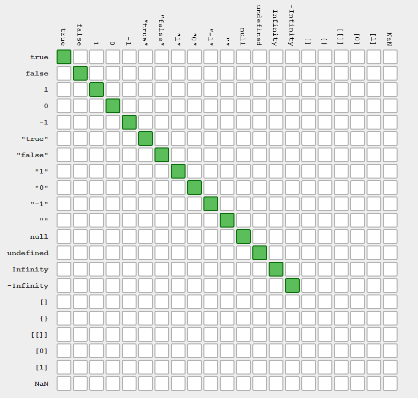
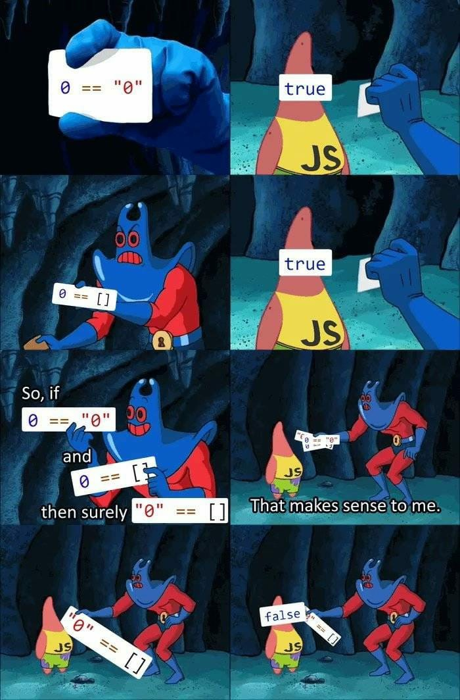

# JS Control Flow

프로그래밍 언어는 데이터를 **저장**과 **조작(계산)**하기 위해 사용합니다. 이를 위해서는 언어의 Control Flow를 파악해야 합니다.

새로운 언어를 살펴볼 때는 다음 두 가지를 우선적으로 파악하는게 빠른 습득에 도움이 됩니다.

- 알고있는 기존 언어와의 문법적 차이

  i.g., Python에서는 Semicolon을 사용하지 않으며, JS에서는 Class 개념이 없이 Object를 사용한다.

- 현재 학습하려는 언어의 관례(Convention)

기존 알고 있던 구조를 새로운 언어로 번역해 봅시다.

<br>

<br>

## Syntactical Difference

문법적 차이에 대해 먼저 알아보겠습니다. JS는 Python과 기능적으로는 유사하지만 문법 형태가 많이 다르며, Java와는 기능적으로 다르지만 문법 형태가 유사합니다.

데이터의 저장(무엇을, 어디에, 어떻게)은 다음과 같이 진행합니다.

1. 무엇을: 자료형, Data Type
2. 어디에: Identifier인 변수명과 Container Type(Variance, List, Dictionary)
   - 상수명: ALLCAPITAL
   - 변수명, 함수명: camelCase
   - 클래스: PascalCase
3. 어떻게: `=`, `==`, `===`

<br>

### 자료형, Data Type

`typeof`를 사용하여 확인해 봅시다. JavaScript의 **Primitive Types**는 다음과 같습니다.

- **number**: `숫자`, `(-)Infiniry`, `NaN`

  - `NaN`: (Not a Number) 숫자가 아님을 의미하면서도 자체적으로는 숫자로 구성되어 있습니다.

  ```javascript
  > typeof 2
  "number"
  > typeof 2.3
  "number"
  > typeof Infinity
  "number"
  > typeof -Infinity
  "number"
  > typeof NaN
  "number"
  ```

- **string**: `''`, `""`, ``

  ```javascript
  > typeof 'hello'
  "string"
  > typeof "hello"
  "string"
  > typeof `hello`
  "string"
  ```

- **boolean**: `true`, `false`

  ```javascript
  // 대문자로 사용하지 않도록 해야 한다.
  > typeof True
  "undefined"
  > typeof true
  "boolean"
  > typeof false
  "boolean"
  ```

- **Empty Value**: `undefined`, `null`

  `undefined`와 `null`로 나뉘어진 이유는 설계적인 오류입니다. 여러 형태로 각각의 브라우저에서 사용되던 과거의 JavaScript들이 통합되면서, 모두 허용하기 위해 같은 기능을 하는 두 가지로 사용됩니다.

  ```javascript
  > typeof undefined
  "undefined"
  > typeof null
  "object"
  ```

  `null`은 빈 객체임을 표현하기 위해 사용됐었으나, 현재는 두 가지가 동일한 목적으로 사용됩니다. 둘을 통합하려는 시도가 없었던 것은 아니나, 이미 엄청난 양의 웹 페이지들에 사용되어 이를 변경하는 것이 어려우므로 현재처럼 사용되고 있습니다.

  ```javascript
  > null == undefined
  true
  > !null
  true
  > !undefined
  true
  > null === undefined
  false
  ```

  `===`은 객체 타입을 비교하며, 이를 이용하면 `==`보다 정확한 비교가 가능합니다.

  아래 이미지는 `== 사용 시의 동일 처리`하는 값들에 대한 표 입니다.

  

  위의 우측 하단 부분들에 대해 같다고 처리하지 않는 이유는, 각자들이 객체로써 서로 속성을 갖기 때문에 객체들 끼리는 다른 것으로 판단합니다.

  ```javascript
  > 123123 == 123123
  true
  > [] === []
  false
  > [] == []
  false
  ```

  아래 이미지는 `=== 사용 시 동일 처리`에 대한 표입니다.

  

<br>

### 묵시적 형변환

묵시적 형변환은 다음에서 확실하게 찾아볼 수 있습니다.

```javascript
> const a = 1
undefined
> const b = "1"
undefined
> a == b
true
> '1' - 1
0
> 8 * null
0
> 2 + '5'
"25"
```



이렇게 묵시적 형변환으로 인해 엄청난 혼란이 생기므로, Strictly Type 하여 명시적으로 Type을 지정하는 것이 좋습니다. Microsoft에서는 이러한 이유로 **TypeScript**를 개발했습니다. TypeScript는 JS를 조금 더 엄격하게, 명시적으로 사용하는 것이라 생각하면 괜찮을 것 같습니다.

<br>

### 연산자, Operator

```javascript
> x = 2
2
> x += 2
4
> true && true
true
> true && false
false
> true || false
true
> true | false
1
> !true
false
> const result = Math.PI > 4 ? '네' : '아니오'
undefined
> console.log(result)
아니오
undefined
```

- bang(`!`): not

- double-pipe(`||`): or

- 삼항 연산자: `조건 ? '참입니다' : '거짓입니다.'`

- `prompt()`: Python의  `input()` 기능

  ```javascript
  > const userName = prompt('당신의 이름을 입력해주세요.')
  undefined
  // 팝업 창에서 Dongbin 입력
  > console.log(userName)
  Dongbin
  undefined
  ```

<br>

<br>

## 조건문, if

```javascript
> const userName = prompt('당신의 이름을 입력해주세요.')
undefined
> if (userName.length >= 3) {
	  alert('이름이 세 글자 이상입니다.')
  } esle {
	  alert('이름이 세 글자 미만입니다.')
  }
```

## 반복문, for

1. 반복문을 구성하는 방법은 다양합니다. 가장 먼저 기초적인 문법 활용입니다.

   ```javascript
   > let menus = ['대우식당', '바스버거', '세븐브릭스']
   undefined
   > menus[0]
   "대우식당"
   > for (let i = 0; i < menus.length; i++) {
       console.log(menus[i])
   }
   대우식당
   바스버거
   세븐브릭스
   undefined
   ```

2. `of`를 사용하여  파이썬처럼 사용할 수도 있습니다.

   ```javascript
   for (let menu of menus) {
       console.log(menu)
   }
   대우식당
   바스버거
   세븐브릭스
   undefined
   ```

3. `function`을 사용하는 방법입니다. `menus`의 `menu`들을 iterable하게 읽습니다. Python의 `map(함수, 데이터)`이 iterable한 데이터들 각각에 함수를 적용하는 방식과 같습니다.

   ```javascript
   menus.forEach(function(menu) {
       console.log(menu)
   })
   대우식당
   바스버거
   세븐브릭스
   undefined
   ```

4. 현재의 개발자들이 가장 많이 사용하는 방법입니다.

   ```javascript
   menus.forEach(menu => {
       console.log(menu)
   })
   대우식당
   바스버거
   세븐브릭스
   undefined
   ```

<br>

<br>

## 함수, function

다른 프로그래밍 언어들과 유사한 방법으로도 함수를 선언할 수 있습니다.

```javascript
> function add(num1, num2) {
  	  return num1 + num2
  }
  undefined
> add(3, 5)
  8
> add
  ƒ add(num1, num2) {
	  return num1 + num2
  }
```

함수 또한 변수와 같이 **특정 이름 공간 안에 저장된 호출 가능한 값**이며, `add` 라고 작성하는것 만으로도 함수 내용을 조회할 수 있습니다.

그런데 JS에서는 함수와 변수 선언 시 **호이스팅(Hoisting)**이 발생하여 모든 코드들 중 가장 먼저 선언하게되어 문제를 야기할 수 있습니다. [_Jbee](https://asfirstalways.tistory.com/197)님의 설명을 참고하면 이해하기 쉽습니다.

따라서 실제로는 아래와 같이 변수처럼 선언해 주는 경우가 대부분입니다.

```javascript
> const sub = function (num1, num2) {
	return num1 - num2
}
undefined
> sub(7, 2)
  5
> sub
  ƒ (num1, num2) {
	  return num1 - num2
  }
```

`fucntion`이라는 단어가 너무 길기 때문에 **Arrow Function(`=>`)**을 이를 다시 줄여서 사용합니다. 이는 ES6에서 새롭게 시작된 함수 표현식이며, 현재 주로 사용하는 방법입니다.

```javascript
const mul = (x, y) => {
    return x * y
}
```

흔한 경우는 아니지만, 만약 **필요 인자가 하나**라면 인자를 가리키는 **괄호(`()`)를 생략**할 수 있으며, **표현식이 하나**일 경우에는 **중괄호(`{}`)까지 생략**할 수 있습니다.

```javascript
// 생략 이전
const ssafy = function (name) {
    return `안녕, ${name}`
}

// 생략 이후
const ssafy1 = name => `안녕, ${name}`
// 제곱 함수 예시
const square = num => num ** 2
console.log(square(2))
// 결과: 4
```

특정한 naming 대신 `_`를 사용할 수도 있습니다.

```javascript
const square1 = _ => _ ** 2
console.log(square1(2))
// 결과: 4
```

<br>

### Arrow Function

`addEventListener('이벤트', 함수)` 형태로 코드를 작성할 때, `함수`를 작성함에 있어서 arrow function을 사용하지 않는 것이 좋습니다. 즉, `function() {}` 형태를 사용하는 것이 좋습니다. 왜냐하면 arrow function이 `EventListener`에서 사용할 `this.`가 가리키는 태그를 변경시키기 때문입니다. `this`는 객체를 지칭하기 위해 사용하는데, 이는 자기 자신객체를 가리킬 때 사용합니다. 그런데 arrow function이 지칭하는 객체를 다른 객체로 변경하게 되면, 적용 대상이 변경됩니다.

<br>

<br>

## Array

Python의 List와 같이 Array를 사용합니다.

<br>

### Indexing

```javascript
const nums = [1, 2, 3, 4]

console.log(nums[0])
console.log(nums[-1])
console.log(nums[nums.length - 1])
// 결과
// 1
// undefined
// 4
```

인덱싱의 경우 Python처럼 `-1`을 사용할 수 없기 때문에, 길이(length)를 구하여 조작해줍니다.

<br>

### Methods

```javascript
const nums = [1, 2, 3, 4]

// reverse
console.log(nums.reverse)
console.log(nums)

// push
nums.push(0)
console.log(nums)

// unshift
nums.unshift(5)
console.log(nums)

// pop
nums.pop()
console.log(nums)

// shift
nums.shift()
console.log(nums)

// 결과
// [Function: reverse]
// [ 1, 2, 3, 4 ]
// [ 1, 2, 3, 4, 0 ]
// [ 5, 1, 2, 3, 4, 0 ]
// [ 5, 1, 2, 3, 4 ]
// [ 1, 2, 3, 4 ]
```

정보 확인하기

```javascript
const nums = [1, 2, 3, 4]

// includes: 값의 존재 여부 확인
console.log(nums.includes(5))
console.log(nums.includes(1))

// indexOf: 값의 인덱스 확인
console.log(nums.indexOf(3))

// 결과
// false
// true
// 2
```

배열에 일반적인 `for (let 변수 of 변수들) {}` 형태를 사용할 수도 있지만, 배열의 **helper method**에는 순회 기능이 많으며, 일반적으로 사용합니다.

- 배열.`forEach(함수)`

  Python의 `map(함수, iterable)`와 같은 기능으로, `iterable.forEach(함수)` 형태로 사용합니다.

  array를 순회하며, 함수를 각각의 요소에 실행합니다. 자세한 내용은 아래와 같습니다.

  `배열.forEach(function(순회되는 요소){조작 내용})`

  ```javascript
  const nums = [1, 2, 3, 4]
  
  nums.forEach(function(num){console.log(num**2)})
  // 결과
  // 1
  // 4
  // 9
  // 16
  ```

- `배열.map(함수)`

  함수 결과를 다른 배열에 저장시키고 싶을 때 간편한 메서드입니다.

  ```javascript
  const nums = [1, 2, 3, 4]
  
  // forEach
  let newNums = []
  nums.forEach(function(num){newNums.push(num * num)})
  console.log(newNums)
  
  // map
  const squaredNums = nums.map(function(num){return num ** 2})
  console.log(squaredNums)
  
  // map + arrow function
  const arrowFunc = nums.map(num => num ** 2)
  console.log(arrowFunc)
  
  // 결과
  // [1, 4, 9, 16]
  // [1, 4, 9, 16]
  // [1, 4, 9, 16]
  ```

<br>

<br>

## Object

JS에서의 Object는 **key-value의 관계로 구성**됩니다.

```javascript
// dictionary의 key값을 변수명처럼 사용 가능
const me = {
    name: 'dongbin'
}
console.log(me['name'])
// console.log(me[name])와 같이 사용 시 해당 변수가 없으므로 에러가 발생
console.log(me.name)

// 결과
// donginb
// donginb
```

내부에 **함수**를 부여할 수 있습니다.

```javascript
const me = {
    name: 'dongbin',
    sleep: function() {
        console.log('쿨쿨')
    },
}
console.log(me.sleep)
console.log(me.sleep())

// 결과
// [Function: sleep]
// 쿨쿨
// undefined
```

마지막의 `undefined`는 `sleep` 함수에 `return` 값이 없기 때문에 발생합니다. Django 처럼 더 이상 요소가 없음에도 Trailing Comma를 작성해도 무방합니다.

Object 안에 Object를 추가적으로 사용하는 것도 가능합니다.

```javascript
const me = {
    name: 'dongbin',
    sleep: function() {
        console.log('쿨쿨')
    },
    appleProduct: {
        macBook: '2018pro',
        ipad: '2018pro',
    },
}
console.log(mee.appleProduct)
console.log(mee.appleProduct.macBook)

// 결과
// { macBook: '2018pro', ipad: '2018pro' }
// 2018pro
```

<br>

<br>

## Json 파일 다루기

- `JSON.stringify()`
  - object -> JSON(string)
- `JSON.parse()`
  - JSON(string) -> object

<br>

<br>

### stringify()

```javascript
const data = {
    name: 'dongbin',
    appleProduct: {
        macBook: '2018pro',
        ipad: '2018pro',
    },
}
const meJSON = JSON.stringify(data)
console.log(typeof meJSON)
// 결과
// string
```

<br>

### parse()

```javascript
const data = {
    name: 'dongbin',
    appleProduct: {
        macBook: '2018pro',
        ipad: '2018pro',
    },
}
// stringify
const dataJSON = JSON.stringify(data)
console.log(typeof dataJSON)

// parse
const dataObject = JSON.parse(dataJSON)
console.log(typeof dataObject)
console.log(dataObject)

// 결과
// string
// object
// {
//   name: 'dongbin',
//   appleProduct: { macBook: '2018pro', ipad: '2018pro' }
// }
```

<br>

### File 쓰기 및 읽기

```javascript
// file system 관련 method 불러오기
const fs = require('fs')

// writeFile: 비동기적 파일 쓰기 방법
// err => {}: Error Handling Function
fs.writeFile('data.json', dataJSON, err => {})

// writeFileSync: 동기적 파일 쓰기 방법
fs.writeFileSync('data2.json', dataJSON)
```

<br>