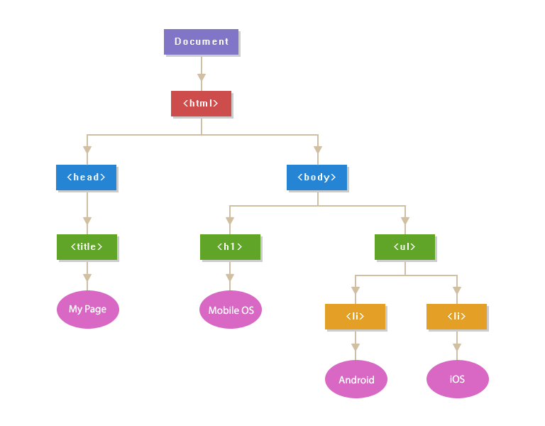

# DOM

DOM은 Tree 구조를 가집니다. 우리는 `querySelector()` 메서드를 이용하여 요소들을 선택할 수 있습니다.




<br>

<br>

## 구글 공룡 게임 만들어보기

console에서 html 파일을 읽어보려면 `document` 명령어를 입력하면 됩니다.  정확히는 `window.document` 이지만, 워낙 빈번히 사용되는 명령어이므로 `document` 만으로도 조회가 가능합니다.

<br>

### Selector

- `document.querySelector('p')`

  p 태그 조회하기

- `document.querySelector('.bg').innerHTML`

  bg class의 HTML  선택

- `const dino = document.querySelector('#dino')`

  id가 dino(`#dino`)인 property를 object로하는 `dino` 상수 생성

- `dino.src = ''`

  저장되어 있는 소스를 삭제하여 사진을 소스로 갖고 있는 객체인 `dino`의 사진을 삭제합니다.

- `dino.style.width = '500px'`

  500px로 넓이를 변경

- `dino.remove()`

<br>

### Selector 다뤄보기

`dino`의 부모는 `.bg` class의 `div`입니다.

```javascript
const bg = document.querySelector('.bg')
```

`bg.lastElementChild.remove()`와 같이 `dino`를 간접적으로 선택하여 조작할 수도 있습니다.

Browser 상에서 console을 사용하여 `dino` 사진을 제거한 후, 다시 생성하는 작업을 진행해 보겠습니다.

```javascript
> const bg = document.querySelector('.bg')
> bg.firstElementChild.remove()
> const newDino = document.createElement('img')
> newDino.src = 'https://store-images.s-microsoft.com/image/apps.38351.14426311725358695.736eb785-1d29-478c-a909-1900849773e9.4247f5ee-1daa-4c97-96c2-23868f1fbc45?mode=scale&q=90&h=200&w=200&background=%230078D7'
> newDino.alt = 'dino'
> newDino.id = 'dino'
> newDino.style.width = '100px'
> newDino.style.height = '100px'
> bg.append(newDino)
```

추가하는 과정에서, `append()` 대신 다음과 같이 다른 자식들과의 위치를 비교하여 추가할 수도 있습니다.

```javascript
bg.insertBefore(newDino, bg.firstElementChild)
```

<br>

### eventlistener

[w3schools](https://www.w3schools.com/jsref/dom_obj_event.asp)

마우스가 Hover됐을 때, 클릭했을 때, 시간이 지났을 때 등 event 발생 시 이를 포착하는 역할을 합니다.

```html
<body>
  <script>
      const dino = document.querySelector('#dino')
      dino.addEventListener('click', () => {
          alert('아야')
      })
  </script>
</body>
```

위 코드는, `dino`를 클릭하면 '아야' 라는 경고창을 팝업시킵니다.

event 또한 객체이며, 이를 handling 하는 것이 가능합니다.

```html
<body>
    <script>
    const dino = document.querySelector('#dino')
    dino.addEventListener('click', event => {
      alert('아야')
      console.log(event)
    })
  </script>
</body>
```

dino를 클릭한 후 console창에 다음과 같은 정보가 나옵니다.

```
MouseEvent {isTrusted: true, screenX: 744, screenY: 587, clientX: 676, clientY: 439, …}
```

이번에는 키보드 조작을 캐치해 보겠습니다.

```html
<body>
    <script>
      document.addEventListener('keydown', e => {
        console.log(e)
      })
  </script>
</body>
```

보통 listener 내부의 변수에는 event를 줄여서 `e`로 사용합니다.

```
KeyboardEvent {isTrusted: true, key: "s", code: "KeyS", location: 0, ctrlKey: false, …}
index.html:34 
KeyboardEvent {isTrusted: true, key: "s", code: "KeyS", location: 0, ctrlKey: false, …}
index.html:34 
KeyboardEvent {isTrusted: true, key: "a", code: "KeyA", location: 0, ctrlKey: false, …}
index.html:34 
KeyboardEvent {isTrusted: true, key: "f", code: "KeyF", location: 0, ctrlKey: false, …}
index.html:34 
KeyboardEvent {isTrusted: true, key: "y", code: "KeyY", location: 0, ctrlKey: false, …}
KeyboardEvent {isTrusted: true, key: "ArrowRight", code: "ArrowRight", location: 0, ctrlKey: false, …}
```

`'mousemove'`로 설정할 경우 마우스의 움직임을 event로 간주합니다.