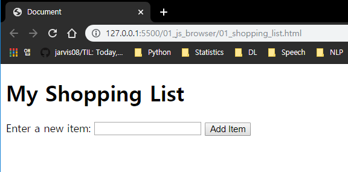
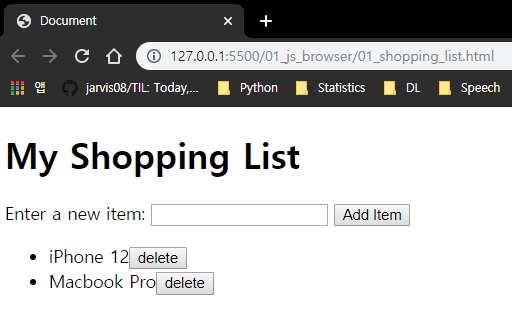

# DOM

JS가 HTML을DOM Tree 형태로 만든 후, 각각의 요소들을 Object로써 다룰 수 있습니다. 우리는 `querySelector()` 메서드를 이용하여 요소들을 선택할 수 있습니다.


<br>

<br>

## 구글 공룡 게임 만들어보기

console에서 html 파일을 읽어보려면 `document` 명령어를 입력하면 됩니다.  정확히는 `window.document` 이지만, 워낙 빈번히 사용되는 명령어이므로 `document` 만으로도 조회가 가능합니다.

<br>

### Selector

- `document.querySelector('p')`

  p 태그 조회하기

- `document.querySelector('.bg').innerHTML`

  bg class의 HTML  선택

- `const dino = document.querySelector('#dino')`

  id가 dino(`#dino`)인 property를 object로하는 `dino` 상수 생성

- `dino.src = ''`

  저장되어 있는 소스를 삭제하여 사진을 소스로 갖고 있는 객체인 `dino`의 사진을 삭제합니다.

- `dino.style.width = '500px'`

  500px로 넓이를 변경

- `dino.remove()`

<br>

### Selector 다뤄보기

`dino`의 부모는 `.bg` class의 `div`입니다.

```javascript
const bg = document.querySelector('.bg')
```

`bg.lastElementChild.remove()`와 같이 `dino`를 간접적으로 선택하여 조작할 수도 있습니다.

Browser 상에서 console을 사용하여 `dino` 사진을 제거한 후, 다시 생성하는 작업을 진행해 보겠습니다.

```javascript
> const bg = document.querySelector('.bg')
> bg.firstElementChild.remove()
> const newDino = document.createElement('img')
> newDino.src = 'https://store-images.s-microsoft.com/image/apps.38351.14426311725358695.736eb785-1d29-478c-a909-1900849773e9.4247f5ee-1daa-4c97-96c2-23868f1fbc45?mode=scale&q=90&h=200&w=200&background=%230078D7'
> newDino.alt = 'dino'
> newDino.id = 'dino'
> newDino.style.width = '100px'
> newDino.style.height = '100px'
> bg.append(newDino)
```

추가하는 과정에서, `append()` 대신 다음과 같이 다른 자식들과의 위치를 비교하여 추가할 수도 있습니다.

```javascript
bg.insertBefore(newDino, bg.firstElementChild)
```

<br>

### eventlistener

[w3schools](https://www.w3schools.com/jsref/dom_obj_event.asp)

마우스가 Hover됐을 때, 클릭했을 때, 시간이 지났을 때 등 event 발생 시 이를 포착하는 역할을 합니다.

```html
<body>
  <script>
      const dino = document.querySelector('#dino')
      dino.addEventListener('click', () => {
          alert('아야')
      })
  </script>
</body>
```

위 코드는, `dino`를 클릭하면 '아야' 라는 경고창을 팝업시킵니다.

event 또한 객체이며, 이를 handling 하는 것이 가능합니다.

```html
<body>
    <script>
    const dino = document.querySelector('#dino')
    dino.addEventListener('click', event => {
      alert('아야')
      console.log(event)
    })
  </script>
</body>
```

dino를 클릭한 후 console창에 다음과 같은 정보가 나옵니다.

```
MouseEvent {isTrusted: true, screenX: 744, screenY: 587, clientX: 676, clientY: 439, …}
```

이번에는 키보드 조작을 캐치해 보겠습니다.

```html
<body>
    <script>
      document.addEventListener('keydown', e => {
        console.log(e)
      })
  </script>
</body>
```

보통 listener 내부의 변수에는 event를 줄여서 `e`로 사용합니다.

```
KeyboardEvent {isTrusted: true, key: "s", code: "KeyS", location: 0, ctrlKey: false, …}
index.html:34 
KeyboardEvent {isTrusted: true, key: "s", code: "KeyS", location: 0, ctrlKey: false, …}
index.html:34 
KeyboardEvent {isTrusted: true, key: "a", code: "KeyA", location: 0, ctrlKey: false, …}
index.html:34 
KeyboardEvent {isTrusted: true, key: "f", code: "KeyF", location: 0, ctrlKey: false, …}
index.html:34 
KeyboardEvent {isTrusted: true, key: "y", code: "KeyY", location: 0, ctrlKey: false, …}
KeyboardEvent {isTrusted: true, key: "ArrowRight", code: "ArrowRight", location: 0, ctrlKey: false, …}
```

`'mousemove'`로 설정할 경우 마우스의 움직임을 event로 간주합니다.

<br>

### 움직이기 & 다른 키 입력 시 경고

```javascript
document.addEventListener('keydown', e => {
    console.log(e)
})
```

키보드 키를 감지하는데, 그 중에 `keycode` 값을 사용하여 어떤 키인지 감지하도록 합니다.

```javascript
document.addEventListener('keydown', e => {
  if (e.keyCode === 37) {
    console.log('왼쪽으로 이동')
  } else if (e.keyCode === 38) {
    console.log('위쪽으로 이동')    
  } else if (e.keyCode === 39) {
    console.log('오른쪽으로 이동')    
  } else if (e.keyCode === 40) {
    console.log('아래쪽으로 이동')    
  } else {
    alert('방향키를 눌러주세요!')
  }
})
```

위와 같이 `e.keyCode` property를 부여하여 `keyCode` 만을 리턴합니다. 이제 실제로 Dino 이미지의 `margin` 값을 조정하여 이동시켜 보겠습니다.

```javascript
document.addEventListener('keydown', e => {
    if (e.keyCode === 37) {
        console.log('왼쪽으로 이동')
        dino.style.marginRight = '40px'
    } else if (e.keyCode === 38) {
        console.log('위쪽으로 이동')
        dino.style.marginBottom = '40px' 
    } else if (e.keyCode === 39) {
        console.log('오른쪽으로 이동')
        dino.style.marginLeft = '40px'
    } else if (e.keyCode === 40) {
        console.log('아래쪽으로 이동')
        dino.style.marginTop = '40px'
    } else {
        alert('방향키를 눌러주세요!')
    }
})
```

하지만 현재는 각 방향으로 1회 씩만 이동이 가능합니다. 따라서 변수 조작 과정을 통해 이에 지속성을 주겠습니다.

```javascript
let x = 0
let y = 0

document.addEventListener('keydown', e => {
  if (e.keyCode === 37) {
    console.log('왼쪽으로 이동')
    x -= 40
    dino.style.marginLeft = `${x}px`
  } else if (e.keyCode === 38) {
    y -= 40
    console.log('위쪽으로 이동')
    dino.style.marginTop = `${y}px`
  } else if (e.keyCode === 39) {
    console.log('오른쪽으로 이동')
    x += 40
    dino.style.marginLeft = `${x}px`
  } else if (e.keyCode === 40) {
    console.log('아래쪽으로 이동')
    y +=40
    dino.style.marginTop = `${y}px`
  } else {
    alert('방향키를 눌러주세요!')
  }
})
```

<br>

<br>

## Shopping List 제작

댓글, 장바구니 등의 컨텐츠들을 사용할 때, 무언가 item을 추가할 때 마다 갱신된 페이지를 다시 load하게 됩니다. 하지만 JS를 사용하면 페이지 load 없이 최신화 할 수 있습니다. 이러한 기능이 가능한 Application을 **Single Page Application**이라고 합니다.



1. 사용자 입력을 동적으로 가져온다.

   ```html
   <body>
     <h1>My Shopping List</h1>
     Enter a new item: <input id="item-input" type="text">
     <button id="add-button">Add Item</button>
     <ul id="shopping-list">
   
     </ul>
   
     <script>
       const input = document.querySelector('#item-input')
       const button = document.querySelector('#add-button')
       const list = document.querySelector('#shopping-list')
       button.addEventListener('click', e => {
         const itemName = input.value
       })
     </script>
   </body>
   </html>
   ```

2. ul 태그 안에 li로 input 내용을 삽입한다.

   ```javascript
   <script>
     const input = document.querySelector('#item-input')
     const button = document.querySelector('#add-button')
     const shoppingList = document.querySelector('#shopping-list')
     button.addEventListener('click', e => {
       const itemName = input.value
       <!-- //////////////////////////////// -->
       input.value = ''    
       const item = document.createElement('li')
       item.innerText = itemName
       shoppingList.appendChild(item)
       <!-- //////////////////////////////// -->
     })
   </script>
   ```

   _`input.value = ''`는 input 값 저장 이후 input 칸을 비워주는 역할을 합니다._

3. Shopping List 삭제 버튼 만들기

   ```html
   <script>
     const input = document.querySelector('#item-input')
     const button = document.querySelector('#add-button')
     const shoppingList = document.querySelector('#shopping-list')
     button.addEventListener('click', e => {
       const itemName = input.value
       input.value = ''
       const item = document.createElement('li')
       item.innerText = itemName
       <!-- /////////////////////////////////////////// -->
       const deleteButton = document.createElement('button')
       deleteButton.innerText = 'delete'
       deleteButton.addEventListener('click', e => {
         item.remove()
       })
   	<!-- /////////////////////////////////////////// -->
       item.appendChild(deleteButton)
   
       shoppingList.appendChild(item)
     })
   </script>
   ```

   

<br>

<br>

## API를 사용하여 GIF 띄우기

별도의 JS 파일인 `main.js` 파일을 html 파일에서 load합니다.

`<script src="./main.js"></script>`

`XHR`: XMLHttpResponse, 구글 검색에서 Enter를 치지도않았는데 추천 검색어들이 변경되며 계속해서 XMR을 통해 Response가 지속적으로 옴

```html
<!-- html -->
<!doctype html>
<html>

<head>
  <title>Giphy Search Engine</title>
  <link rel="stylesheet" href="./main.css">
</head>

<body>
  <div class="container container-padding50">
    <input type="text" id="js-userinput" class="container-textinput" value="HPHK" />
    <button id="js-go" class="container-button">Go!</button>
  </div>
  <div id="result-area" class="container container-padding50 js-container">

  </div>

  <!-- JS 파일은 HTML문서에 이렇게 import 한다 -->
  <script src="./main.js"></script>
</body>

</html>
```

```css
/* main.css */
body {
  width: 80%;
  max-width: 1024px;
  margin: 0 auto;
  background-color: black;
}
h1 {
  color: white;
}
.img-center {
  display: block;
  margin-left: auto;
  margin-right: auto;
}
.container-padding50 {
  padding-top: 50px;
}
.container-textinput {
  width: 80%;
  display: inline-block;
  padding: 20px;
  font-size: 16px;
  font-family: Helvetica, sans-serif;
}
.container-button {
  width: 10%;
  display: inline-block;
  padding: 20px;
  background-color: green;
  color: white;
  font-size: 16px;
  font-family: Helvetica, sans-serif;
  border: 1px solid green;
  border-radius: 5px;
}
.container-image {
  width: 30%;
  display: block;
  float: left;
  margin-right: 3%;
  margin-bottom: 5%
}
```

```javascript
/* 1. <input> 태그 안의 값을 잡는다. */
const inputArea = document.querySelector('#js-userinput')
const button = document.querySelector('#js-go')
const resultArea = document.querySelector('#result-area')
button.addEventListener('click', e => {
    // const inputValue = inputArea.value
    // console.log(`click 됐어요: ${inputValue}`)
    searchAndPush(inputArea.value)
})
inputArea.addEventListener('keydown', e => {
    if (e.keyCode === 13) {
        // const inputValue = inputArea.value
        // console.log(`enter key 쳤어요: ${inputValue}`)
        searchAndPush(inputArea.value)
    }
})

/* 2. Giphy API 를 통해 data 를 받아서 가공한다. */
const searchAndPush = keyword => {
    const API_KEY = 'giphy developers 참고'
    const URL = `http://api.giphy.com/v1/gifs/search?q=${keyword}&api_key=${API_KEY}`
    
    const GiphyAPICall = new XMLHttpRequest()
    // Python request.get과 달리 보내는 작업이 open()과 send()로 나뉨
    // open(Http method, URL): 어디로 어떻게 보낼지
    GiphyAPICall.open('GET', URL)
    // send()를 하면 request를 보내고, response까지 돌려받음
    GiphyAPICall.send()
    // 응답 event(load) 발생 시 > event 객체 안의 target 객체 > data 추출
    GiphyAPICall.addEventListener('load', e => {
        const parsedData = JSON.parse(e.target.response)
        // const imageURL = parsedData.data[0].images.original.url
        pushToDOM(parsedData)
    })

    /* 3. GIF 파일들을 index.html(DOM)에 밀어 넣어서 보여준다. */
    const pushToDOM = data => {
        resultArea.innerHTML = null
        const dataSet = data.data
        dataSet.forEach(data => {
            let imageURL = data.images.original.url
            // resultArea.innerHTML += ``

            // appendChild 이용하기
            const elem = document.createElement('img')
            elem.src = imageURL
            // css에 정의된 container-image로 정렬
            elem.className = 'container-image'
            resultArea.appendChild(elem)
        })
    }
}
```

