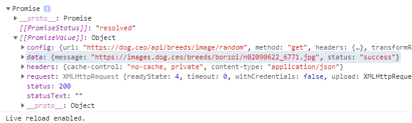

# Promise

원하는 시점에 작업이 끝나도록 조작하는 함수입니다.

`writeFileSync()`: `writeFile()`을 조금 더 동기적으로 제작한 함수이며, 콜백 함수가 없습니다.

<br>

<br>

### axios, Promise based HTTP client

참고 자료: [axios Github](https://github.com/axios/axios)

```javascript
//// 번거로운 API Call 과정을 대체하는 axios
const URL = 'https://dog.ceo/api/breeds/image/random'
const result = axios.get(URL)
console.log(result)
```



`then()` method로 call back 함수를 처리해 봅시다. axios의 `get()`은 **Promise** 객체를 반환하며, `then()`을 통해 이를 조작할 수 있습니다.

```javascript
const URL = 'https://dog.ceo/api/breeds/image/random'

const result = axios.get(URL)
result.then( response => {
    console.log(response.data.message)
})
```

axios와 `then()`을 사용하는 컨벤션은 다음과 같습니다.

```javascript
const URL = 'https://dog.ceo/api/breeds/image/random'
const result = axios.get(URL)

axios.get(URL)
    .then(response => console.log(response.data.message))
```

`get()`뒤에 `then()`을 붙여서 작성할 수 있지만, **보다 가시적으로 작성**하기 위해 위처럼 `.then()`을 다음 line에 작성해 줍니다.

<br>

### Wrapping

```javascript
// 1. axios Dog API 요청
// 2. 목표 태그 내부에  태그로 사진 보여주기
const URL = 'https://dog.ceo/api/breeds/image/random'

const getDogAndPush = () => {
    axios.get(URL)
        .then(response => {
            const imgURL = response.data.message
            const imgTag = document.createElement('img')
            imgTag.src = imgURL
            document.querySelector('#showroom').appendChild(imgTag)
        })
}

const dogButton = document.querySelector('#dog')
dogButton.addEventListener('click', getDogAndPush)
```

<br>

### EventListener()에는 Arrow Function 사용하지 않는다!

원본 형태인 `funtion(){}`로 사용해야 합니다. 그 이유는 `this`라고 하는 것의 바인딩이 달라서입니다.

