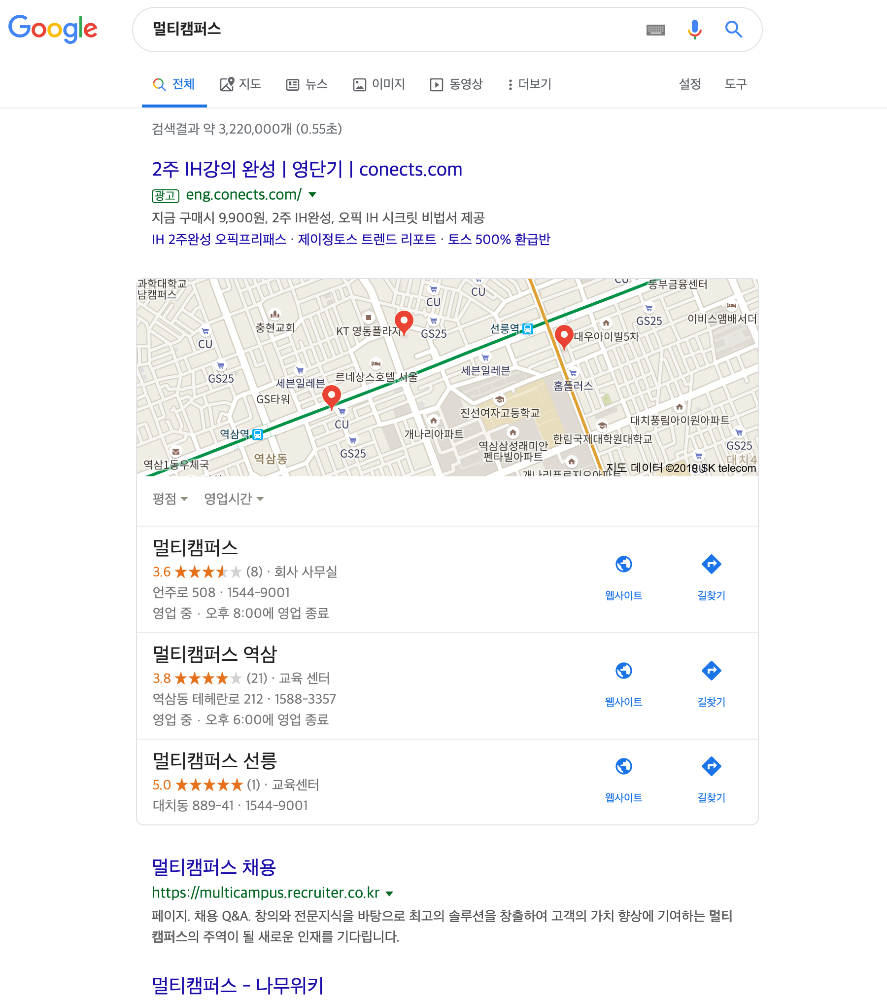
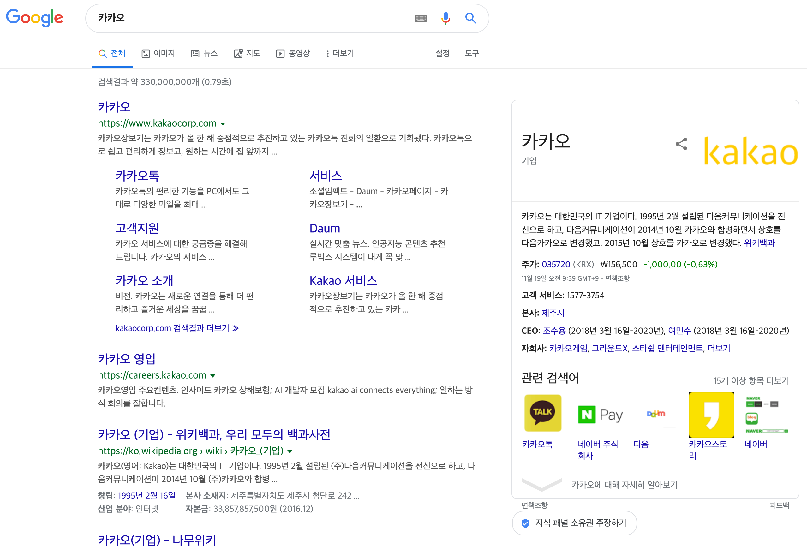

# DRF & Vue

Django DRF의 경우 Server 역할을 하며, Vue는 Front 역할을 합니다. 따라서 큰 프로젝트 내부에 작게는 back, front projects로 나뉘게 됩니다.

```
05_DRF_Vue/
					todo-back/
					todo-front/
```

보통 back-end는 Node.js로 많이 사용되지만, 현재까지 배운 내용을 공부하기 위해 Django DRF를 사용하겠습니다. Front-end 또한 React.js를 많이 사용하는 추세이나, Vue와 동일하게 component base이므로 추후 학습하기 용이할 것입니다. React.js의 경우 별도의 mobile app framework를 사용하지 않아도 되는 편리한 기능이 존재합니다.

<br>

## Front 환경 설정

```bash
$ mkdir 05_DRF_Vue
$ cd 05_DRF_Vue
$ mkdir todo-back
$ vue create todo-front
```

프로젝트 개발을 용이하게 도와주는 Vue UI를 사용하여 Vue Router를 설치해 보겠습니다.

```bash
$ vue ui
```

`가져오기` > `플러그인` > `플러그인 추가` > `@vue/cli-plugin-router` 검색 및 설치

설치 시 어떤 파일이 변경되고, 또 추가되는지 알려줍니다. 추가되는 파일 중, todo-front/src/router/index.js 를 확인해 보면, Django에서 `urlpatterns`와 같은 기능을 하는 `const routs`가 작성되어 있음을 확인할 수 있습니다.

```javascript
import Vue from 'vue'
import VueRouter from 'vue-router'
import Home from '../views/Home.vue'

Vue.use(VueRouter)

const routes = [
  {
    path: '/',
    name: 'home',
    component: Home
  },
  {
    path: '/about',
    name: 'about',
    // route level code-splitting
    // this generates a separate chunk (about.[hash].js) for this route
    // which is lazy-loaded when the route is visited.
    component: () => import(/* webpackChunkName: "about" */ '../views/About.vue')
  }
]

const router = new VueRouter({
  routes
})

export default router
```

코드 마지막 줄의 `export default router` 는 외부에서도 router를 사용할 수 있게끔 합니다. JavaScript에서는 이렇게 굳이 선언해 주지 않는다면, 외부에서 사용할 수 없도록 되어 있습니다.

main.js 파일에는 기본적인 Vue 내용에  `router`가 추가되어 있습니다.

Vue ui에서 변경사항 저장, first commit을 기록하여 저장해줍니다.

물론 CLI를 통해 설치할 수도 있습니다.

```bash
$ npm install vue-router
```

우리는 Vue ui를 통해 설치했으므로, 위 명령어는 생략한 후 vue와 router를 연결해 주는 작업을 하겠습니다.

```bash
$ vue add router
? Use history mode for router? (Requires proper server setup for index fallback in production) Yes
```

History mode를 사용할 것이냐는 물음에는 `Yes`를 설정하겠습니다. 변경 사항을 commit 해 줍시다.

```bash
$ git add .      
$ git commit -m "install vue router with history mode"
```

이제 다시 서버를 실행하여 확인해 보겠습니다.

```bash
$ npm run serve
```

위에서 설치한 Router로 인해, 이제 Single Page에서도 뒤로가기 기능을 사용할 수 있습니다. `Home` 과 `About` 을 클릭하면 page load 없이 새로운 페이지를 보여주며, 뒤로가기 클릭 시 이전 페이지 로드가 아닌 `Home`혹은 `About`으로 이동하게 됩니다. 이는 Router가 history에 지난 행적을 기록하기 때문입니다.

<br>

### SPA(Single Page Application)의 극단적인 단점

1. History

Page load 없이 해당 페이지에서 모든 작업을 할 수 있다는 것은 SPA의 엄청난 장점입니다. 하지만, 이는 사용자의 history를 저장할 수 없는 것 또한 엄청난 단점으로 연결됩니다. 어느 경로를 통해 접속했고, 어떤 작업들을 수행했는지 기록하는 것은 기업에게는 아주 중요한 정보입니다.

SPA가 아닌 시스템의 history 사용 과정은 다음과 같습니다. 우선, url로 어떠한 요청이 올 때마다 history라는 곳에 이전 페이지를 저장합니다. 이후, 뒤로가기 요청이 들어올 때 마다 `window.history.back()`을 통해 이전 페이지를 보여줍니다.

2. SEO, Search Engine Optimization

구글이 검색엔진에 적용하는 기능은 **page rank**입니다. 양질의 정보라고 판단되는, 링크가 많이 사용되는, 마치 논문처럼 많이 인용되는 페이지들의 ranking을 매겨 먼저 나오게 합니다. 물론 이렇게 단순하게 구현되지만은 않았을 것입니다. 예를들어, Python의 공식 홈페이지는 일반적인 사용자 리뷰보다 더 먼저 나오도록 되어 있을 것입니다.

SEO는 기본적으로 HTML 페이지가 보유한 contents를 통해 결정됩니다. 당장 예를 들어 보자면, 구글 검색에 `멀티캠퍼스`와 `카카오`를 검색해 보면 그 중요성을 알 수 있습니다. SEO가 고려된 페이지의 경우, 사용자가 정보를 검색할 때 필요한 정보들을 훨씬 가시적으로 보여줄 수 있습니다.





<br>

### SPA의 단점, History 기록에 대한 보완 방법

1. sh bang

Hash bang을 줄여서 (ha)sh bang, sh bang으로 불립니다. 실제 /쉬뱅/이라 읽지만, Wikipedia에서는 [셔뱅](https://ko.wikipedia.org/wiki/셔뱅)이라고 기록되어 있습니다. 이는 이전에도 많이 사용해 왔던 기능이며,  `#`을 통해 지정된 id로 이동하는 기능입니다. HTML에 `<a href="#point">` 와 같이 사용했습니다. 그런데 shbang은 history에 저장되는 내역 중 하나이므로, 이를 활용하는 방법이 있습니다. 하지만 이는 효율적이지 못하다 하여 router를 사용합니다.

2. Router

추가적인 page load는 없지만, url을 통해 페이지를 관리하도록 합니다. /router/index.js를 통해 관리할 수 있습니다.

<br>

### console

실제 서비스 환경에서는 console의 기능을 사용할 수 없도록 해야 하며, vue에서 default로 사용을 금지해 두었습니다. 하지만 우리는 개발하는 과정에 정상적으로 작동하는지 확인해야 하므로, 이를 사용하도록 설정하겠습니다.

```json
// todo-front/package.json
"rules": {
  "no-console": "off",
},
```


