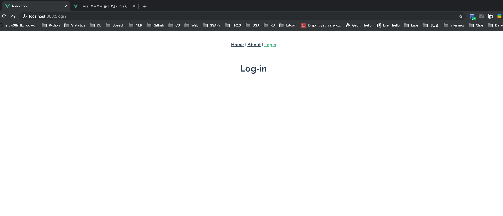

# View & Component

View는 Django MTV의 **Template**에 해당하며, 보여지는 부분을 관리합니다. Component의 경우 새로운 page 할당할 수 있겠지만, page 내부의 구분 단위로 사용할 경우에는 이전에 학습한 내용처럼 부모와 자식(@/components/vue)간의 연결 작업만 해 주면 됩니다.

<br>

<br>

## View 생성

### Log-in page

Log-in을 할 수 있는 View를 새로운 page에 생성해 보겠습니다. 새로운 page를 할당하려면 /router/index.js에 등록해 주어야 합니다.

이전에는 Component 파일을 components 디렉토리 안에 생성한 후, 부모 혹은 조부모 component에 등록해주었습니다. 하지만 이제는 **router**를 사용하므로, router의 **index.js**에 등록한 후 **App.vue**를 수정하여 실제 보여지도록 해 보겠습니다.

```javascript
// router/index.js 수정 전
import Vue from 'vue'
import VueRouter from 'vue-router'
import Home from '../views/Home.vue'

Vue.use(VueRouter)

const routes = [
  {
    path: '/',
    name: 'home',
    component: Home
  },
  {
    path: '/about',
    name: 'about',
    // route level code-splitting
    // this generates a separate chunk (about.[hash].js) for this route
    // which is lazy-loaded when the route is visited.
    component: () => import(/* webpackChunkName: "about" */ '../views/About.vue')
  },
]
```

```javascript
// router/index.js 수정 후
import Vue from 'vue'
import VueRouter from 'vue-router'
import Home from '../views/Home.vue'
import Login from '../views/Login.vue'

Vue.use(VueRouter)

const routes = [
  {
    path: '/',
    name: 'home',
    component: Home
  },
  {
    path: '/about',
    name: 'about',
    // route level code-splitting
    // this generates a separate chunk (about.[hash].js) for this route
    // which is lazy-loaded when the route is visited.
    component: () => import(/* webpackChunkName: "about" */ '../views/About.vue')
  },
  {
    path: '/login',
    name: 'login',
    component: Login
  }
]
```

이제 **App.vue**에 내용을 추가해 주겠습니다.

```vue
<!-- App.vue 수정 전 -->
<template>
  <div id="app">
    <div id="nav">
      <router-link to="/">Home</router-link> |
      <router-link to="/about">About</router-link>
    </div>
    <router-view/>
  </div>
</template>
```

```vue
<!-- App.vue 수정 후 -->
<template>
  <div id="app">
    <div id="nav">
      <router-link to="/">Home</router-link> |
      <router-link to="/about">About</router-link> |
      <router-link to="/login">Login</router-link>
    </div>
    <router-view/>
  </div>
</template>
```

App.vue 내부에 `router-link` 대신 `<a>` tag를 사용할 수 있지만, a tag의 경우 새로운 page load를 발생시킵니다.



`<router-vew/>`는 Routing 경로에 해당하는 component를 rendering해주며, 만약 이를 여러 줄로 복사할 경우 같은 내용이 복사한 만큼 출력됩니다. 예를 들어, `About.vue` 파일에는 `This is an about page`라는 `<h1>` tag가 존재하는데, `router-vew/`를 하나 추가해 줄 경우 해당 태그가 두번 render되어 두 번 출력되게 됩니다.

<br>

### 불필요 파일 제거

Home.vue를 수정해 봅시다. Home.vue에 사용된 `@`는 /src를 의미합니다. 기존에 생성되어 있었던 components/HelloWord.vue와 vews/About.vue를 삭제해 주겠습니다. About.vue가 삭제되었으므로, router/index.js와 App.vue에서의 About.vue에 대한 내용을 삭제해 주어야 합니다.

<br>

### Login Form, Component 만들기

Log-in page의 구성 요소 중 하나인 Log-in form을 만들어 보겠습니다.

형태를 꾸미고 구조를 잡는 것에 있어서, 차후에는 주로 Vuetify.js를 사용하게 될 것입니다만, 현재는 Bootstrap을 사용하도록 하겠습니다. Vuetify는 vue의 layout library로, CSS의 Bootstrap과 유사한 기능을 합니다. /public/index.html에 bootstrap을 연결해 보겠습니다. Style component만을 사용할 것이므로, CSS CDN만을 사용하겠습니다. _Bootstrap의 JavaScript는 jquery를 사용하므로, javascript와 충돌 가능성이 있습니다._

`container` class를 부여하여 grid system을 적용해 주겠습니다. `<router-vew/>` 또한 class를 부여할 수 있으며, 이를 이용하여 반응형으로 제작할 수 있습니다.

Vue.js 에서는 Form 태그가 필요 없습니다. /components에 LoginForm.vue를 생성해 주겠습니다.

```vue
<!-- LoginForm.vue -->
<template>
  <div>
      <div class="form-group">
          <label for="id">ID</label>
          <input type="text" class="form-control" placeholder="Your ID">
          <label for="password">Password</label>
          <input type="password" class="form-control" placeholder="Your Password">
      </div>
      <button class="btn btn-primary">Log-in</button>
  </div>
</template>

<script>
export default {
  name: 'LoginForm'
}
</script>

<style>

</style>
```

```vue
<!-- Login.vue -->
<template>
  <div>
    <h1>Log-in</h1>
    <LoginForm />
  </div>
</template>

<script>
import LoginForm from '@/components/LoginForm.vue'

export default {
  name: 'Login',
  components: {
    LoginForm,
  }
}
</script>

<style>

</style>
```

<br>

<br>

## Component 생성

### Home.vue에 To Do List 제작

Home.vue에 기본 틀을 생성하며, To do list를 보여주는 component인 TodoList.vue와 새로운 to do를 생성하는 component인 TodoInput.vue로 로 나누어 제작하겠습니다.

Todo에서 공유하는 list 데이터는 부모인 Home.vue에게 설정하며, TodoList.vue에서는 `props`를 통해 데이터를 받습니다.

이전에 새로운 to do를 생성하는 TodoInput.vue는 `$emit`을 사용하여 Home.vue로 데이터를 보내고, 다시 Home.vue가 TodoList.vue에게 `props`로 전달합니다. 

가장 바깥의 `<div>` 태그들에 `<div class="todo-list">`와 같이 케바케이스로 class명을 부여하는 이유는, 차후에 구분하기 용이하게 하기 위함입니다.

```vue
<!-- Home.vue -->
<template>
  <div class="home">
    <h1>Todo w/ Django & Vue</h1>
    <TodoInput />
    <TodoList :todos="todos"/>

  </div>
</template>

<script>
// @ is an alias to /src
import TodoList from '@/components/TodoList.vue'
import TodoInput from '@/components/TodoInput.vue'

export default {
  name: 'home',
  data() {
    return {
      todos: [
        {id: 1, title: 'Django DRF 활용한 Log-in 기능 구현'},
        {id: 2, title: 'JWT 활용한 세션 구현'},
        {id: 3, title: 'Todo 관련 API 구현'},
        {id: 4, title: 'Vuex 활용한 Flux 아키텍처 적용'},
      ]
    }
  },
  components: {
    TodoList,
    TodoInput,
  }
}
</script>
```

```vue
<!-- TodoList.vue -->
<template>
  <div class="todo-list">
      <h2>List</h2>
      <div class="card" v-for="todo in todos" :key="todo.id">
        <div clss="card-body">
          <span>{{ todo.title }}</span>
        </div>
      </div>
  </div>
</template>

<script>
export default {
  name: 'TodoList',
  props: {
    todos: {
      type: Array,
    }
  },
}
</script>
```

```vue
<!-- TodoInput.vue -->
<template>
  <div class="todo-input">
    <h2>New to work</h2>
    <div class="input-group mb-3">
      <input type="text" class="form-control">
      <button type="submit" class="btn btn-primary">+</button>
    </div>
  </div>
</template>

<script>
export default {
  name: 'TodoInput',
  data() {
    return {
      
    }
  }
}
</script>

<style>

</style>
```


