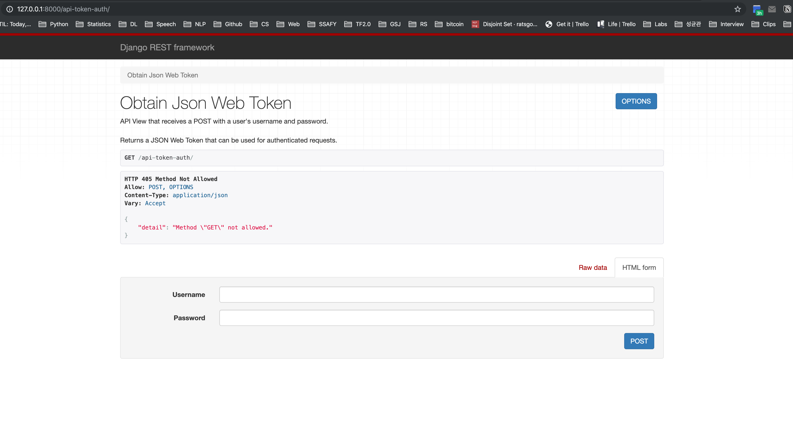
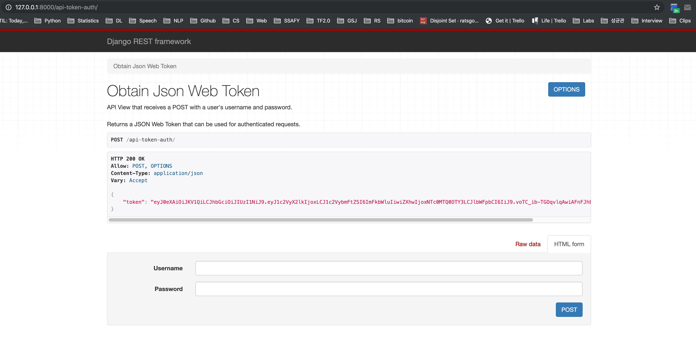
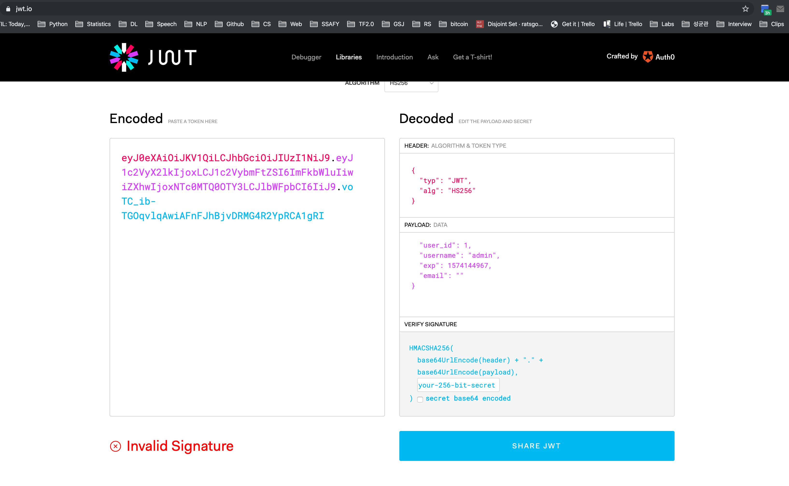

# Back 환경설정

Back-end를 생성하여 발생하는 데이터와 유지되어야 할 데이터들을 관리합니다.

<br>

### 환경 설정

Back-end와 Front-end는 따로 개발하는 경우가 많습니다. 그리고, 이에따라 대부분의 경우 따로 git을 관리합니다.

```bash
$ cd todo-back
$ django-admin startproject todoback .
```

```bash
$ django-admin startapp todos
$ pip install djangorestframework
$ pip install djangorestframework-jwt
$ pip install django-cors-headers
```

다음 Documentation들을 참고하여 settings.py에 설정합니다.

- [Django Restframework](https://www.django-rest-framework.org/#installation)
  - `INSTALLED_APPS = { 'rest_framework' }` 추가
- [Django Restframework -jwt](https://jpadilla.github.io/django-rest-framework-jwt/)
  - [Github](https://github.com/jpadilla/django-rest-framework-jwt)
    - `REST_FRAMEWORK = { ... } 생성
    - `JWT_AUTH = { ... }` 생성
    - `import datetime` 생성
- [Django Corsheaders](https://pypi.org/project/django-cors-headers/)
  - `INSTALLED_APPS = { 'corsheaders' }` 추가
  - `MIDDLEWARE = [ 'corsheaders.middleware.CorsMiddleware', ]` 추가
  - `CORS_ORIGIN_ALLOW_ALL = True` 생성

각각의 Documentation에 따라, 위 세 가지를 django가 사용하도록 settings.py에 설정하겠습니다.

```python
# todoback/settings.py
import datetime

INSTALLED_APPS = [
    # Django cors headers Installation
    'corsheaders',
    # Django Restframework Installation
    'rest_framework',
    'todos',
    'django.contrib.admin',
    'django.contrib.auth',
    'django.contrib.contenttypes',
    'django.contrib.sessions',
    'django.contrib.messages',
    'django.contrib.staticfiles',
]

# Django Restframework -jwt Documentation > Installation
# 복사 + 붙여넣기
REST_FRAMEWORK = {
    'DEFAULT_PERMISSION_CLASSES': (
        'rest_framework.permissions.IsAuthenticated',
    ),
    'DEFAULT_AUTHENTICATION_CLASSES': (
        'rest_framework_jwt.authentication.JSONWebTokenAuthentication',
        'rest_framework.authentication.SessionAuthentication',
        'rest_framework.authentication.BasicAuthentication',
    ),
}

# django restframework -jwt Documentation > Installation
# 복사 + 붙여넣기
JWT_AUTH = {
    'JWT_ENCODE_HANDLER':
    'rest_framework_jwt.utils.jwt_encode_handler',

    'JWT_DECODE_HANDLER':
    'rest_framework_jwt.utils.jwt_decode_handler',

    'JWT_PAYLOAD_HANDLER':
    'rest_framework_jwt.utils.jwt_payload_handler',

    'JWT_PAYLOAD_GET_USER_ID_HANDLER':
    'rest_framework_jwt.utils.jwt_get_user_id_from_payload_handler',

    'JWT_RESPONSE_PAYLOAD_HANDLER':
    'rest_framework_jwt.utils.jwt_response_payload_handler',

  	# 아래 settings.은 현재 파일을 의미하며, 불필요하므로 삭제
    # 'JWT_SECRET_KEY': settings.SECRET_KEY,
    'JWT_SECRET_KEY': SECRET_KEY,
    'JWT_GET_USER_SECRET_KEY': None,
    'JWT_PUBLIC_KEY': None,
    'JWT_PRIVATE_KEY': None,
    'JWT_ALGORITHM': 'HS256',
    'JWT_VERIFY': True,
    'JWT_VERIFY_EXPIRATION': True,
    'JWT_LEEWAY': 0,
    'JWT_EXPIRATION_DELTA': datetime.timedelta(seconds=300),
    'JWT_AUDIENCE': None,
    'JWT_ISSUER': None,

    'JWT_ALLOW_REFRESH': False,
    'JWT_REFRESH_EXPIRATION_DELTA': datetime.timedelta(days=7),

    'JWT_AUTH_HEADER_PREFIX': 'JWT',
    'JWT_AUTH_COOKIE': None,
}
```

```python
# todoback/settings.py
# corsheaders의 documentation에 의하면 두 가지를 추가하도록 되어있지만,
# 한 가지는 이미 있으므로 나머지 하나를 추가해 준다.

MIDDLEWARE = [
    'corsheaders.middleware.CorsMiddleware',
    'django.middleware.security.SecurityMiddleware',
    'django.contrib.sessions.middleware.SessionMiddleware',
    'django.middleware.common.CommonMiddleware',
    'django.middleware.csrf.CsrfViewMiddleware',
    'django.contrib.auth.middleware.AuthenticationMiddleware',
    'django.contrib.messages.middleware.MessageMiddleware',
    'django.middleware.clickjacking.XFrameOptionsMiddleware',
]

# corsheaders의 configuration 추가
# 현재는 개발 과정이므로, 모든 domain/port의 접속을 허용하도록 True 설정
CORS_ORIGIN_ALLOW_ALL = True
```

<br>

<br>

## CORS, HTTP 접근 제어

[MDN](https://developer.mozilla.org/ko/docs/Web/HTTP/Access_control_CORS) 참고

CORS는 HTTP 접근 제어, 다른 domain/port에서 온 요청에 대한 허용 여부를 결정합니다. 즉, 정의된 곳으로 부터의 요청만을 허용합니다.

<br>

<br>

## JWT, Json Web Token

참고 자료: [VELOPART.LOG](https://velopert.com/2389)

Django는 Session형 인증 구조를 갖고 있습니다. 유저들의 인증 정보를 모두 서버측에서 저장한 후, 서버의 Session이라는 메모리 영역에서 관리합니다. HTTP는 Connectionless하며 Stateless하기 때문에 프로토콜 상에 상태를 저장할 수 없고, 이를 해결하기 위해 Django Aut는 Session을 기반으로 상태성을 확보합니다.

서버에 이러한 정보가 저장되어 있기 때문에 굉장히 빠른 속도로 작업을 처리할 수 있으며, HTTP의 단점을 거의 완벽히 보완할 수 있습니다. 하지만 browser의 요청(cookie의 session id)이 있을 때 마다 서버에서 유저 정보를 확인하는 session은, 사용자의 수가 증가하면 서버의 부하가 증가합니다. 또한 device의 browser 별로 session id가 부여되기 때문에 device를 옮길 경우 유저 정보가 모두 사라집니다. 물론 비슷한 개념은 존재합니다만, mobile browser에는 cookie를 저장하는 기능 조차 없습니다.

JWT를 활용한다면 더 이상 서버에서 state를 관리하지 않아도 되며, 유저가 유저의 인증 정보를 포함하는 **Token** 파일을 소유하게 합니다. 그리고 다음 요청 부터는 해당 토큰만 보내주면, 더 이상 유저 정보를 찾기 위해 session을 탐색하지 않고도 유저는 인증 상태의 서비스를 제공하게 됩니다. 그리고 보안을 위해 이 토큰을 암호화(`JWT_SECRET_KEY`)합니다.

JWT의 형태는 다음과 같습니다.

- `xxxxxxxx.yyyyyyyyy.zzzzzzzzzzz`
- `HEADER.PAYLOAD.SIGNATURE`
- header, payload, verify signature 각각을 해싱하여 연결한 `~~.~~.~~` 형태의 파일

서버 입장에서 보았을 때, session은 stateful하며, JWT은 stateless한 요청과 응답을 주고받습니다.

_One Way Hashing: 같은 값을 넣었을 때에는 같은 해쉬 값으로 출력되며, 복호화 하는 과정은 현재로서는 밝혀진게 없다. SHA 1은 대표적으로 git에서 사용하고 있으며, 이는 복호화가 가능하다고 구글에서 밝힌적이 있다._

<br>

### JWT 활용해서 Token 발급

Token을 발급하는 url을 정의하겠습니다. Django에는 이미 JWT를 활용할 수 있는 기능이 있으므로, 이를 import하여 사용하겠습니다.

```python
# todoback/urls.py
from rest_framework_jwt.views import obtain_jwt_token

urlpatterns = [
    path('api-token-auth/', obtain_jwt_token),
]
```

아직 기능을 완벽히 구현하지 않을 것이므로, 대략적으로만 모델을 제작해 보겠습니다.

```python
# todos/models.py
from django.db import models
from django.contrib.auth.models import AbstractUser
from django.conf import settings

# Create your models here.
class User(AbstractUser):
    pass

class Todo(models.Model):
    title = models.CharField(max_length=50)
    completed = models.BooleanField(default=False)
    # settings.py에 AUTH_USER_MODEL = 'todos.User' 설정 필요
    user = models.ForeignKey(settings.AUTH_USER_MODEL, on_delete=models.CASCADE)
		
    # django admin에서 가시적으로 보이게 하기 위해 __str__ 설정
    def __str__(self):
        return self.title
```

```python
# todoback/settings.py
AUTH_USER_MODEL = 'todos.User'
```

```bash
$ python manage.py makemigrations
$ python manage.py migrate
$ python manage.py runserver
$ django manage.py createsuperuser
# admin, 1234
```



이후 `localhost:8000/api-token-auth/` 주소로 접속하면 위와 같은 페이지를 확인할 수 있습니다. 이는 원래 사용되는 화면은 아니며, api 요청을 보냈기 때문에 이에 대한 반응으로 page를 보여준 것입니다. 이에 아까 생성해 둔 admin 계정을 입력하면 다음과 같이 반환됩니다.



그리고 이를 [jwt.io](https://jwt.io/)에서 decoding 해 보면 다음과 같은 정보들이 들어있음을 확인할 수 있습니다.




