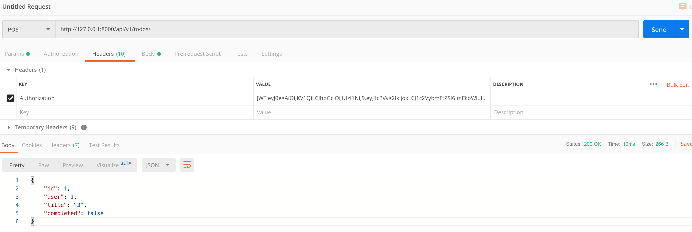

# API, Django & Vue 연동

Django와 Vue 서버들을 동시에 실행하여 admin 계정으로 로그인해 보겠습니다. 우선 request-response를 주고 받을 axios를 설치합니다.

```bash
$ npm i axios
```

이제 LoginForm.vue에게 로그인하는 기능을 추가하겠습니다.  `credential`이라는 object에 `data`를 저장하고, `axios` 를 사용하여 front에서 back으로 로그인 정보를 전송하겠습니다.

로그인 정보 확인 후 django server가 JWT를 response로 돌려 줄 것이고, vue session을 이용하여  JWT를 저장하도록 합니다.

```bash
$ npm i vue-session
```

```javascript
// @/router/index.js
import Vue from 'vue'
import VueRouter from 'vue-router'
import Home from '../views/Home.vue'
import Login from '../views/Login.vue'
// 별도로 설치한 내용이므로, 따로 경로 표시할 필요 없이 from 'vue-session'
import VueSession from 'vue-session'

Vue.use(VueRouter)
// 별도로 설치한 vue-session을 사용하도록 설정
Vue.use(VueSession)

const routes = [
  {
    path: '/',
    name: 'home',
    component: Home
  },
  {
    path: '/login',
    name: 'login',
    component: Login
  }
]

const router = new VueRouter({
  mode: 'history',
  base: process.env.BASE_URL,
  routes
})

export default router

```

Vue session을 설치했으니, LoginForm.vue를 수정하여 로그인 시도 시 JWT을 확인하여 로그인 처리를 하도록 하겠습니다.

```vue
<template>
  <div>
    <div class="form-group">
      <label for="id">ID</label>
      <input v-model="credentials.username" type="text" id="id" class="form-control" placeholder="Your ID">

      <label for="password">Password</label>
      <input v-model="credentials.password" type="password" id="password" class="form-control" placeholder="Your Password">
    </div>
    <button @click="login()" class="btn btn-primary">Log-in</button>
  </div>
</template>

<script>
import axios from 'axios'
// import router from '@/router/index.js'
// 위와 같이 작성하지 않아도, export default router라고 index.js에 작성해 두었으므로, 아래처럼 간단하게 router로 사용 가능
import router from '@/router'

export default {
  name: 'LoginForm',
  data() {
    return {
      credentials: {}
    }
  },
  methods: {
    login() {
      // console.log(this.credentials)
      axios.post('http://127.0.0.1:8000/api-token-auth/', this.credentials)
      .then(res => {
        // parse JWT from res.data.token
        // session start
        this.$session.start()
        // set(key, value)
        this.$session.set('jwt', res.data.token)
        // 복잡하게 this.$router를 작성하는 대신, 간편하게 위에서 import 후 router로 사용 가능
        // push 후 route로 가도록 '/' 설정
        router.push('/')
      })
    }
  },
}
</script>
```

<br>

### 데이터 검사 및 처리

Django에서는 models.py를 통해 데이터를 정의하며, 데이터의 생성, 저장 등의 조작을 **Queryset**으로 관리합니다. 하지만 우리가 필요한 데이터의 형태는 **JSON** 형식이며, Queryset을 JSON으로 변환 후 데이터 형식에 맞는지 검사하는 것이 **직렬화(Serializer)**입니다. Serializer는 JSON 형태와 Queryset 형태를 조정하는 역할을 하며, form의 기능을 수행하여 그 형식을 조정합니다.

1. todo-back/todos/serializer.py를 생성한 후 작성
2. `api/v1/`으로 시작하는 모든 요청들을 todos/urls.py로 전송하도록 설정
3. views.py에 데이터를 검증하여 반환하는 함수를 작성

```python
# todos/serializers.py
from rest_framework import serializers
from .models import Todo

class TodoSerializer(serializers.ModelSerializer):
    class Meta:
        model = Todo
        fields = ('id', 'user', 'title', 'completed',)
```

```python
# todoback/urls.py
from django.contrib import admin
from django.urls import path, include
from rest_framework_jwt.views import obtain_jwt_token

urlpatterns = [
    path('admin/', admin.site.urls),
    path('api-token-auth/', obtain_jwt_token),
    path('api/v1/', include('todos.urls')),
]
```

```python
# todos/urls.py
from django.urls import path
from . import views
urlpatterns = [
    path('todos/', views.todo_create),
]
```

POST를 통해 전송받은 데이터가 seiralized 하다면 그 정보를 반환하고, 아닐 경우 400 에러를 전송합니다.

```python
# todos/views.py
from django.shortcuts import render
from .serializers import TodoSerializer
from rest_framework.response import Response
from rest_framework.decorators import api_view


@api_view(['POST'])
def todo_create(request):
    serializer = TodoSerializer(data=request.POST)
    if serializer.is_valid():
        serializer.save()
        return Response(serializer.data)
    return Response(status=400)
```

Postman으로 생성되는 쿠키를 확인해 보겠습니다. Body에 id, user, title을 입력하고 Headers에 Authentication 항목의 key와 token을 입력합니다.

- Header
  - Auth(JWT)
- Body
  - id
  - user
  - content


 그 후 POST 방식으로 api/v1/todos/ 주소로 요청을 보내면, 성공적일 시 아래의 그림처럼 json 형태의 쿠키를 돌려받습니다.




