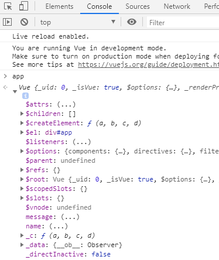
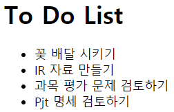
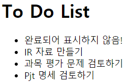

# Control Flow of VueJS

### Vue Extionsions

- VS Code

  - Vetur Extension
  - Vue VSCode Snippets

- Chrome Extension

  - [Vue.js devtools](https://chrome.google.com/webstore/search/vue?utm_source=chrome-ntp-icon)

    Vue.js가 사용된 페이지에서는 Extension의 Vue Logo가 색칠된 형태로 표시됩니다.

    Extension을 설치하면 DevTools(`F12`)에서 Vue 내용을 뜯어볼 수 있습니다.

<br>

### MTV -> V VM M

- Django
  - Model
  - Template
  - View
- Vue
  - **Model**
  - **View**
  - **ViewModel**

<br>

<br>

## Control Flow

Vue.js를 우리가 사용할 앱에 load 하는 방법으로 CLI와 CDN 두 가지가 있지만, CDN을 먼저 사용해 보겠습니다.

우선 Vue.js를 사용함을 선언해 주기 위해 `<script src="http:...."></script>`를 자세한 Vue.js code를 작성하는 `<script>코드들</script>` 위에 선언해 줍니다.

```html
<body>
  <!-- Vue framework를 사용하기 이전, CDN을 먼저 load해 주어야 한다. -->
  <script src="https://cdn.jsdelivr.net/npm/vue/dist/vue.js"></script>
  <script>
    // 이후 선언 공간
  </script>
</body>
```

이제 자세한 내용을 아래와 같이 작성해 보겠습니다.

```html
<body>
  <!-- View -->
  <div id="app">
    <p>{{ message }}</p>
  </div>

  <script src="https://cdn.jsdelivr.net/npm/vue/dist/vue.js"></script>
  <script>
    // M (V VM)
    // app이라는 이름으로 Vue의 instance인 ViewModel을 생성
    const app = new Vue({
      // Vue instance에게 html의 어느 element에 mount(load)할 것인지 지정
      // 보통 id로 지정하며, 보통 app 별로 하나의 element에만 mount
      el: '#app',
      data: {
        message: 'Hello, Vue.js!',
        name: 'Dongbin Cho',
      },
      methods: {
        // changeName: function () {},
        // ES6 부터는 다음과 같이 축약형으로도 사용 가능
        changeName(input) {
          this.name = input
        },
      }
    })
  </script>
</body>
```

이렇게 생성한 `app` instance는, Browser Console에서 `app`이라는 이름의 객체를 열어봄으로서 그 내용을 확인할 수 있습니다. Vue.js는 `app`의 내용을 자동으로 naming 하는데, `el` 요소를 `$el` 과 같이 지정합니다. 따라서 우리가 코드를 작성할 때에는 under-bar(`_`) 혹은 dollar(`$`)로 시작하여 naming하지 않도록 유의해야 합니다.

Vue instance의 적용 대상인 `el` 속성은 `$el`로 지정되며, `message`, `name`과 같은 `data` 변수들은 `_data`로 저장되어 있습니다.



Vue.js는 Reactive합니다. Reactive는 data의 변화를 자동으로 적용하는 성질을 말합니다.

<br>

### For문

`v-for` 속성을 부여하여 DTL의 ``와 같이 사용할 수 있습니다.

```html
<body>
  <!-- View -->
  <div id="app">
    <h1>To Do List</h1>
    <ul>
      <li v-for="todo in todos">{{ todo }}</li>
    </ul>
  </div>

  <script src="https://cdn.jsdelivr.net/npm/vue/dist/vue.js"></script>
  <script>
    // ViewModel
    const app = new Vue({
      el: '#app',
      data: {
        todos: [
          '꽃 배달 시키기',
          'IR 자료 만들기',
          '과목 평가 문제 검토하기',
          'Pjt 명세 검토하기',
        ],
      },
    })
  </script>
</body>
```



<br>

### if문, 각 요소를 Object로 만들어 속성 부여하기

todo 리스트의 각 요소들을 object로 만들고, 완료 여부(`complete`)를 적용해 봅시다. 

```html
<body>
  <!-- View -->
  <!-- <div id="app">
    <p>{{ message }}</p>
  </div> -->

  <div id="app">
    <h1>To Do List</h1>
    <ul>
      <li v-for="todo in todos" v-if="!todo.completed">{{ todo.content }}</li>
      <li v-else>완료되어 표시하지 않음!</li>
    </ul>
  </div>
    
  <script src="https://cdn.jsdelivr.net/npm/vue/dist/vue.js"></script>
  <script>
    // ModelView
    const app = new Vue({
      el: '#app',
      data: {
        todos: [
          {content: '꽃 배달 시키기', completed: true},
          {content: 'IR 자료 만들기', completed: false},
          {content: '과목 평가 문제 검토하기', completed: false},
          {content: 'Pjt 명세 검토하기', completed: false},
        ],
      },
    })
  </script>
</body>
```



`v-if`를 사용하여 완료되지 않은 사항만을 보여줄 수 있으며,`v-else` 속성을 통해 `'완료되어 표시하지 않음!'`이라고 보여줄 수 있습니다.


