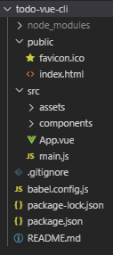
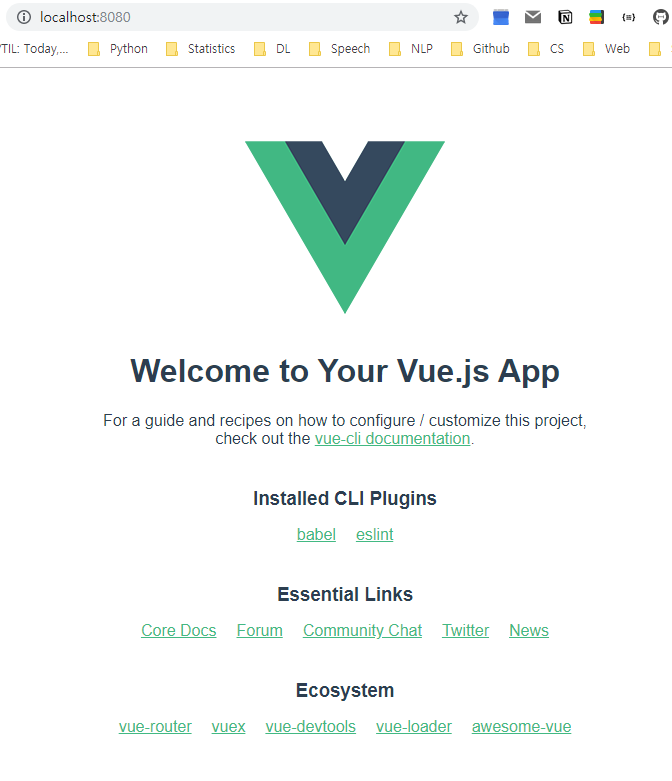

# Vue CLI

### Single File Component

파일 하나 당 하나의 컴포넌트만 유치하며, 확장자는 `.vue`를 사용합니다.

JavsSciprt는 파일 별 데이터 공유가 매우 어려운데, 파일들의 데이터 공유를 도와주는 대표적인 라이브러리로 **WebPack**이 있습니다. 하지만 WebPack을 다루는 것이 매우 까다로우므로, 현재는 **Vue-cli**를 사용하겠습니다.

<br>

<br>

## Vue CLI

참고자료: [공식 페이지](https://cli.vuejs.org/)

JavaScript를 Browser에서 벗어나, 프로그래밍 언어처럼 Runtime을 실행하는 Node.js를 사용하겠습니다. npm은 Node.js에게 Python의 pip과 같은 역할을 수행하며, 프로젝트 별 패키지 관리가 가능합니다.

<br>

### Vue CLI 설치하기

npm을 사용하여 Vue CLI를 설치해 보겠습니다. 여기서는 CLI를 프로젝트 별로 사용할 것이 아니라, 모든 프로젝트에서 사용할 것이므로 `--global` 혹은 `-g` configure를 부여하여 전역 설치하겠습니다.

```bash
$ npm install -g @vue/cli
...
+ @vue/cli@4.0.5
added 1074 packages from 624 contributors in 34.637s

$ vue --version
@vue/cli 4.0.5
```

<br>

### Vue CLI의 Extensions

`Vetur`: 코드 자동 완성

`Vue VSCode Snippets`

IDE의 indentation 설정해주면 편해집니다.

```
// VS Code/Preference: Open Settings (JSON)
"[vue]": {
"editor.tabSize": 2 
},

// Indentation Using Spaces에서 2 선택
```

<br>

### Vue CLI로 프로젝트 생성하기

Vue CLI를 사용하여 `todo-vue-cli`라는 이름으로 프로젝트를 생성해 보겠습니다.

```bash
# Project 생성할 디렉토리를 만든 후, path를 옮김
$ mkdir ProjectName
$ cd ProjectName
# 프로젝트 생성
$ vue create todo-vue-cli
...
```

'endpoint를 (npm 개발국인 미국보다) 가까운 taobao(중국)로 옮겨서 속도를 빠르게 할 것인가?'와 같은 질문이 나오면 `Y`, 선택지 뭐 고를지 모를땐 `enter`를 입력하면 알아서 default 설정으로 진행합니다.



중국/한국에는 여전히 IE Browser 사용자가 많으며, IE는 최신 JavaScript 문법을 지원하지 않습니다. 따라서 과거 버전만을 지원하는 Browser에게 번역해주기 위해 **Babel**이 사용됩니다. 그리고 프로젝트 생성 시 자동으로 `babel.config.js`라는 파일이 생성됩니다. `package.json`을 통해 dependency를 비롯한 설정들을 조작할 수 있습니다.

npm은 project 단위로 패키지를 설치하며, 이를 `node_modules` 디렉토리에 저장합니다. 우리가 사용할 Vue는 `node_modules/@vue` 디렉토리 안에, Babel과 관련된 내용은 `node_modules/babel-preset-app` 디렉토리 안에 설치됩니다.

Project Directory는 이렇게 많은 내용들을 포함하고 있으며, 공유 불필요 및 불가 파일들에 대해 `.gitignore`를 자동으로 생성해 줍니다. 그런데, 이렇게 패키지들이 저장되고 공유할 시 `.gitignore`에 의해 모두 제외되는데, 만약 다른 개발자의 package를 clone해 온다면 어떻게 해야 할까요? 간단한 방법은, `package.json` 내부의 `dependencies: {}` 내용을 참고하여 `npm --install` 등의 명령어로 설치해 주는 것입니다.

다음 코드 블록은 서버를 실행하는 코드입니다.

```bash
$ npm run serve
```



<br>

### console.log()

개발 과정에서 `console.log()`를 사용할 일이 있는데, `console`이란 메서드는 사용자로 부터 값을 알 수 없도록 하기 위해 사용하지 못하도록 되어있습니다. 따라서 `package.json`의 `eslintConfig : {rules: {}}`에  no console 에러를 예외처리를 해주어야 합니다.

```json
{
  ...
  "eslintConfig": {
	...
    "rules": {
      "no-console": "off"
    },
  },
  ...
}
```

