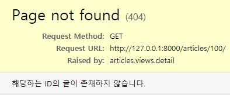

# Errors

## 404 Error

`404 Error`: **Page Not Found**



사용자가 존재하지 않는 페이지를 검색했을 경우, django error가 아닌 404 Error 페이지를 반환

404는 Client Application Error이며 개발자의 실수로 인해 발생하는 에러가 아니다.

- 페이지가 존재 한다면 가져오고, 없다면 404 Error를 반환하는 함수

  `get_object_or_404(DB클래스, 인스턴스탐색인자)`

```python
from django.shortcuts import render, redirect, get_object_or_404
```

```python
def update(request, pk):
    #####################################
    # todo = Todo.objects.get(pk=pk)
    todo = get_object_or_404(Todo, pk=pk)
    #####################################
    if request.method == 'POST':
        todo.title = request.POST.get('title')
        todo.due_date = request.POST.get('due-date')
        todo.save()
        return redirect('todos:index')
    else:
        context = {
            'todo': todo,
        }
        return render(request, 'todos/update.html', context)
```

```python
def delete(request, pk):
    # todo = Todo.objects.get(pk=pk)
    todo = get_object_or_404(Todo, pk=pk)
    todo.delete()
    return redirect('todos:index')
```

<br>

### try로 직접 만들어보기

```python
from django.shortcuts import render, redirect, get_object_or_404
from .models import Article
from .forms import ArticleForm
from django.http import Http404

def detail(request, article_pk):
    # article = get_object_or_404(Article, pk=article_pk)
    
    ## 직접 만들어 보기
    #####################################################
    try:
        article = Article.objects.get(pk=article_pk)
    # except:
    ## 에러 지정하기
    except Article.DoesNotExist:
        raise Http404('해당하는 ID의 글이 존재하지 않습니다.')
	#####################################################
    
    context = {
        'article': article,
    }
    return render(request, 'articles/detail.html', context)
```

<br>

<br>

## 405 Error

`405 Error`: **Method Not Allowed**

[Django Documetation Decorators](https://docs.djangoproject.com/en/2.2/topics/http/decorators/)

```python
# views.py
from django.views.decorators.http import require_POST

# if request.method == 'POST' 대신, POST가 아닐 경우 405 Error를 발생시킨다.
@require_POST
def delete(request, article_pk):
    article = get_object_or_404(Article, pk=article_pk)
    # view 단계에서 decorator를 통해 POST만을 허용하지만,
    # 만일에 대비하여 if로 한번 더 protection 기능을 하도록 한다.
    if request.method == 'POST':
        article.delete()
        return redirect('articles:index')
    else:
        return redirect(article)
```

**Python Decorator(@)** 기능은 해당 decorator를 그 아래의 함수에 포함시킨다.