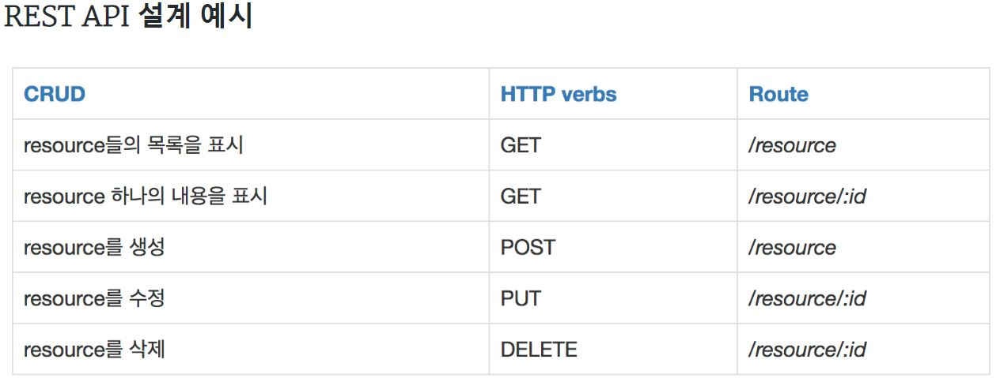

# RESTful API

[참고자료](https://gmlwjd9405.github.io/2018/09/21/rest-and-restful.html)

REST = REpresentational State Transfer”

url을 예쁘게 만드는 것이 요점이며, REST API 규칙을 지키는 페이지들을 RESTful하다고 한다.

i.g., resource를 다루는 것에 **detail과 같이 의미를 보여주는 용어를 사용하지 않는다**.

```python
from django.urls import path
from . import views

app_name = 'articles'

urlpatterns = [
    path('', views.index, name='index'),
    path('<int:article_pk>/', views.detail, name='detail'),
]
```

**GET/POST** 메써드만을 사용하면 RESTful 하지 못하며, **DRF(Django Rest Framework)**를 활용하여 `update` 함수에 **PUT**을 사용할 수 있다.



REST API의 끝판왕은 **Github**이다.

**GraphQL**은 REST API가 귀찮아서 Facebook이 만든 핫한 언어이며, 매우 편리하여 주목받고 있다.